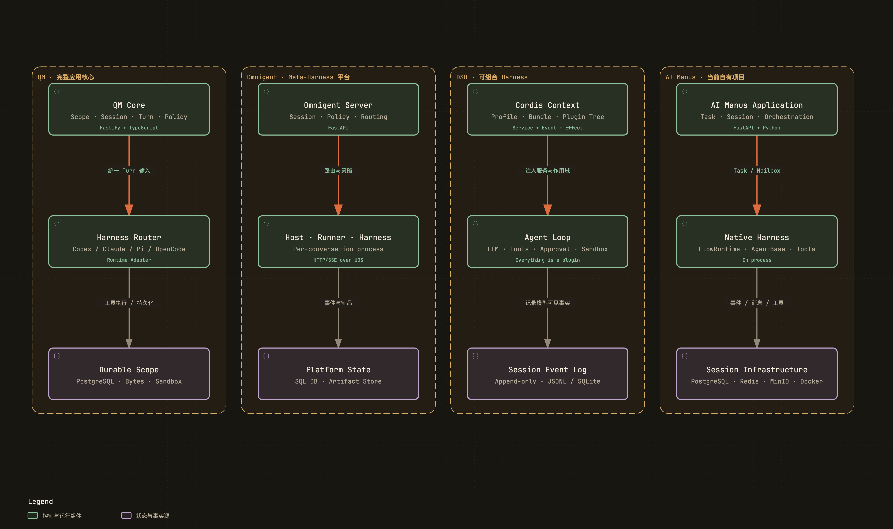
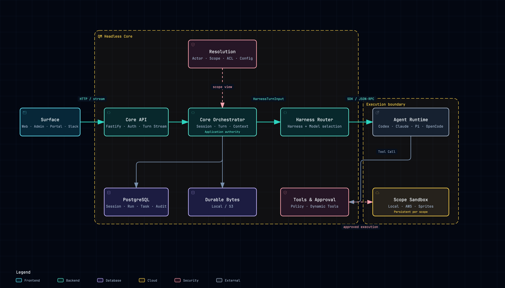
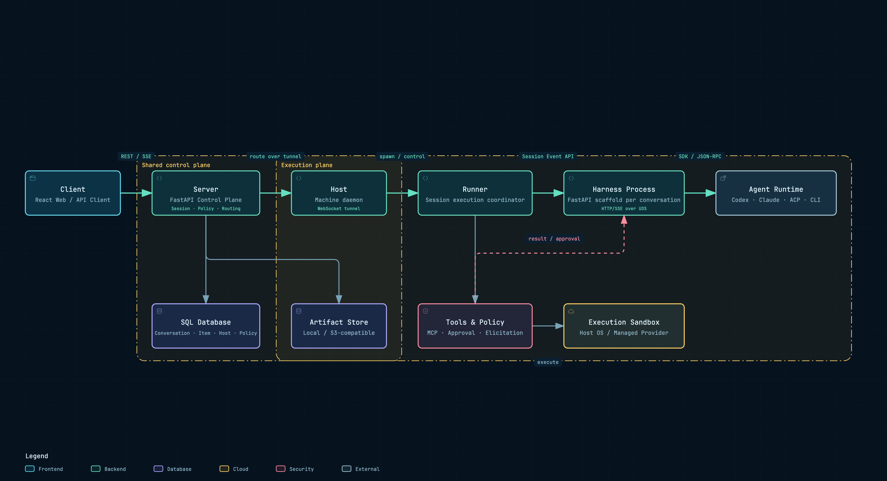
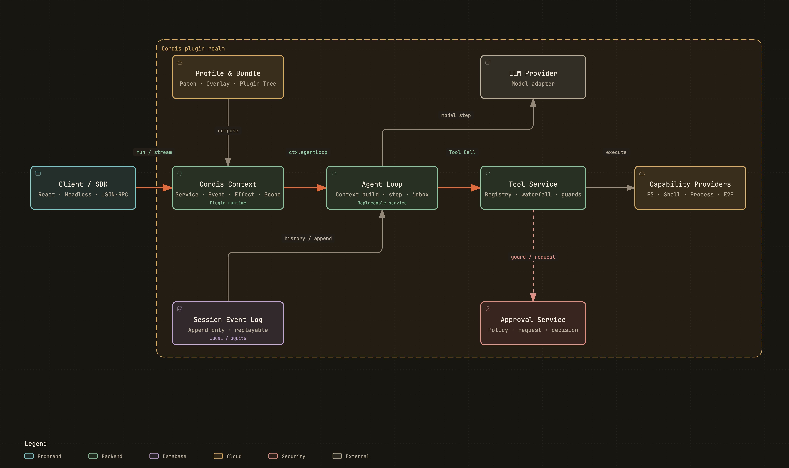
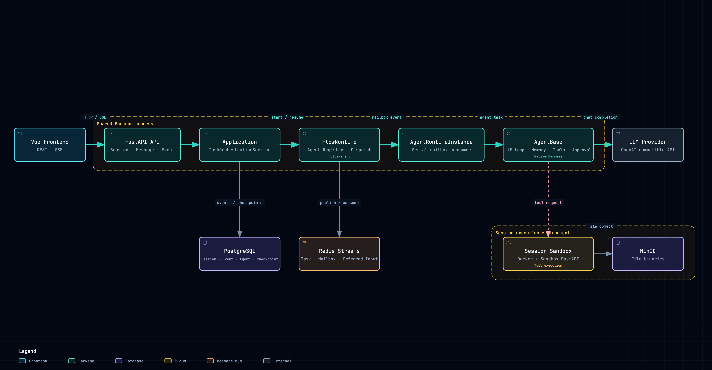
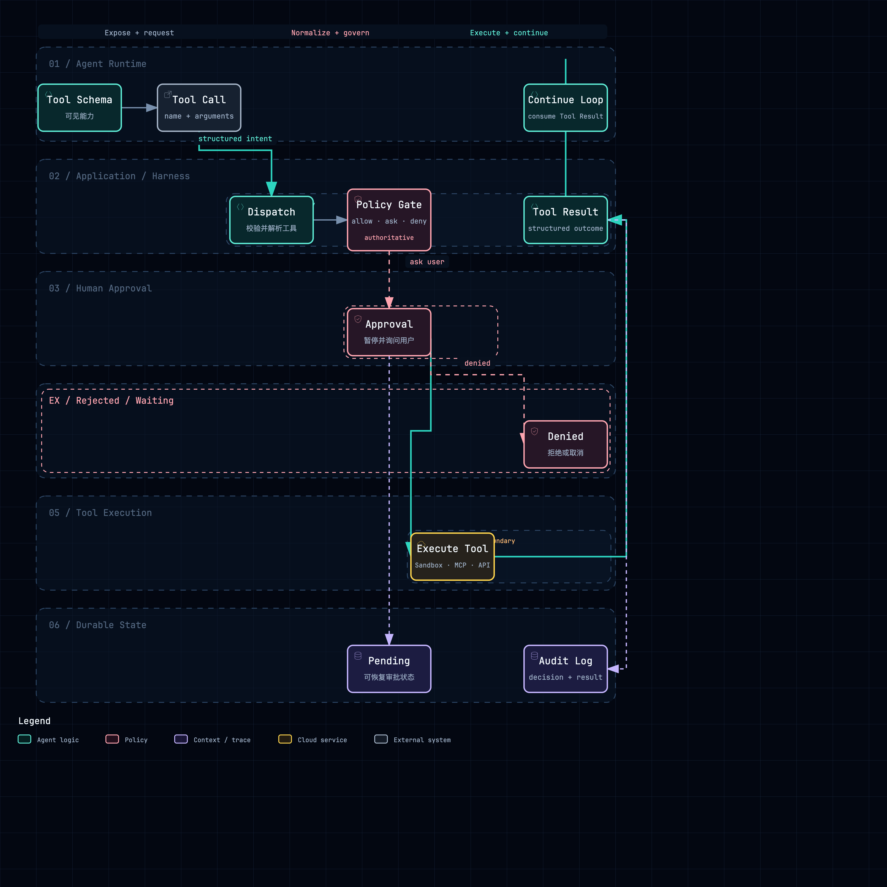

# QM、Omnigent、DeepSeek Harness 与 AI Manus 架构分析

## 1. 阅读说明

本文先分别还原 QM、Omnigent、DeepSeek Harness（DSH）和 AI Manus 的整体架构，再按照共同职责进行横向比较。

四个项目在本文中的角色并不相同：

- QM、Omnigent 和 DSH 是用于学习与比较的成熟开源实现。
- AI Manus 是当前自有项目，本文分析其现有结构、技术和不足，但不在这里展开完整改造方案。
- QM 与 Omnigent 覆盖了比较完整的 Agent 应用控制和执行链路。
- DSH 的重点是可组合 Harness 内部的插件、服务、事件和生命周期设计。

本文只总结总览级事实，重点解释系统边界、主要组件和主调用链。Context、Tools、Approval、Sandbox、状态恢复等细节已经下钻到文末链接的独立模块分析。

图示采用三种同源载体：正文内嵌 PNG，确保 VS Code Markdown Preview Enhanced 在直接打开单个文件时也能显示；SVG 作为可缩放矢量附件；HTML 作为可交互、可缩放的 Archify 附件。模块文档的 PNG 放在各文档可直接访问的 `models/assets/` 下，SVG 与 HTML 统一保存在 `diagrams/` 下。

### 1.1 分析版本

| 项目 | 分支 | Commit | 分析日期 |
| --- | --- | --- | --- |
| QM | `main` | `0f0e0adccce2d13e4aff3e5bf3efb0cccf312f7a` | 2026-08-30 |
| Omnigent | `main` | `c84ee695170501ba357eb410de0bbda4e1e83c41` | 2026-08-30 |
| DeepSeek Harness | `master` | `141eb6fef83422698aef7a981029e843e8161534` | 2026-08-30 |
| AI Manus | `feat/skill-lazy-sync` | `d6f3921110f722065d531fe32cfb4e5a3038ba58` | 2026-08-30 |

### 1.2 结论先行

1. **QM 的核心是 Scope-first 的 Headless Agent Application Core。** 它把身份、Scope、Session、Turn、工具、审批、记忆、Sandbox 和持久化放在统一 Core 中，再把不同 Agent Runtime 隐藏在 Harness 接口之后。
2. **Omnigent 的核心是控制面与分布式执行面的分离。** Server 管理平台状态和路由，Host 管理机器上的进程，Runner 管理会话执行，Harness 适配具体 Agent Runtime。
3. **DSH 的核心不是中心控制面，而是可组合运行时。** Cordis Context 提供服务注入、类型化事件、作用域和可逆副作用；模型、Session、Tools、Approval、Agent Loop 和 UI 都是插件。
4. **AI Manus 是 Session-first 的多 Agent 应用。** Application 层负责 Task 和 Session 编排，Native Harness 由 `AgentBase`、Context、Tools、Approval 和 LLM loop 组成，`FlowRuntime` 与 `AgentRuntimeInstance` 负责多 Agent 调度和 mailbox 消费。
5. 四个项目都有入口、运行控制、模型循环、工具、状态和执行环境，但**职责拥有者与进程边界差别很大**。理解这些边界比寻找同名类更重要。
6. 技术栈的差异通常来自产品边界：组织级服务更依赖共享持久化和任务租约；本地可组合 Harness 更重视插件作用域与事件日志；远程 Agent 平台更重视进程隔离和隧道路由。

## 2. 技术栈全景

这张表先回答“各项目用了什么”。选型原因与架构影响放在对应项目和横向比较中解释。

| 维度 | QM | Omnigent | DeepSeek Harness | AI Manus |
| --- | --- | --- | --- | --- |
| 主要语言 | TypeScript | Python；前端 TypeScript；少量 Rust/Swift/Kotlin | TypeScript；少量原生 Rust | Python；前端 TypeScript |
| 运行时 | Node.js 24+ | Python 3.12+、Node.js 前端 | Node.js 22.19+/24+ | Python 3.12、Node.js 前端 |
| 后端/API | Fastify + `node:http` | FastAPI + Uvicorn | Cordis 插件树；可选 Web Server / Headless Bundle | FastAPI + Uvicorn |
| 前端 | Lit + Vite；Web/Admin/Portal 为可选插件 | React 18 + Vite + TanStack Query + Zustand | React 18 + Vite；Client 同样插件化 | Vue 3 + Vite |
| Agent 核心 | Core Orchestrator + Harness Router | Server + Host + Runner + Harness Process Manager | Cordis Context + Agent Loop 插件 | Task Orchestration + Native Harness + FlowRuntime |
| Runtime 接入 | Codex App Server、Claude Agent SDK、Pi、OpenCode | Codex App Server、Claude SDK、ACP/CLI/SDK 等多 Harness | 自有 Agent Loop；可通过 SDK/ACP/插件接外部能力 | OpenAI 兼容 LLM 接口；当前 Agent Loop 在进程内 |
| 主要通信 | HTTP；Harness 各自使用 SDK/API/JSON-RPC；Surface 与 Core 解耦 | REST、SSE、WebSocket、HTTP over UDS/TCP、SDK/JSON-RPC | Cordis 进程内事件；Web；newline-delimited JSON-RPC stdio SDK | REST、SSE、Redis Streams、Sandbox HTTP API |
| 关系数据 | PostgreSQL；本地测试可使用内存实现 | 默认 SQLite；生产可用 PostgreSQL；SQLAlchemy/Alembic | Session 追加日志；JSONL/SQLite Provider 可替换 | PostgreSQL；SQLAlchemy/Alembic |
| 队列/实时状态 | PostgreSQL Run/Lease；`pg-boss` 用于 Cron 队列 | 进程内 `asyncio.Queue`；WebSocket tunnel；无通用外部 Broker | 进程内类型化事件；Agent inbox；持久事件日志 | Redis Streams 用于 Task、Mailbox 和 deferred input |
| 文件/对象 | 本地或 S3 Durable Byte Store | Local Artifact Store 或 S3/R2 等兼容存储 | 文件、附件、Spill、Storage 都是可替换 seam | MinIO 保存文件二进制，PostgreSQL 保存元数据 |
| 执行隔离 | Per-scope Local/AWS/Sprites Sandbox | Host/Runner；本地 OS Sandbox 或 Managed Sandbox Provider | Local/E2B 等可组合 FS、Subprocess、Sandbox Provider | Per-session Docker Sandbox 容器 |
| 扩展方式 | 接口 + `wiring.ts` + Deployment Layer + Surface Plugin | AgentSpec + Harness Registry + Community Entry Point + Sandbox Provider | Profile + Bundle + Cordis Plugin + Patch Overlay | Registry + YAML 配置 + `projects/{project_id}` 扩展 |
| 可观测性 | Audit/Metrics/Error/Usage stores | OpenTelemetry、Server/Runner metrics、持久化 usage/cost | OpenTelemetry Session 插件、事件日志、运行时不变量 | Langfuse 可选 + OpenTelemetry + Loguru |

表中“没有通用外部 Broker”不等于 Omnigent 没有队列：它使用进程内队列、SSE 订阅队列、Runner 消息缓冲和数据库状态。区别在于这些机制没有形成 Redis、Kafka、RabbitMQ 一类跨进程通用消息中间件。

## 3. 共同阅读模型

为了比较四个项目，可以先把一个 Agent 应用拆成以下职责。它不是要求所有项目拥有相同进程，而是一套阅读视角。

| 层次 | 主要问题 |
| --- | --- |
| 交互入口 | 用户、API、Web 或 CLI 如何发起请求并接收流式结果 |
| 应用核心 / 控制面 | 谁管理身份、Session、Turn、策略、资源和生命周期 |
| Harness / Runtime Adapter | 谁把应用语义翻译成具体 Runtime 协议 |
| Agent Runtime / Agent Loop | 谁调用模型、消费上下文、决定调用工具并继续循环 |
| 能力层 | Context、Memory、Skills、Tools、MCP、Policy、Approval 如何提供 |
| 执行环境 | 命令、文件、终端和代码在哪里真正执行 |
| 持久化与运行基础设施 | 哪些状态是事实源，如何流式传输、恢复、审计和部署 |

“控制面”和“执行面”是宏观划分；“Harness”和“Agent Runtime”是执行面内部更细的责任边界。某个项目可以把多层放在同一个进程中，也可以拆成多个独立进程。



附件：[SVG 矢量图](./diagrams/cross-project-architecture.svg) · [HTML 交互图](./diagrams/cross-project-architecture.html)

## 4. QM

### 4.1 项目定位

QM 将自己定义为面向工作的多人 Agent Harness。它首先解决的是组织级 Agent 应用问题：不同用户和共享空间拥有各自的 Scope、记忆、文件、凭据视图、权限、定时任务和持久 Sandbox，同时可以选择不同 Harness 与模型。

QM 的 Web、Admin、Portal 和 Slack 是交互表面；真正的核心是 Headless Core。即使不讨论多 Channel，Core 的身份、Scope、Session、Turn、Sandbox 和 Harness 结构仍然成立。



附件：[SVG 矢量图](./diagrams/qm-architecture.svg) · [HTML 交互图](./diagrams/qm-architecture.html)

### 4.2 整体结构

QM 的生产主路径可以概括为：

```text
Surface / HTTP API
  → Fastify Core API
  → Resolution + Orchestrator
  → Harness Router
  → Codex / Claude / Pi / OpenCode Harness
  → Per-scope Sandbox 与 Core Tools
  → PostgreSQL / Durable Bytes / Audit
```

主要组件如下：

| 组件 | 职责 | 关键实现 |
| --- | --- | --- |
| Surface Plugins | Web、Admin、Portal、Slack 等入口 | `plugins/`、`src/slack/` |
| HTTP/API | 鉴权、请求协议、Turn 入口和资源接口 | `src/api/`、Fastify |
| Resolution | 根据 Actor、Conversation 和 Scope 解析配置、权限与可见资源 | `src/resolution/`、`src/acl/` |
| Core Orchestrator | 组织一次 Turn、上下文、记忆、工具、审批、Sandbox 和持久化 | `src/core/orchestrator.ts` |
| Harness Router | 根据组织与 Scope 配置选择 Harness 和 Model | `src/harness/harness-router.ts` |
| Harness Adapter | 把 Core 的统一 `HarnessTurnInput` 映射到具体 Runtime | `src/harness/*.ts` |
| Sandbox | 以 Scope 为边界提供持久文件、进程和工具执行环境 | `src/sandbox/` |
| Durable State | Session、Run、Task、Memory、ACL、Audit、Cron 等 | PostgreSQL stores、S3/local byte stores |

### 4.3 Core 与 Harness 的边界

QM 的 `HarnessTurnInput` 已经包含 Session、System Prompt、History、Tools、附件、模型选择、事件写入函数、Tool Approval Gate 和安全筛查等信息。这说明：

- Core 决定本轮可以看到哪些上下文、工具与策略。
- Harness 负责把统一输入变成 Codex、Claude、Pi 或 OpenCode 能理解的协议。
- Runtime 负责模型循环与 Tool Call 决策，但真正的工具实现仍可以由 QM 掌握。

`HarnessAdapterProfile` 明确记录控制传输、工具传输、Transcript 格式和能力集。`Harness Router` 只做选择与切换，不把多个 Harness 同时组织成一个多 Agent Flow。

Codex Harness 是这条边界的代表：QM 启动 Codex App Server，关闭或隔离会绕过 Core 策略的原生执行路径，把 QM 工具以 Dynamic Tools 暴露给 Codex。Codex 负责推理，QM 负责工具、审批、Sandbox 和持久化。

### 4.4 一次 Turn 的主流程

1. Surface 把用户身份、Conversation、附件和输入发送到 Core API。
2. Resolution 解析 Actor 对应的 Scope、权限、配置和资源视图。
3. Orchestrator 创建或恢复 Session/Run，取得运行权并构建本轮上下文。
4. Core 解析 Memory、Skills、System Prompt、ToolContext、安全姿态和 Sandbox。
5. Harness Router 选择当前 Harness 和 Model。
6. 具体 Harness 驱动 Runtime；模型产生文本或 Tool Call。
7. Tool Call 回到 QM ToolContext，经过命令策略和 Approval Gate 后在 Scope Sandbox 中执行。
8. Tool Result 返回 Runtime 继续推理；Session Entry、Tape、Usage、Audit 等写入持久层。
9. Surface 通过 Core 的 Turn Stream 接收增量与最终状态。

### 4.5 状态与执行

QM 的 PostgreSQL 不只是聊天记录数据库。当前代码中可以看到 Session Store、Run Store、Run Signal、Task Store、Run Activity、Memory、ACL、Cron、Delivery 和 Audit 等多种持久化组件。

这使 QM 可以把“业务事实”和“运行控制”都放入共享持久层：

- Session 与 Entry 记录用户可见历史。
- Run、Claim、Lease 和 Signal 记录后台 Worker 如何取得与控制任务。
- PostgreSQL Session State Bus 支撑跨实例状态通知。
- `pg-boss` 当前主要服务 Cron Job Queue，不是所有交互式 Turn 都先经过一个通用队列。
- 大文件通过本地或 S3 Durable Byte Store 保存，元数据仍由 Core 管理。

Sandbox 以 Scope 为边界，比“每轮创建一个临时容器”更接近一台持续存在的个人或共享计算机。安装的工具、工作文件和登录服务可以跨 Turn 保留。

### 4.6 技术选择与影响

#### TypeScript + Node.js

QM 的 Core、Harness Adapter、Surface 和部署装配大部分使用 TypeScript。直接在 Node.js 24 上运行 TypeScript，减少了 Core 与插件之间的语言边界。对于大量异步 I/O、HTTP、事件流和 SDK 接入，这种技术组合比较直接。

代价是 Agent Runtime、Sandbox、数据库和部署仍然涉及多种外部进程与云服务，单语言并不等于系统本身简单。

#### Fastify

Fastify 提供 Core HTTP API，同时保留 `node:http` 级控制。Web UI 是调用 Core HTTP API 的薄 Surface，不把 Agent 逻辑复制到前端插件中。

#### 接口 + 单一 Wiring

Session Store、Sandbox、Memory、Harness 等能力都通过接口定义，在 `src/wiring.ts` 中选择内存、本地、PostgreSQL、S3、AWS 或其他生产实现。它的价值不是为了抽象本身，而是让同一 Core 能在本地开发和组织部署中使用不同基础设施。

#### PostgreSQL

QM 的产品目标包含多人共享、后台运行、租约、审计和跨实例状态，因此 PostgreSQL 同时承担业务数据与运行协调。这个选择比只保存聊天记录更重，但与其组织级服务边界一致。

### 4.7 架构特点

- Scope 是权限、记忆、文件、Sandbox 和配置的共同边界。
- Core 掌握应用语义，Harness 主要负责 Runtime 适配。
- 持久化不仅服务历史记录，也服务后台 Run 与协调。
- Surface 是可替换入口，不是 Agent 核心。
- 组织定制集中在 Deployment Layer，而不是散落进通用 Core。

## 5. Omnigent

### 5.1 项目定位

Omnigent 将自己定义为管理多种 AI Agent 的 Meta-Harness。它不仅要运行一个 Agent Loop，还要管理 AgentSpec、用户、会话、项目、策略、分享、远程执行节点、不同 Harness 和多种 Sandbox Provider。



附件：[SVG 矢量图](./diagrams/omnigent-architecture.svg) · [HTML 交互图](./diagrams/omnigent-architecture.html)

### 5.2 五个主要角色

| 角色 | 主要职责 | 典型位置 |
| --- | --- | --- |
| Client | Web、桌面或移动壳；创建会话、显示事件和审批 | `web/` |
| Server | 平台控制面、API、持久化、权限、策略、会话路由 | `omnigent/server/` |
| Host | 一台执行机器上的常驻代理，接收启动/停止 Runner 等命令 | `omnigent/host/` |
| Runner | 会话执行协调器，管理 Workspace、MCP、工具和 Harness | `omnigent/runner/` |
| Harness / Runtime | 按 Conversation 隔离的适配进程及其底层 Agent Runtime | `omnigent/runtime/harnesses/`、`omnigent/inner/` |

这几个名称代表不同粒度：Server 管平台，Host 管机器，Runner 管会话执行，Harness 管 Runtime 协议，底层 Runtime 负责模型循环。

### 5.3 进程与通信拓扑

普通 Host 模式的主路径是：

```text
React Client
  → REST / SSE / WebSocket
Omnigent Server
  → Host WebSocket Tunnel
Host daemon
  → spawn / stop
Runner
  → HTTP + SSE over UDS/TCP
Harness subprocess
  → SDK / JSON-RPC / CLI protocol
Agent Runtime
```

Runner 的 `HarnessProcessManager` 第一次访问某个 Conversation 时懒启动对应 Harness 子进程。macOS/Linux 默认使用 Unix Domain Socket，Windows 使用 loopback TCP；Runner 通过 `httpx.AsyncClient` 调用 Harness 暴露的 FastAPI 子集。

每个 Conversation 独立 Harness 子进程带来三个直接效果：

- Runtime 崩溃或依赖冲突不会直接拖垮 Runner。
- 模型或 Harness 切换可以回收并重建对应进程。
- 取消、空闲回收、孤儿清理和进程健康检查有清晰对象。

### 5.4 Server、Host 和 Runner

#### Server

Server 是 FastAPI 模块化控制面，负责 Agent、User、Project、Session/Conversation、Permission、Policy、Scheduled Task、Host/Runner 路由、事件持久化和静态 Web 服务。

它不应该直接持有每个 Runtime 的模型循环。它把输入路由到 Runner，把 Runner 返回的事件持久化并提供给 Client。

#### Host

Host 主动连接 Server，因此本地电脑、私网机器或远程节点不需要向 Server 暴露入站控制端口。它负责报告机器状态、启动 Runner、管理工作目录和终端等机器级生命周期。

Host 是 Omnigent 支持“任意机器成为执行节点”的基础设施层设计，不是所有 Agent 应用都必须拥有的业务组件。

#### Runner

Runner 是执行面的会话入口。它加载 AgentSpec、管理 MCP subprocess、工具调度、终端、运行期消息、Harness 子进程和到 Server 的 WebSocket tunnel。

Runner 与 Harness 的分离意味着 Runner 可以保留平台一致的工具、策略和会话语义，而 Harness 只处理具体 Runtime 差异。

### 5.5 Harness Contract

Omnigent Harness 本身是一个小型 FastAPI 服务，暴露统一的 Session Event 接口。共享 scaffold 管理：

- 每 Turn 的 Futures 与工具结果等待。
- Approval / Elicitation 等待。
- Heartbeat、取消和优雅退出。
- 运行中消息注入与 Steering。
- Tool Call、Policy Evaluation 和 Runtime Event 的协议转换。

具体 Harness 只需实现自己的 `run_turn(request, ctx)`，再通过 `TurnContext` 向 Runner 发事件、请求工具、等待审批或评估策略。

Harness Registry 除内置实现外，还允许通过 Python Entry Point 加载 Community Harness。这里的插件边界是“贡献一种可运行 Runtime”，而不是像 DSH 那样让所有内部模块都成为插件。

### 5.6 一次消息的主流程

1. Client 创建或打开 Session，并提交用户消息。
2. Server 校验身份、权限和输入策略，持久化必要状态。
3. Server 根据 Session 绑定找到 Runner；需要时先由 Host 启动 Runner。
4. Runner 获取 AgentSpec、Workspace、MCP、Tool 和 Harness 配置。
5. `HarnessProcessManager` 获取或懒启动该 Conversation 的 Harness 子进程。
6. Harness 调用 Codex App Server、Claude SDK、ACP Runtime 或其他 Agent Runtime。
7. Runtime 产生 Tool Call；Harness 通过 `TurnContext` 把调用交回 Runner。
8. Runner 与 Server 完成 Policy/Approval，执行工具或 MCP，再把结果送回 Harness。
9. Harness 持续产生 SSE Event；Runner 经 Tunnel 送回 Server。
10. Server 持久化事件，Client 通过 SSE 或 WebSocket 更新界面。

### 5.7 状态与实时通信

Omnigent 使用 SQLAlchemy/Alembic 支持 SQLite 和 PostgreSQL 等关系数据库，保存 Agent、Conversation、Item、Permission、Project、Host、Scheduled Task 和 Usage 等数据。Artifact Store 将 Agent Bundle 和大文件放在本地目录或 S3/R2 等对象存储中。

实时 Session Stream 使用每订阅者一个有界 `asyncio.Queue`：

- 它是进程内、临时的实时通道。
- 没有订阅者时，实时事件不会缓存。
- 订阅者落后时会断开，并通过 Snapshot + live tail 恢复。
- Client 重连后从持久化 Session 快照恢复，而不是要求实时队列重放一切。

当前 Kubernetes 清单仍固定单 Server Replica，部署文档明确指出 Runner Registry 在内存中。源码已经出现跨 Replica 的 Host liveness、wrong-replica 判断和 live-state 镜像，但完整部署路径仍不能简单把副本数调大。

### 5.8 技术选择与影响

#### Python + FastAPI

Server、Host、Runner 和 Harness 大部分使用 Python。FastAPI/Pydantic 让 Server API、Runner API 和 Harness Contract 可以复用同一批数据模型；HTTPX、WebSocket 和 asyncio 覆盖控制面与执行面的异步通信。

#### 子进程 + HTTP/UDS

Omnigent 没有把所有 Harness 作为同进程 Python 对象直接调用，而是用子进程获得故障和依赖隔离；同时继续使用 HTTP/SSE 语义，减少自定义二进制协议。UDS 适合本机进程通信，不占用公开端口。

代价是进程管理、心跳、超时、取消、孤儿清理和恢复逻辑明显增加。

#### SQLite 默认、PostgreSQL 生产、Artifact 分离

SQLite 降低本地安装门槛，PostgreSQL 支持共享部署，Artifact Store 避免把大文件全部塞进关系表。多种后端通过 Store 接口和 SQLAlchemy 适配，但兼容多个数据库也增加迁移和测试成本。

#### 无通用外部消息 Broker

Omnigent 当前优先使用直接 Tunnel、进程内队列和数据库。这使交互式主链路更直接，但也把实时路由与连接状态留在 Server/Runner 进程中，成为水平扩展的主要约束。

### 5.9 架构特点

- 控制面、机器代理、会话协调、Runtime 适配和模型循环分层明确。
- 通过进程隔离支持大量异构 Runtime。
- 直接连接优先，尚未用外部 Broker 统一所有运行消息。
- Managed Sandbox 可以把 Host、Runner、Harness 和 Runtime 整体放入会话隔离环境。
- 平台能力很完整，同时也带来显著的进程和生命周期复杂度。

## 6. DeepSeek Harness

### 6.1 项目定位

DSH 是一个 Agent Harness，而不是以中心 Server 为主的组织级 Agent 控制面。它的核心目标是让 Agent Loop、模型、工具、Session、审批、Sandbox、UI 等能力在同一个组合框架中可替换、可作用域化并可安全卸载。

项目当前版本为 `0.1.0-rc.8`，README 将其标记为开发者预览。本文所说的“成熟”主要指架构设计和模块覆盖度较高，不表示 API 已经稳定。



附件：[SVG 矢量图](./diagrams/dsh-architecture.svg) · [HTML 交互图](./diagrams/dsh-architecture.html)

### 6.2 Cordis：插件运行时

Cordis Context 是 DSH 的基础设施。插件可以向 Context：

- 提供 Service。
- 注册类型化 Event Listener。
- 声明依赖并等待服务可用。
- 创建会随插件卸载而撤销的 Effect。
- 通过 Context/Realm 把能力限定到某个 Agent 或作用域。

因此 DSH 没有一个包含所有能力的特权大对象。Agent Loop 本身也是插件，可以被另一实现替换。

这里的 `ctx` 与 Omnigent 的 `TurnContext` 不同：

- DSH Cordis Context 是插件容器、服务注册表、事件总线和生命周期作用域。
- Omnigent TurnContext 是一次正在运行的 Turn 与 Runner 交互的桥接对象。

### 6.3 Profile、Bundle 与插件树

DSH 启动时构建一棵插件树：

1. Profile 指定需要叠加的 Bundle。
2. Bundle 通过 Cordis Patch 插入一组插件配置。
3. Profile Patch、Home Patch 和命令行 Overlay 可以继续替换或增加节点。
4. 每个插件贡献服务、事件和副作用。

`dsh-base` 提供模型、Session、Agent Loop、Tools、审批、Sandbox、Skills、Jobs 等基础能力；`dsh-web-app` 添加浏览器应用；`dsh-headless` 添加无服务器的一次性运行器。

同一个 Harness 因此可以组合为 Web 产品，也可以组合为 Headless CLI，而不要求复制 Agent Loop。

### 6.4 核心服务

| Context Service | 职责 |
| --- | --- |
| `ctx.sessions` | 追加式 Session Event Log 与内存 Session 表示 |
| `ctx.systemPrompt` | System Prompt 片段与 Tool Schema 组装 |
| `ctx.tools` | 作用域化工具注册、Guard 与执行流水线 |
| `ctx.agents` | Agent 接口、活跃 Agent Registry 与事件 |
| `ctx.agentLoop` | 默认 Agent Loop 实现 |
| `ctx.llm` | 模型消息、流式协议和 Provider Adapter seam |
| `ctx.approval` | 一次性 Approval 决策与审计事件 |
| `ctx.fs` / `ctx.subprocess` / `ctx.sandbox` | 文件、进程与执行隔离能力 |

一个能力 seam 通常包含三部分：Service Definition、Service Provider 和 Consumer。替换 Provider 可以改变整个产品的实现，而 Consumer 继续依赖稳定接口。

### 6.5 Agent Loop 与 Session Event Log

DSH 将一个 Turn 拆成零个或多个 Step：

1. `turn/start` 打开持久 Turn。
2. Agent 从 Inbox 领取输入。
3. `agent/pre-step` 允许插件修改或拒绝模型输入。
4. System Prompt Service 组装提示词片段与 Tool Schema。
5. `agent/request` 经 `ctx.llm` 发起模型流。
6. Assistant Chunk、Message 和 Tool Call 写入 Session Log。
7. Tool Call 经过 `tools/pre-execute`、Guard、`tools/execute`、`tools/post-execute`。
8. Tool Result 写入日志；若仍有待处理工作则进入下一 Step。
9. `agent/turn-stopping` 执行收尾，最后写入 `turn/end`。

DSH 的关键不变量是：**模型可见内容必须能够从 Session Log 重建。** UI、Transcript、Fork、恢复、遥测和持久化都从同一事件流投影，而不是分别维护多套消息事实。

### 6.6 工具与审批流水线

Tools Registry 不直接把策略写死在每个工具中。一次调用可以经过：

- `tools/pre-execute` Waterfall：权限、Sandbox、Hook 可以改写或拒绝调用。
- 单调 Guard：只能继续收紧，不能被后续插件重新放宽。
- `ctx.approval`：`ask` 委托给应答者，`never` 确定拒绝；缺少应答者时 fail closed。
- `tools/execute` Waterfall：适合超时、重试、指标等环绕逻辑。
- Tool Body：真正执行能力。
- `tools/post-execute`：接受、阻止、替换结果或增加上下文。
- `tools/result`：观察冻结后的最终结果。

这套事件化流水线使策略、工具、UI 和 Sandbox 不需要直接互相依赖。

完整的跨项目工具与审批控制权图放在 [9.2 工具与审批控制权](#92-工具与审批控制权)，这里不重复嵌入。

### 6.7 技术选择与影响

#### TypeScript Monorepo

DSH 把非常细的能力拆成大量 Workspace Package，以 `peerDependencies` 表达运行时依赖。TypeScript 类型增强了 Service 和 Event Contract 的可发现性，但包数量、组合约束和文档同步成本也明显增加。

#### Cordis 插件模型

Cordis 的价值不仅是“能注册插件”，而是同时管理作用域、依赖、事件顺序和可逆生命周期。它适合需要在同一进程中动态组合大量能力的 Harness。

代价是理解成本较高：维护者需要同时掌握插件树、Context 作用域、Event Domain、Effect 回收和 Service seam，不能只沿普通函数调用阅读。

#### Event-sourced Session

Append-only Event Log 让模型上下文、UI 回放和恢复拥有共同来源。DSH 提供 JSONL 和 SQLite Persistence Provider，而不是要求所有部署使用中心 PostgreSQL。

这与本地 Harness 的产品边界一致；如果扩展成多用户分布式服务，仍需要额外的身份、租约、共享数据库和路由控制面。

#### JSON-RPC SDK

DSH SDK 使用 newline-delimited JSON-RPC over stdio，让外部进程可以启动和驱动 DSH Runtime。JSON-RPC 提供方法、参数、结果和错误的统一信封，比解析 CLI 文本可靠；stdio 则适合父子进程，无需额外监听端口。

### 6.8 架构特点

- 一切能力都通过插件树组合，Agent Loop 也不是特权内核。
- 持久 Session Event 与实时 Agent/Capability Event 明确分域。
- Service、Provider、Consumer 形成可替换能力 seam。
- Effect 与 Context Scope 让注册项能够随插件或 Agent 生命周期撤销。
- 解耦程度高，但理解、组装和版本治理成本也更高。

## 7. AI Manus

### 7.1 项目定位

AI Manus 是一个支持业务项目扩展的多 Agent Session 系统。当前由 Vue 前端、FastAPI Backend、Application 编排层、Native Harness、FlowRuntime、Docker Sandbox 和多种持久化基础设施组成。



附件：[SVG 矢量图](./diagrams/ai-manus-architecture.svg) · [HTML 交互图](./diagrams/ai-manus-architecture.html)

### 7.2 当前主链路

```text
Vue Frontend
  → FastAPI Session API
  → AgentService
  → TaskOrchestrationService
  → Task input/output streams
  → AgentTaskRunner
  → TaskEventDispatcher
  → FlowRuntime
  → AgentRuntimeInstance
  → AgentBase Native Harness
  → LLM / Tool / Docker Sandbox
  → SessionEventPublisher
  → PostgreSQL + SSE
```

主要组件如下：

| 组件 | 职责 | 关键位置 |
| --- | --- | --- |
| Frontend | Session UI、事件展示、审批、文件与终端 | `frontend/`、Vue/Vite |
| Interfaces | REST API、Schema、SSE 转换、认证入口 | `backend/app/interfaces/` |
| Application | Session、Task、Turn、事件发布、文件和 Skill 应用服务 | `backend/app/application/` |
| AgentTaskRunner | 装配 Flow、Runtime、Dispatcher、Publisher 和 Sandbox 依赖 | `application/turn/agent_task_runner.py` |
| FlowRuntime | Agent Registry、Mailbox、实例与后台消费 Loop | `agent_runtime/flows/flow_runtime.py` |
| AgentRuntimeInstance | 单 Agent 串行消费 Mailbox，驱动 Agent 并包装事件 | `agent_runtime/core/agent_runtime_instance.py` |
| AgentBase | LLM Loop、Context、Memory、Compaction、Tools、Approval 与 Checkpoint | `agent_runtime/core/agent_base.py` |
| Infrastructure | PostgreSQL、Redis、MinIO、LLM、Sandbox 和 Tracing Adapter | `backend/app/infrastructure/` |
| Sandbox Service | Bash、Python、文件和进程执行 | `sandbox/`、FastAPI、Docker |

### 7.3 Application 与 Native Harness

Application 层已经承担了较明确的外层职责：

- `TaskOrchestrationService` 管理 Session 对应 Task、Sandbox、Stop/Delete、Deferred Input 和输入输出流。
- `AgentTaskRunner` 负责一次性装配当前 Session 的运行组件。
- `TaskEventDispatcher` 把用户输入、审批回复和内部事件路由到 FlowRuntime。
- `SessionEventPublisher` 将 Runtime Event 转换为持久化 Session Event，并投递给 SSE Output Stream。

Native Harness 主要集中在 `agent_runtime`：

- `AgentBase` 自己维护 Session Memory、上下文压缩和 LLM Transport。
- `AgentBase` 自己分析 Tool Batch、生成 Approval Batch、等待审批回复、执行工具并回填 Tool Result。
- `ToolManager` 决定最终 Tool Schema 和执行入口。
- `FlowRuntime` 与 `AgentRuntimeInstance` 管理多 Agent 实例和 Mailbox，而不是由外部 Runtime 提供子 Agent 语义。

因此 AI Manus 当前不是“Application 调用一个可替换外部 Harness”，而是 Application 与自研 Native Harness 共同运行在 Backend Python 进程中。

### 7.4 多 Agent 与 Mailbox

`FlowRuntime` 为每个 Runtime Agent 创建 `AgentRuntimeInstance`，并维护后台 `asyncio.Task` 消费 Loop。消息通过 `MailboxRouter` 和 Redis Stream Mailbox Store 投递；Agent Record 与运行 Checkpoint 则通过 Repository 持久化。

这套结构提供了明确的 Session 内多 Agent 能力：

- Root Orchestrator 与 Worker 由 Flow 配置声明。
- Agent 之间通过 Mailbox 发送任务和结果。
- 每个 Agent 串行消费自己的消息。
- Agent 状态、Latest Task、Tool Batch、Approval Batch 和 Trace Context 可以作为 Checkpoint 保存。

这里的“多 Agent”与 QM 的 Harness Router 不同：QM 每轮选择一个 Runtime；AI Manus 的 FlowRuntime 会在同一个业务 Session 内显式维护多个 Agent 实例。

### 7.5 Sandbox 与持久化

AI Manus 为 Session 动态创建 Docker Sandbox。Backend 通过 Docker API 启动容器，再通过 HTTP 调用 Sandbox FastAPI 服务执行 Bash、Python 和文件操作。

当前持久化分工比较明确：

- PostgreSQL：Session、Agent Flow、Runtime Agent、Session Event 和文件元数据的事实源。
- Redis Streams：Task Stream、Agent Mailbox 和 Deferred Input 等运行消息。
- MinIO：Session 文件二进制对象。
- Docker Sandbox：运行期文件和命令执行环境。
- Langfuse / OpenTelemetry：可选 Trace。

与 Omnigent Managed Sandbox 不同，AI Manus 当前 Backend、AgentTaskRunner、FlowRuntime 和 AgentBase 仍在共享 Backend 进程内；Sandbox 主要承载工具执行，不承载完整 Agent Runtime。

### 7.6 一次消息的主流程

1. Frontend 调用 Session Chat API。
2. AgentService 调用 `TaskOrchestrationService.chat()`。
3. 用户输入转换成 `MessageEvent` 写入 Task Input Stream。
4. `AgentTaskRunner` 创建或恢复 Flow、FlowRuntime、Dispatcher、Publisher 和 Sandbox 绑定。
5. `TaskEventDispatcher` 根据 Mode、Priority 和目标 Agent 投递事件。
6. `FlowRuntime` 经 Redis Mailbox 把消息送给 `AgentRuntimeInstance`。
7. `AgentRuntimeInstance` 把事件转换成 Agent task/context，并调用 `AgentBase`。
8. `AgentBase` 组装 Memory、Prompt 和 Tool Schema，调用 OpenAI 兼容 LLM。
9. 若模型返回 Tool Call，`AgentBase` 生成 Tool Batch；需要审批时持久化 Approval Batch 并发出 Approval Event。
10. 审批回复再次进入 Mailbox，`AgentBase` 恢复 Tool Batch、执行获批工具并继续 LLM Loop。
11. Runtime Event 经 FlowRuntime、Dispatcher 和 SessionEventPublisher 写入 PostgreSQL 并推送 SSE。

### 7.7 技术选择与影响

#### Python + FastAPI

Application、Native Harness、LLM Adapter 和 Sandbox Client 使用同一种语言，开发与调试链路直接。Pydantic Model 贯穿 API Event、Runtime Event、Tool Batch 和持久化序列化。

当前代价是多个运行职责也容易继续集中在 Backend 进程和 `AgentBase` 中；语言一致降低了抽取进程边界的必要性，但不会自动形成清晰模块边界。

#### PostgreSQL + Redis + MinIO

三种基础设施分别承担结构化事实、运行消息和二进制对象，职责比“所有内容进一个数据库”更清晰。相应地，Session 的完整恢复需要协调多条状态路径，必须明确哪些可以重建、哪些是唯一事实。

#### Per-session Docker Sandbox

容器为不同 Session 的文件和命令提供隔离，适合不可信工具执行和依赖隔离。Sandbox 通过独立 FastAPI 服务暴露统一接口，Backend 不直接进入容器执行命令。

当前 Agent Runtime 仍在 Backend 进程，因此它是“工具 Sandbox”，不是“完整 Session Worker Sandbox”。

#### Vue + SSE

Vue 前端主要消费 REST 与 SSE。SSE 对 Server 到 Client 的单向流式消息较简单，适合 Token、Tool、Approval 和状态增量；需要 Client 双向实时控制时仍通过普通 HTTP 请求完成。

### 7.8 当前架构特点与不足

以下是当前源码可以直接观察到的结构特点，不是完整改造方案：

- Application、FlowRuntime 和 Native Harness 已经形成三段调用链，但边界主要是 Python 对象调用，不是稳定的 Runtime Protocol。
- `AgentBase` 同时拥有 LLM Loop、Memory、Compaction、Tool、Approval 和 Runtime Checkpoint，职责密度较高。
- `AgentTaskRunner` 直接组装 FlowRuntime、Redis Mailbox、Publisher、Sandbox 和 Skill Runtime，作为 Composition Root 的同时也承载较多运行细节。
- 多 Agent Flow 与 Mailbox 是项目自身的重要能力，不应简单等同于外部 Runtime 的原生子 Agent。
- PostgreSQL、Redis、MinIO 和 Sandbox 的分工明确，但完整恢复链路跨越多个组件，后续需要独立分析事实源和重建语义。
- 当前 Runtime 接入主要是 OpenAI 兼容 LLM，不具备 QM/Omnigent 那种统一 Harness Adapter 层；这是现状描述，是否以及怎样抽取需要后续研究。

## 8. 横向比较

### 8.1 系统定位

| 项目 | 首要系统问题 | 核心边界 |
| --- | --- | --- |
| QM | 多用户、多 Scope 的组织级 Agent Application Core | Scope、Core、Harness、Durable Sandbox |
| Omnigent | 多种 Agent Runtime 的平台化托管与分布式执行 | Server、Host、Runner、Harness、Runtime |
| DSH | Agent Harness 内部能力的时空可组合性 | Cordis Context、Plugin Tree、Service/Event |
| AI Manus | Session 内单/多 Agent 任务的业务编排与交付 | Application、FlowRuntime、Native Harness、Session Sandbox |

### 8.2 控制面与 Runtime 划分

| 职责 | QM | Omnigent | DSH | AI Manus |
| --- | --- | --- | --- | --- |
| Session/Turn 控制 | Core Orchestrator | Server + Runner | Agent/Session Plugin | Application + Task Runner |
| Runtime 选择 | Harness Router | AgentSpec + Harness Registry | Profile/Plugin Composition | 当前主要由 Flow/LLM Factory 决定 |
| Runtime 适配 | 独立 Harness Adapter | 独立 Harness subprocess | Agent Loop/LLM Adapter 均为插件 | Native Harness 在进程内 |
| 工具与审批权威 | Core | Runner/Server Policy + Harness Bridge | `ctx.tools` + `ctx.approval` | `AgentBase` + ToolManager + Approval Workflow |
| 模型循环 | 外部 Harness/Runtime | 底层 Agent Runtime | `ctx.agentLoop` | `AgentBase.reply()` |

QM 与 Omnigent 都强调“应用语义由外层拥有，Runtime 可以替换”。DSH 通过同进程插件拆解 Runtime 内部能力。AI Manus 已经有 Application 与 Runtime 分层，但 Native Harness 内部职责仍集中。

### 8.3 进程边界

| 项目 | 主要进程模型 | 隔离重点 |
| --- | --- | --- |
| QM | Core/API、Worker、Surface Plugin、Harness/SDK、Sandbox Provider | Scope Sandbox 与后台 Run 协调 |
| Omnigent | Server、Host、Runner、Per-conversation Harness、Runtime | 机器、会话协调和 Runtime 故障隔离 |
| DSH | 默认单 Node 进程插件树；Web/SDK/Worker 可按 Bundle 组合 | 逻辑作用域与可逆生命周期；部分能力可进 Worker/远程 Provider |
| AI Manus | Frontend、共享 Backend、动态 Session Sandbox、数据库/Redis/MinIO | 工具执行容器隔离 |

进程越多，故障和依赖隔离越清晰，但取消、心跳、路由和恢复也越复杂。DSH 选择先在一个进程内解决逻辑解耦；Omnigent 则把异构 Runtime 的不稳定性显式放到子进程边界外。

### 8.4 通信技术

| 技术 | 适用关系 | 项目中的典型使用 |
| --- | --- | --- |
| REST/HTTP | 请求/响应、资源管理 | 四个项目的 Web 或 API 层均有使用 |
| SSE | Server 单向持续推送流式事件 | Omnigent、AI Manus；QM Surface 也有 Turn Stream 抽象 |
| WebSocket | 双向长连接、Tunnel、终端 | Omnigent Host/Runner Tunnel 与终端 |
| JSON-RPC | 稳定的方法调用协议，适合 Runtime/SDK | QM Codex App Server、DSH SDK、Omnigent 部分 Runtime |
| Unix Domain Socket | 同机进程间低暴露通信 | Omnigent Runner ↔ Harness |
| Redis Streams | 跨协程/进程的可确认消息流 | AI Manus Task、Mailbox、Deferred Input |
| 进程内类型化事件 | 低延迟模块组合 | DSH Cordis；Omnigent/AI Manus 内部也使用 asyncio 机制 |

选择协议时首先看边界：同进程模块不需要为了“解耦”强行上网络；跨语言或不可信进程则需要明确 Wire Contract；双向隧道和单向页面流也不应使用同一种通信模式。

### 8.5 状态与事实源

| 项目 | 主要事实源 | 运行期状态 |
| --- | --- | --- |
| QM | PostgreSQL Session/Run/Task/ACL/Memory/Audit；Durable Bytes | Worker Claim、Lease、Surface Stream、Harness Session |
| Omnigent | 关系数据库 Conversation/Item/Host/Policy；Artifact Store | Server Registry、Runner 状态、Harness Turn Future、SSE Queue |
| DSH | Append-only Session Event Log；JSONL/SQLite Provider | Agent Handle、Inbox、Cordis Service/Event |
| AI Manus | PostgreSQL Session/Event/Agent；MinIO File | Redis Stream、Task、FlowRuntime、Agent Instance、Sandbox |

DSH 最强调“一切模型可见内容都来自同一事件日志”；QM 最强调共享持久化对组织服务和后台 Run 的支持；Omnigent 需要在持久平台状态与实时连接 Registry 之间协调；AI Manus 则把结构化事实、消息流和对象分别放入 PostgreSQL、Redis 与 MinIO。

### 8.6 Sandbox 粒度

| 项目 | 主要粒度 | 主要含义 |
| --- | --- | --- |
| QM | Scope | 一个人或共享空间的持久计算环境 |
| Omnigent | Host / Managed Session Sandbox | 可以直接使用宿主机，也可以把完整执行栈放入会话 Sandbox |
| DSH | Provider + Agent/Capability Scope | FS、Subprocess、Shell 等 Consumer 共享可替换 Provider |
| AI Manus | Session | 每个 Session 动态 Docker 容器，主要承载工具执行 |

Sandbox 粒度直接影响依赖复用、文件持久性、资源成本和安全边界，不存在对所有产品都最优的统一答案。

### 8.7 模块解耦方式

| 项目 | 主要机制 | 特点 |
| --- | --- | --- |
| QM | TypeScript Interface + Composition Wiring | 生产实现集中装配，边界直接，适合模块化单体 |
| Omnigent | Store Interface + Harness Registry + Process Contract | 同时解决实现替换和异构进程隔离 |
| DSH | Cordis Service/Event/Effect/Context | 最细粒度、动态、作用域化，可组合性最强 |
| AI Manus | Python 分层 + Protocol/Port + Registry + YAML + Project Extension | 已有多层扩展点，但 Native Harness 仍以具体对象装配为主 |

解耦不是接口数量越多越好。QM 的 Wiring 更容易沿调用链理解；DSH 的插件模型更灵活，但必须承担配置树和生命周期复杂度；Omnigent 的进程 Contract 适合异构 Runtime；AI Manus 当前的分层适合快速迭代，但部分职责边界还需要后续单独核查。

### 8.8 多 Agent 的含义

- QM Core 每 Turn 选择一个 Harness；是否出现 Runtime 原生子 Agent，由具体 Harness/Runtime 决定。
- Omnigent 同时支持 Runtime 原生 Child Thread 投影和平台级 Child Session，两者的生命周期不同。
- DSH 通过 Subagent seam 支持进程内 Fork、外部 Codex/Claude Code/ACP 等多种 Provider，实验性 Agent Team 另有 Roster、Task Board 和 Mailbox。
- AI Manus 通过 FlowRuntime、AgentRegistry 和 Redis Mailbox 原生定义 Root/Worker 协作，是显式业务编排的一部分。

因此“支持多 Agent”不能作为一个布尔值比较，必须继续追问：是谁创建、上下文如何继承、状态放在哪里、如何恢复、工具和权限由谁拥有。

## 9. 关键动态流程

### 9.1 Turn 主链路

四个项目都可以抽象为以下步骤，但每一步的责任拥有者不同：

1. 接收并验证用户输入。
2. 解析 Session/Scope 与当前运行配置。
3. 组装 Context、History、Skills 和 Tool Schema。
4. 调用 Agent Runtime 获取模型流。
5. 处理 Tool Call、Policy 与 Approval。
6. 执行工具并返回 Tool Result。
7. 重复模型 Step，直到 Turn 结束。
8. 持久化事件、状态和 Usage。
9. 把增量与终态交付给用户。

主要差异在第 2—6 步：QM 由 Core + Harness 分担；Omnigent 由 Server + Runner + Harness 分担；DSH 由多个 Cordis Plugin/Event 分担；AI Manus 由 Application + FlowRuntime + AgentBase 分担。

### 9.2 工具与审批控制权



附件：[SVG 矢量图](./diagrams/tool-approval-flow.svg) · [HTML 交互图](./diagrams/tool-approval-flow.html)

工具链路需要同时回答三个问题：

- Runtime 能看到哪些工具。
- 谁决定允许、拒绝或询问用户。
- 谁真正执行工具并保存结果。

QM 和 Omnigent 都可以让外层应用成为 Tool/Approval 权威，再把 Dynamic Tool 暴露给 Runtime。DSH 把 Tool Registry、Waterfall、Guard 和 Approval 作为可组合服务。AI Manus 当前由 `AgentBase`、ToolManager 和 Approval Workflow 在 Native Harness 内完成整条链路。

### 9.3 恢复的共同难点

恢复一个 Agent Turn 不能只恢复聊天文本，还需要考虑：

- 当前是否有未完成 Tool Call。
- 是否正在等待 Approval 或用户问题。
- Runtime 的 Session/Thread 是否能够 Resume。
- Sandbox 与 Workspace 是否仍然存在。
- 实时事件丢失后从哪里重建 UI。
- 后台 Agent、Mailbox 或 Run 是否仍有所有权。

QM 使用 Run/Lease、Session Store 与 Harness Resume 能力；Omnigent 使用持久 Conversation、Runner/Host Binding、Harness Process 恢复与 Snapshot；DSH 从 Session Event Log 重放；AI Manus 使用 PostgreSQL Checkpoint、Redis Mailbox、Task 恢复和 Sandbox 恢复。具体语义需要后续模块继续核对。

### 9.4 动态流程图索引

总览图先帮助理解“所有项目共有的骨架”，下面四张图再把同一件事放回各自的真实边界。建议先看通用图，再按兴趣打开项目图；每张图都同时保留 SVG 和可点击的 HTML 版本。


附件：[通用 Turn SVG](./diagrams/turn-ui-state-sequence.svg) · [通用 Turn HTML](./diagrams/turn-ui-state-sequence.html)

| 项目 | Turn / UI 时序图 | 图中重点 |
| --- | --- | --- |
| QM | [SVG](./diagrams/qm-turn-ui-sequence.svg) · [HTML](./diagrams/qm-turn-ui-sequence.html) | Run claim、Harness、Session entries、SSE |
| Omnigent | [SVG](./diagrams/omnigent-turn-ui-sequence.svg) · [HTML](./diagrams/omnigent-turn-ui-sequence.html) | Server、Host、Runner、Harness、optimistic input |
| DSH | [SVG](./diagrams/dsh-turn-ui-sequence.svg) · [HTML](./diagrams/dsh-turn-ui-sequence.html) | Session event、revision、Mux/Host、resync |
| AI Manus | [SVG](./diagrams/ai-manus-turn-ui-sequence.svg) · [HTML](./diagrams/ai-manus-turn-ui-sequence.html) | Task、Flow、Agent、PostgreSQL、Redis/SSE |

另外三张细节图分别解释“Skill 是否需要投影进 Sandbox”“时间到了如何生成一次新执行”“附件如何变成用户可下载 Artifact”：

- [Skill materialization：SVG](./diagrams/skill-materialization.svg) · [HTML](./diagrams/skill-materialization.html)
- [Scheduler workflow：SVG](./diagrams/scheduler-workflow.svg) · [HTML](./diagrams/scheduler-workflow.html)
- [Attachment / Artifact flow：SVG](./diagrams/attachment-artifact-flow.svg) · [HTML](./diagrams/attachment-artifact-flow.html)

## 10. 共同模式与主要差异

### 10.1 共同模块

从四个项目可以归纳出一个完整 Agent 应用通常需要：

1. 交互入口与实时输出。
2. Session / Turn / Task 生命周期。
3. Agent Runtime 或 Agent Loop。
4. Context、Prompt、Memory 与 Compaction。
5. Tools、Skills、MCP、Policy 与 Approval。
6. Sandbox、Workspace、文件与制品。
7. 状态、事件、持久化与恢复。
8. 多 Agent 或 Subagent 协作。
9. 插件、配置与依赖装配。
10. 身份、安全、审计、可观测性、测试与部署。

这些共同模块已经拆分为十篇模块级分析，浏览器插件作为横切专题另有一篇，均作为本总览的下钻材料。

### 10.2 三条主要分界线

#### 应用语义放在哪里

QM 和 Omnigent 倾向由外层 Core/Runner 选择工具、策略和上下文；DSH 允许这些能力由同一插件树动态组合；AI Manus 当前由 Application 与 Native Harness 共同拥有。

#### 隔离是逻辑边界还是进程边界

DSH 首先通过 Context Scope 和 Effect 建立逻辑生命周期；Omnigent 进一步使用 Runner 与 Harness 子进程形成故障边界；QM 更强调 Scope Sandbox 与 Worker Run；AI Manus 主要使用 Session Sandbox 隔离实际工具执行。

#### 持久化首先服务什么

QM 的持久层首先服务组织级业务和后台运行；Omnigent 同时服务平台状态与分布式执行绑定；DSH 的 Event Log 首先服务模型上下文、回放和可组合 Runtime；AI Manus 的 PostgreSQL、Redis 和 MinIO 分别服务业务事实、运行消息和文件对象。

### 10.3 模块分析导航

1. [交互入口与实时通信](./models/01-interaction-realtime.md)
2. [应用核心与 Session / Turn 生命周期](./models/02-session-turn-lifecycle.md)
3. [Harness、Agent Runtime 与模型调用](./models/03-harness-runtime-model.md)
4. [Context、Prompt、Memory 与 Skills](./models/04-context-prompt-memory-skills.md)
5. [Tools、MCP、Policy 与 Approval](./models/05-tools-mcp-policy-approval.md)
6. [Sandbox、Workspace、文件与制品](./models/06-sandbox-workspace-artifacts.md)
7. [状态、事件、持久化与恢复](./models/07-state-events-persistence-recovery.md)
8. [多 Agent、子 Agent 与消息协作](./models/08-multi-agent-collaboration.md)
9. [插件、依赖注入与模块组合](./models/09-plugins-di-composition.md)
10. [部署、可观测性、安全与测试](./models/10-deployment-observability-security-testing.md)
11. [浏览器插件作为 Agent 的浏览器执行端](./models/11-browser-extension-integration.md)

## 11. 技术概念附录

### 11.1 Control Plane 与 Execution Plane

Control Plane 决定“谁可以让什么任务在哪里运行”，例如身份、Session、配置、路由和策略。Execution Plane 负责实际运行模型、工具和进程。

二者可以在同一进程中，也可以像 Omnigent 那样跨 Server、Host 和 Runner。这个词描述职责，不等于必须采用微服务。

### 11.2 Harness、Agent Runtime 与 Runtime Adapter

- **Agent Runtime**：真正执行模型循环、维护 Runtime Session 并产生 Tool Call 的引擎。
- **Harness**：包在模型或 Runtime 外面的控制层，管理上下文、工具、权限、状态和执行循环。
- **Runtime Adapter**：把上层统一协议翻译成某个具体 Runtime 协议的薄层。

现实项目中 Harness 与 Runtime Adapter 经常合并，因此阅读源码时要看它是否还拥有 Session、Tools、Approval 和 Loop，而不能只看名称。

### 11.3 JSON-RPC

JSON-RPC 是一种远程方法调用协议。请求通常包含方法名、参数和请求 ID，响应包含对应 ID、结果或错误。

它与 REST 的主要区别是：REST 通常围绕 HTTP Resource 与 Verb 组织；JSON-RPC 围绕“调用某个方法”组织。JSON-RPC 可以跑在 stdio、WebSocket 或其他双向传输上，不要求使用 HTTP。

Codex App Server 和 DSH SDK 都适合 JSON-RPC，因为宿主需要持续调用 Runtime 方法，同时接收事件或反向请求。

### 11.4 SSE 与 WebSocket

- **SSE**：建立一个 HTTP 长响应，由 Server 持续向 Client 推送文本事件。协议简单，天然适合模型 Token、工具状态和任务进度。
- **WebSocket**：建立双向长连接，Client 和 Server 都可以随时发送消息。适合 Terminal、Host Tunnel 和需要双向实时控制的场景。

SSE 不是低配 WebSocket。对于“页面提交普通 HTTP 请求，Server 持续返回事件”的 Agent Chat，SSE 往往更直接。

### 11.5 Unix Domain Socket

UDS 是同一台机器上进程间通信的 Socket。它使用文件路径寻址，不占 TCP 端口，也不会默认暴露给外部网络。

Omnigent Runner 与 Harness 已经位于同机，用 HTTP over UDS 可以同时保留 HTTP Client/Server 编程模型和本机进程隔离。

### 11.6 依赖注入、Registry 与插件容器

- **依赖注入**：组件不自己创建依赖，而由外部装配后传入。
- **Registry**：按名称或类型找到已注册实现。
- **插件容器**：除注册之外，还管理依赖可用性、作用域、事件和生命周期。

QM 的 `wiring.ts` 更接近集中依赖注入；Omnigent Harness Registry 更接近实现注册加进程 Contract；DSH Cordis 是完整插件容器；AI Manus 同时使用构造注入、Registry、YAML 和项目扩展。

### 11.7 Event Log、Event Bus 与 Queue

- **Event Log**：持久保存已经发生的事实，可用于回放和重建状态。
- **Event Bus**：把事件分发给当前订阅者，不一定持久化。
- **Queue/Stream**：把待处理消息交给一个或多个消费者，通常包含确认和消费位置。

它们不是同一个概念。DSH Session Log 是持久事实；Cordis Event 是扩展点；AI Manus Redis Stream 是运行消息；Omnigent `asyncio.Queue` 是单进程实时缓冲。

### 11.8 Snapshot + Live Tail

Snapshot 是某一时刻的完整持久状态，Live Tail 是其后的实时增量。Client 断线重连时先加载 Snapshot，再订阅新事件，就不要求实时通道永久保存所有历史。

Omnigent 的 Session SSE 明确使用这种恢复方式。这个模式也适合其他存在持久 Session Event 的 Agent 应用。

## 12. 证据索引

### QM

- `README.md`：产品定位、Headless Core、PostgreSQL 与 Per-scope Sandbox。
- `package.json`：Node、Fastify、PostgreSQL、pg-boss 与 Runtime SDK 依赖。
- `src/wiring.ts`：Store、Sandbox、Harness 和 Orchestrator 的生产装配。
- `src/core/orchestrator.ts`：Turn 主编排。
- `src/harness/harness.ts`：统一 Harness Contract。
- `src/harness/harness-router.ts`：Harness/Model 选择。
- `src/harness/codex-harness.ts`：Codex App Server 接入。
- `src/runs/`、`src/sessions/`、`src/sandbox/`：Run、Session 与执行隔离。

### Omnigent

- `pyproject.toml`、`web/package.json`：Python 与 React 技术栈。
- `omnigent/server/app.py`：Server Composition Root 与 FastAPI 入口。
- `omnigent/host/connect.py`：Host WebSocket Tunnel 与 Runner 生命周期。
- `omnigent/runner/_entry.py`：Runner 入口与 Harness/MCP 装配。
- `omnigent/runtime/harnesses/_scaffold.py`：Harness Contract 与 TurnContext。
- `omnigent/runtime/harnesses/process_manager.py`：Per-conversation Harness 子进程。
- `omnigent/runtime/session_stream.py`：进程内 SSE Pub/Sub 与 Snapshot 恢复说明。
- `omnigent/db/db_models.py`：平台持久化模型。
- `deploy/kubernetes/README.md`：当前单 Replica 约束。

### DeepSeek Harness

- `README.zh.md`：项目定位与开发者预览状态。
- `docs/architecture.zh.md`：Cordis、Plugin Tree、Event Domain、Turn Flow 与 Capability Seam。
- `docs/tool-execution-pipeline.zh.md`：工具、Guard、Approval 和结果流水线。
- `docs/subsystems/approval.zh.md`：Approval Service、Policy 与审计语义。
- `docs/module-graph.zh.md`：Workspace Package 依赖。
- `packages/core/agent-loop/`、`packages/core/session/`、`packages/core/tools/`：核心运行时。
- `packages/bundle/base/`：默认 Profile 的能力组合。
- `packages/sdk/protocol/`：JSON-RPC stdio Contract。

### AI Manus

- `docs/architecture.md`：当前官方架构与后端主链路。
- `pyproject.toml`、`frontend/package.json`：后端与前端技术栈。
- `backend/app/application/turn/task_orchestration_service.py`：Session Task 生命周期。
- `backend/app/application/turn/agent_task_runner.py`：运行组件装配。
- `backend/app/agent_runtime/flows/flow_runtime.py`：多 Agent Runtime。
- `backend/app/agent_runtime/core/agent_runtime_instance.py`：Mailbox 消费与 Agent 执行边界。
- `backend/app/agent_runtime/core/agent_base.py`：Native Harness、LLM Loop、Memory、Tool 与 Approval。
- `backend/app/infrastructure/external/sandbox/docker_sandbox.py`：Per-session Docker Sandbox。
- `docker-compose.yml`：Frontend、Backend、PostgreSQL、Redis、MinIO 与 Sandbox 部署。

## 相关笔记

- [[agent/notes/agent-application-development/overview|Agent Application Development]]
- [[agent/notes/agent-application-development/analysis-plan|分析计划]]
- [[agent/notes/agent-application-development/qm-ai-manus-comparison|QM 与 AI Manus 对比分析]]
- [[agent/notes/agent-application-development/omnigent-ai-manus-runtime-deployment-analysis|Omnigent 与 AI Manus：Runtime 与部署分析]]
