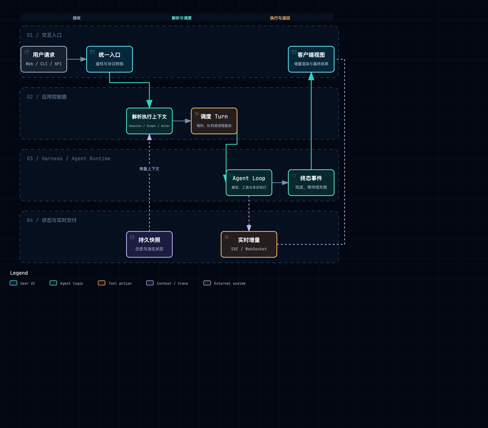
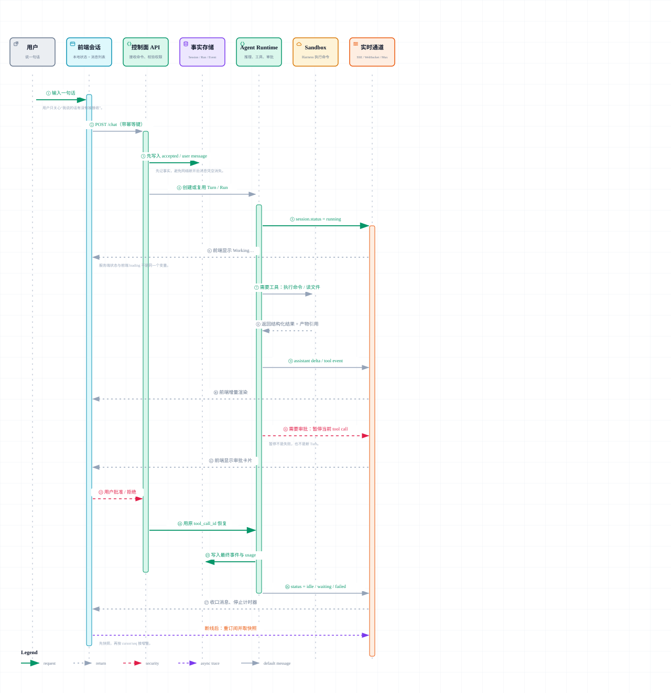

# 交互入口与实时通信

## 1. 这一模块到底负责什么

交互层负责把 Web、CLI、Slack 或 SDK 请求转换成应用内部统一的 Session / Turn 输入，并把执行事件返回给客户端。这里要同时分清三条路径：

- **命令路径**：创建 Session、发送消息、停止任务、提交审批。
- **事实路径**：消息、工具调用、审批和终态怎样持久化。
- **实时路径**：token、状态变化和日志怎样低延迟推送。



附件：[SVG 矢量图](../diagrams/module-request-turn-flow.svg) · [HTML 交互图](../diagrams/module-request-turn-flow.html)

## 2. QM：多 Surface 进入同一个 Headless Core

### 2.1 入口和协议

QM 的 API 使用 TypeScript、Node.js、Fastify。src/api/server.ts 中的 createServer / buildFastify 负责建立 HTTP 服务、路由和前置 gate。gate 不只是普通登录校验，还会把 capability、actor、source auth 等入口信息转换成 Core 能理解的身份上下文。

Web、Admin、Portal 和 Slack 是不同 Surface。它们可以使用不同的展示协议，但不会各自实现一套 Agent Loop。src/api/app-turn.ts 的 createTurnMethods 把 Surface 行为收敛为 Turn 操作，再交给 App/Core。

~~~text
Web / Portal / Slack
  → Fastify route + gate
  → createTurnMethods
  → App / Orchestrator
  → Run Store 或直接执行
  → Session entries + Turn result
~~~

### 2.2 实时流怎样工作

src/runs/turn-stream.ts 的 createTurnStream 在进程内维护每个 Turn 的 snapshot、监听器和关闭状态。订阅者可以先读取已有 snapshot，再接收后续 push；慢订阅者或连接断开不会改变 Run 的业务状态。

生产执行并不由 TurnStream 保证。Run 进入 src/runs/run-store.ts，Worker 在 src/runs/worker.ts 中 claim 工作并维持 lease。也就是说：

~~~text
Run Store = 待执行工作与执行所有权
Session Store = 对话事实
Turn Stream = 当前进程的低延迟观察窗口
~~~

这种拆分使 API 进程重启或 SSE 断线不会把一次已经受理的 Turn 从事实层抹掉。

### 2.3 值得观察的细节

- createServer 前面的 gate 把入口安全放在 Surface 与 Core 之间，而不是写进 Prompt。
- Run 的 idempotency、claim、lease 和 terminal status 解决“谁执行”，TurnStream 解决“谁正在看”。
- 多 Surface 共享同一套 Actor、Conversation、Scope、Session 语义，因此 Slack 不是旁路系统。

## 3. Omnigent：Server、Host、Runner、Harness 四段协议

### 3.1 进程边界决定协议

Omnigent 的 omnigent/server/app.py 用 FastAPI 提供控制面 API。Server 保存 Conversation、Agent、Policy、Host 等产品对象，但具体 Harness 可以运行在另一台 Host 上。

omnigent/host/connect.py 的 HostProcess 与 Server 建立 WebSocket 隧道，并负责启动、观察 Runner。omnigent/runner/_entry.py 创建 Runner 应用，Runner 再通过 UDS 或 TCP 与 Harness 子进程通信。

~~~text
Browser
  → FastAPI Server
  → Host WebSocket tunnel
  → Runner HTTP app
  → HarnessProcessManager
  → Harness UDS/TCP endpoint
~~~

HTTP、WebSocket 和 UDS 在这里不是随意混用：HTTP 适合 API 语义，WebSocket 适合 Server 与远程 Host 的双向控制，UDS 适合同主机的一对一子进程通信。

### 3.2 SessionStream 的 snapshot + live tail

omnigent/runtime/session_stream.py 的 publish 把事件投递到当前进程内订阅者；subscribe 为订阅者建立有界队列。关键顺序是先注册订阅者，再读取 snapshot，然后消费 live tail，从而缩小“读完快照但尚未订阅”的空窗。

~~~text
subscribe(conversation_id)
  → 注册 bounded queue
  → 读取 Conversation snapshot
  → 输出 snapshot
  → 持续读取 live queue
  → close / overflow / disconnect
~~~

SubscriberOverflowError 说明该队列明确承认自己不是永久日志：消费者太慢时应中止并重新同步，而不是无限占用内存。Connection 之前的事件仍要从 Conversation Store 恢复。

### 3.3 值得观察的细节

- Server 里的 Conversation 是事实，Harness session id 只是外部 Runtime 的继续执行句柄。
- SessionStream 是 per-process 状态；多 Server 实例不能假设彼此自动共享订阅队列。
- Runner / Harness 的健康检查、父进程死亡检测和 idle timeout 属于执行载体生命周期，不等于 Conversation 终态。

## 4. DeepSeek Harness：事件日志先行，入口只是 Profile

DSH 没有把 Web API 固定成唯一中心。CLI、Web、Headless 和 SDK 都通过 Profile 装配 Cordis Context；真正的 Agent 行为由 ctx.session、ctx.agentLoop、ctx.tools 等服务承载。

SDK 边界由 packages/sdk/protocol、packages/sdk/server、packages/sdk/client 定义，典型宿主通信是按行传输的 JSON-RPC stdio。Web Profile 则把 Context 事件转换为 UI 可消费事件。

~~~text
CLI / Web / Host SDK
  → Profile boot
  → Cordis Context
  → Agent lifecycle events
  → Session append-only log
  → Projection / UI / JSON-RPC notification
~~~

DSH 的重要区别是：模型可见消息先进入 Session 日志，UI 再从 projection 得到当前视图。实时事件表达“日志发生了什么”，而不是创建第二份会话状态。packages/session/session-projection 负责把事件折叠成查询模型，packages/session/session-persistence-* 负责写入 JSONL 或 SQLite。

JSON-RPC 只解决宿主和 Harness 之间的请求、响应与通知关联；Session event id / revision 才解决断线后的业务恢复。

## 5. AI Manus：REST/SSE、Task 编排和两类事件

### 5.1 请求入口

backend/app/interfaces/api/session_routes.py 中的 chat 校验 Session 访问权后调用 TaskOrchestrationService.chat。后者不是简单调用 Agent：它会处理正在运行的任务、deferred input、运行时选择变化、Task 恢复和事件流连接。

~~~text
POST /sessions/{id}/chat
  → SessionAccessService
  → TaskOrchestrationService.chat
  → _accept_user_message / _ensure_task_for_session
  → AgentTaskRunner.run
  → FlowRuntime.send_to_agent
  → AgentRuntimeInstance.handle
~~~

审批入口 respond_approval 也回到同一个 TaskOrchestrationService，再由 FlowRuntime.dispatch_approval_response 投递到原 Agent，而不是伪造成新的普通用户消息。

### 5.2 完整事件和实时 delta

SessionEventPublisher.handle_session_event 处理 Runtime 事件：完整的业务事件进入 SessionEventService / PostgreSQL，再由 Delivery 层通知在线消费者。Redis Stream 也承担 Task 和 Mailbox 的跨协程/进程协调。

模型 token、thinking chunk 等 delta 主要用于 SSE 实时显示；可恢复的 Session 仍依赖完整事件和 Runtime checkpoint。

~~~text
Agent event
  → SessionEventPublisher
  → PostgreSQL session_event
  → EventDeliveryService / Redis
  → SSE consumer

LLM delta
  → realtime delivery
  → UI incremental rendering
~~~

这个结构已经避免把 token 流当数据库使用。不过 TaskOrchestrationService 同时处理 Session 生命周期、Task 恢复、deferred input、审批和 SSE，因而入口调用链比另外三个项目更长。

## 6. 横向对比

| 维度 | QM | Omnigent | DSH | AI Manus |
| --- | --- | --- | --- | --- |
| 主要入口 | Fastify + Surface plugins | FastAPI Server | Profile / SDK | FastAPI REST/SSE |
| 跨边界协议 | HTTP + Worker Store | WebSocket + HTTP/UDS | Context event + JSON-RPC stdio | HTTP/SSE + Redis |
| 实时载体 | TurnStream | bounded SessionStream | Context events | Redis / SSE delivery |
| 重连依据 | Session + Run Store | Conversation snapshot | Session log + projection | PostgreSQL events + checkpoint |
| 入口特征 | 多入口共用 Core | 远程执行边界清楚 | 宿主可替换 | 应用编排能力集中 |

## 7. 阅读结论

- 先找事实源，再看 SSE/WebSocket。实时通道能否丢弃，是判断边界是否正确的快速方法。
- snapshot + live tail 必须定义订阅顺序、游标和 overflow 行为。
- Surface 应只做身份、协议和展示转换；Session / Turn 语义要由 Core 统一。
- 跨进程协议越多，越要传播同一组 conversation/session/turn/tool-call 标识，否则日志无法串联。

## 8. 源码索引

- QM：src/api/server.ts、src/api/app-turn.ts、src/runs/turn-stream.ts、src/runs/run-store.ts、src/runs/worker.ts
- Omnigent：omnigent/server/app.py、omnigent/host/connect.py、omnigent/runner/_entry.py、omnigent/runtime/session_stream.py
- DSH：apps/cli/src/profile-boot.ts、packages/sdk/protocol/、packages/session/session-projection/
- AI Manus：backend/app/interfaces/api/session_routes.py、backend/app/application/turn/task_orchestration_service.py、backend/app/application/sessions/events/session_event_publisher.py

## 9. Turn 状态怎样和前端会话联动

可以把前端想成一个“看比赛的记分牌”：它不能自己猜比赛是否结束，只能根据后端发来的**快照、事件和游标**更新画面。一个可靠的链路通常是：先拿当前快照，再从快照的游标之后接收增量；重连时再次从游标追赶。`loading` 只是浏览器正在等，不是后端真正的 Turn 状态。



附件：[SVG 矢量图](../diagrams/turn-ui-state-sequence.svg) · [HTML 交互图](../diagrams/turn-ui-state-sequence.html)

四个项目的真实做法有明显差异：

### 9.1 QM：Run 是执行事实，Session 状态负责“现在是否忙”

QM 的前端或 Surface 先通过 `activeRunForThread` 判断某个 Thread 是否已有运行，再调用 `streamRunViaSse` 订阅事件；SSE 失败时可以 `pollRun`，而不是重新创建一次 Turn。`subscribeDeliveries` 还会接收由其他入口（例如 Slack 或 Cron）产生的 Run，因此当前浏览器不是唯一消息来源。

Run 完成后，`run-store` 的终态和 Session entries 都是可恢复事实；`turn-stream` 只是当前进程的低延迟窗口。Session 状态更新带单调时间戳，旧的 `working` 事件不能覆盖较新的 `awaiting_approval` 或 `idle`。所以 UI 至少要区分：

```text
queued/running       = 后端已受理，可能还没有可显示文本
awaiting_approval    = 需要用户做决定，不能当作失败
idle/completed       = 本轮不再生成新事件
disconnected         = 只是浏览器暂时没连上，不能直接改写后端状态
```

### 9.2 Omnigent：服务端状态与本地显示状态刻意分开

Omnigent 的 `chatStore` 同时维护服务端 `sessionStatus` 和本地 `status`。用户刚提交输入时，前端可以先显示 pending/optimistic 状态；只有收到 Server 的确认或 `session.input.consumed`，才把这条输入标成已接收。连接恢复后，Session snapshot 会覆盖本地临时值，避免“浏览器显示发送成功、Server 实际没收到”的假象。

单个 Session 的事件走 Session SSE/stream；用户级 Session 列表更新走 WebSocket。这样打开一个会话看正文、同时在侧栏看其他会话是否运行，是两条不同的订阅。等待用户输入、后台运行和已结束同样不是一个 `isRunning` 布尔值。

### 9.3 DSH：UI 订阅的是 Session 日志，不是进程内变量

DSH 由 resident `Session` 和 `SessionManager` 持有运行时，Mux/Host 负责把事件帧送到宿主。客户端发送 `session/subscribed` 时带上 `lastSeq`；如果服务端发现中间有缺口，会先重放日志或要求 resync，再继续 live tail。断线只会丢掉连接，不会删除 append-only Session event。

队列、steer、cancel 都是带 Session/Turn 标识的控制消息。前端显示“排队中”时，实际上是 Session 中存在尚未消费的输入；显示“停止中”时，服务端仍可能要等待当前 provider 清理，不能立即当作 `turn/end`。

### 9.4 AI Manus：SSE 交付与数据库事件通过 cursor 对齐

AI Manus 的 `sessionStore` 维护 `status`、`stopPhase`、当前 task 和 approval 状态；SSE 消费 `delivery_cursor`，后端从 PostgreSQL `session_event` 读取可恢复事实，再由 Redis delivery 把事件送到在线连接。前端按 event id 去重，重连时使用 cursor 继续，而不是把已有消息再绘制一遍。

停止操作会先进入 stopping/suppressed 阶段，抑制新的 delta，但不等于立刻取消所有后台工作；只有收到终止事件，UI 才变成 stopped。自动恢复只在 Session 仍是 active、没有等待输入/审批且 Task 仍可继续时触发。这个细节能避免浏览器刷新后把一个已经等待审批的任务错误地重新启动。

### 9.5 读图时要问的五个问题

1. 第一次打开页面拿到的快照，是否包含事件游标或版本号？
2. “已发送”是前端乐观状态，还是 Server 已持久化的事实？
3. SSE/WebSocket 断开后，怎样知道从哪里继续，怎样去重？
4. 慢客户端或事件队列溢出时，是阻塞生产者、丢弃事件，还是要求重新同步？
5. `awaiting_approval`、`waiting_input`、`background` 和 `completed` 是否能在 UI 中区分？

如果这五个问题回答不清，前端看起来“能流式输出”也不代表会话运行状态是可靠的。

[返回架构总览](../architecture.md)
