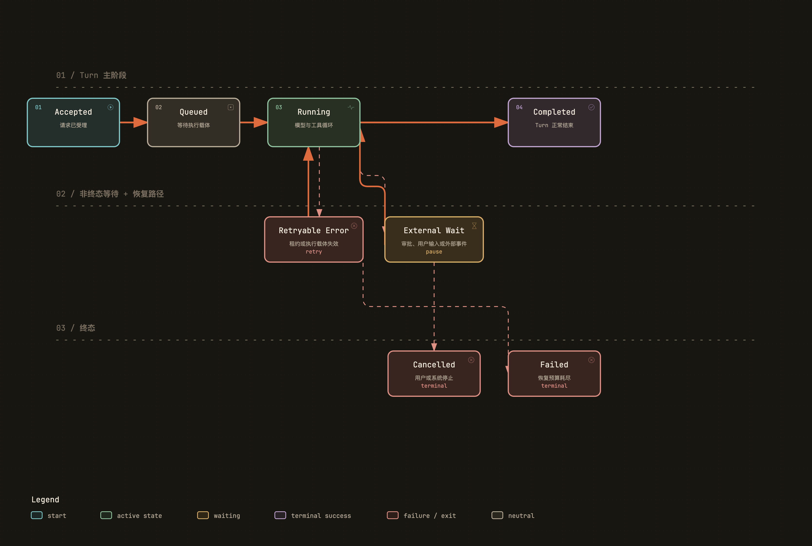
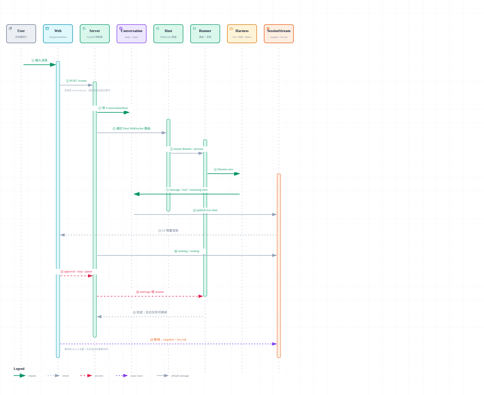
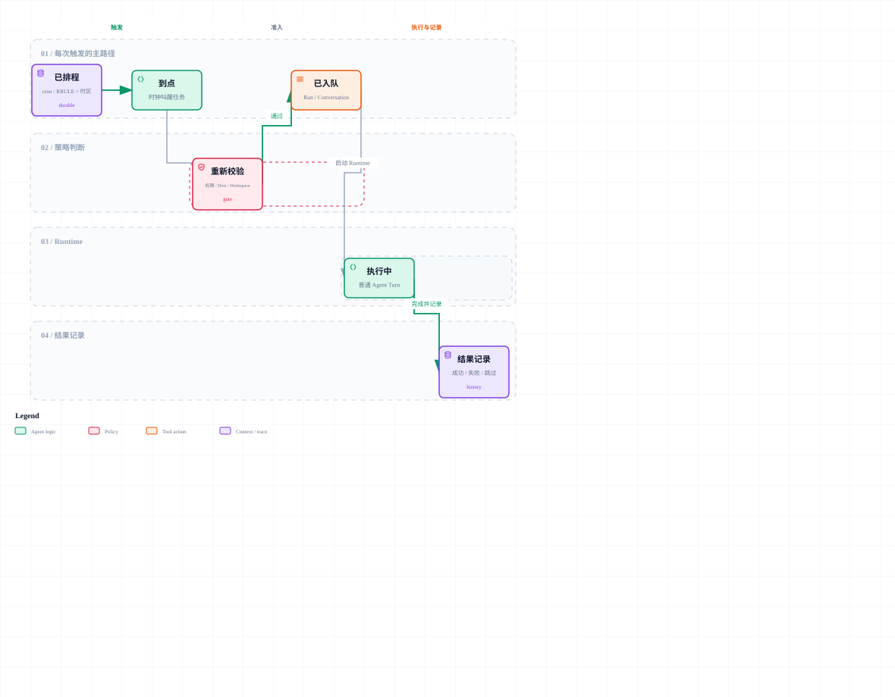

# 应用核心与 Session / Turn 生命周期

## 1. 比较口径

Session 是跨多轮存在的业务上下文，Turn 是一次用户驱动的执行，Step 是 Turn 内一次模型或工具推进；Worker、Runner、进程、容器和 Agent 实例只是执行载体。它们必须有不同的标识、终止条件和恢复规则。

附件：[SVG 矢量图](../diagrams/module-session-turn-lifecycle.svg) · [HTML 交互图](../diagrams/module-session-turn-lifecycle.html)

| 通用概念 | QM | Omnigent | DSH | AI Manus |
| --- | --- | --- | --- | --- |
| 长期上下文 | Scope + Session | Conversation | Session | Session |
| 一次执行 | Turn / Run | Conversation turn / items | Turn | Task / Turn |
| 内部推进 | Harness events | Harness events | Step events | Agent loop iteration |
| 执行载体 | Worker + Harness | Host + Runner + Harness | Agent Loop provider | TaskRunner + FlowRuntime |

## 2. QM：Session 事实与 Run 调度分开

src/runs/run-store.ts 把 Run 建模为 pending、running、done、failed，并保存 attempts、maxAttempts、leaseExpiresAt 和 delivery state。Worker 的 createWorker 循环 claim Run，processRun 调用 App.turn，heartbeat 维持租约；reaper 处理租约过期。

~~~text
enqueue Run
  → Worker claim + lease
  → processRun
  → App.turn / Orchestrator
  → append Session entries
  → mark done / failed
  → deliver result
~~~

Session Store 保存对话条目，Run Store 保存调度状态。因此 Worker 崩溃只会让 lease 失效，不会删除 Session。是否重试由 Run attempt 和 error parking 决定，避免把无限重试偷偷藏进 Worker。

Orchestrator 执行前解析 Actor、Conversation、Scope 和项目 roster；执行中把 user、thinking、assistant、tool_call 等条目附加到 Session。审批或等待输入不是 Session 结束，而是 Turn 的可恢复停点。

值得注意的是 ToolLedger：如果工具已经产生副作用但 Worker 尚未完成 Run，恢复时不能只凭“Run 仍未完成”就再次执行。Ledger 为调用提供 begin / complete 的账本接口。

## 3. Omnigent：Conversation 是事实，进程按 Conversation 管理

omnigent/entities/conversation.py 的 Conversation 保存 parent/root、agent、status、外部 runtime session id 等元数据；ConversationItem 用区分联合类型表示 message、function_call、function_call_output、reasoning、compaction、terminal command 等内容。

~~~text
Conversation
  → Runner routing decision
  → HarnessProcessManager.ensure process
  → HarnessApp / TurnContext
  → stream ConversationItem
  → persist item + update live status
~~~

HarnessProcessManager 为 conversation_id 计算独立 socket / endpoint，跟踪 subprocess entry、idle timeout 和连接状态。Runner 消失后可以根据 Conversation 和 external session id 重建执行环境；进程 PID 不是 Conversation 身份。

取消或注入新输入必须从 Server 穿过 Runner 到 Harness。Harness scaffold 里的 TurnContext 维护当前请求上下文、pending input / approval 和事件发送；它让不同 Harness 在相同的 Conversation 语义下暴露能力，但不会假装所有 CLI 都具备完全相同的 resume 行为。

## 4. DeepSeek Harness：生命周期本身就是事件协议

docs/agent-lifecycle.md 定义了清晰的事件顺序。典型 Turn 会经历：

~~~text
turn/start
  → inbox claim
  → agent/pre-step
  → step/start
  → session projection
  → agent/request
  → assistant chunks / tool calls
  → tool execution
  → step/end
  → next step 或 turn/end
~~~

packages/core/session 定义 append-only Session 服务，packages/core/agent-loop 消费 Session projection 并产生新事件。Loop 是状态推进器，不是唯一事实源。

session-checkpoint-policy、session-persistence 与 projection 组合出 crash recovery：写入事件后才能把某一步视为已提交；重启时读取 revision、重建 projection，再从合法生命周期节点继续。Fork 本质上是创建引用或复制到某个 revision，而不是拷贝一个活进程。

DSH 的优点是暂停、resume、replay 和测试都围绕同一事件协议展开；代价是插件必须遵守事件顺序和 invariant，否则局部事件会破坏整个 projection。

## 5. AI Manus：Session、Task、Flow、Agent Instance 四层

TaskOrchestrationService.chat 首先决定复用、恢复还是创建 Task。_ensure_task_for_session 会检查 Sandbox、未完成执行、pending input 和 runtime selection；AgentTaskRunner 再为 Session 建立 Flow 与执行组件。

~~~text
Session
  → TaskOrchestrationService
  → Task
  → AgentTaskRunner
  → FlowRuntime
  → AgentRuntimeInstance
  → AgentBase reasoning / acting / reply
~~~

FlowRuntime 保存 AgentRegistry、MailboxRouter、实例映射和 agent loop tasks。ensure_agent_instance 创建或恢复实例，ensure_agent_loop 启动 mailbox consumer，_serve_agent 依次处理投递事件。AgentRuntimeInstance.handle 负责把 MessageEvent / ApprovalResponseEvent 注入 AgentBase。

AgentBase 会保存 current tool batch、approval batch、trace context 和 runtime checkpoint。AgentTaskRunner._suspend_for_approval 把当前 Task 暂停；respond_approval 恢复同一批调用。这样审批不是一个新 Turn，也不会丢失原 tool_call_id。

当前层次已经完整，但生命周期责任分布较广：

- TaskOrchestrationService 管应用级创建、恢复、停止和删除。
- AgentTaskRunner 管一次执行所需组件和 Turn 收尾。
- FlowRuntime 管多 Agent 实例与消息循环。
- AgentRuntimeInstance / AgentBase 管单 Agent 推理与工具状态。

理解 Bug 时必须先确认问题属于哪一个寿命层，不能把所有“running”都当成同一状态。

## 6. 状态与失败语义对照

| 问题 | QM | Omnigent | DSH | AI Manus |
| --- | --- | --- | --- | --- |
| 谁取得执行权 | Run claim + lease | Runner / process routing | lifecycle provider | Task runner / agent loop |
| 审批等待 | durable pending + ledger | pending approval / policy state | interaction event | approval batch + checkpoint |
| 进程崩溃 | lease 回收 | 重建 Harness process | replay revision | 恢复 Task/Flow/Agent records |
| 会话终止 | Session 仍可保留 | Conversation status | turn/end，不等于删除 Session | finalize Task，Session 保留 |
| 防止副作用重放 | ToolLedger | tool result replay / ids | event + provider contract | current tool batch + result events |

## 7. 阅读结论

- 状态机要描述业务状态；PID、WebSocket 连接和 UI loading 是载体状态。
- Approval 和 waiting input 是非终态，恢复必须命中原始调用。
- “重启一个 Worker”与“重放一个工具”风险完全不同，后者要有账本或幂等语义。
- Session 删除是跨资源操作：数据库、Mailbox、Agent records、Sandbox 和 Artifact 都要有明确 owner。

## 8. 源码索引

- QM：src/runs/run-store.ts、src/runs/worker.ts、src/runs/reaper.ts、src/runs/tool-ledger.ts、src/core/orchestrator.ts
- Omnigent：omnigent/entities/conversation.py、omnigent/runtime/harnesses/process_manager.py、omnigent/runtime/harnesses/_scaffold.py
- DSH：docs/agent-lifecycle.md、packages/core/agent-loop/、packages/session/session-checkpoint-policy/
- AI Manus：backend/app/application/turn/task_orchestration_service.py、agent_task_runner.py、backend/app/agent_runtime/flows/flow_runtime.py

## 9. 四个项目的一次 Turn：把“谁在做、做到哪、谁能继续”画出来

下面四张图都只画一个 Turn，读图时可以把它想成“写作业”：用户交作业（input），老师分配一个执行者（Run/Runner/Session），执行者可能查资料或问你要授权（tool/approval），最后把结果写回作业本（event/store）。浏览器刷新时，系统应该能从作业本继续，而不是假装从头开始。

### 9.1 QM：入口先产生 Run，再由 Worker 持有执行权

附件：[SVG 矢量图](../diagrams/qm-turn-ui-sequence.svg) · [HTML 交互图](../diagrams/qm-turn-ui-sequence.html)

QM 的关键顺序是：Surface 调用 Core → 创建带幂等键的 Run → Worker claim 并续 lease → Harness 逐步执行 → Session entries/Run terminal 写回 → TurnStream 或 SSE 通知观察者。浏览器只负责订阅和展示；Cron、Slack 或另一个浏览器也可以产生同类 Run。

### 9.2 Omnigent：Conversation 事实不等于 Harness 进程

附件：[SVG 矢量图](../diagrams/omnigent-turn-ui-sequence.svg) · [HTML 交互图](../diagrams/omnigent-turn-ui-sequence.html)

Omnigent 的 Server 接收输入并记录 Conversation item，随后把执行路由给 Host/Runner 上的 Harness。Harness 的 external session id 允许继续执行，但 Conversation 才是产品层事实。前端的 optimistic input 只有在 `session.input.consumed` 后才算真正被 Runner 消费；Runner 崩溃时，Server 仍可从 Conversation snapshot 告诉用户发生了什么。

### 9.3 DSH：Turn 是事件协议中的一段生命周期

附件：[SVG 矢量图](../diagrams/dsh-turn-ui-sequence.svg) · [HTML 交互图](../diagrams/dsh-turn-ui-sequence.html)

DSH 先 append `turn/start`，之后每个 step、assistant chunk、tool call/result 和 `turn/end` 都是 Session event。projection 再把这些事件折叠成前端/模型需要的视图。连接断开时，客户端带 `lastSeq` 重新订阅；因此“重新显示”是从日志重放，不是从某个内存中的 Agent 对象复制。

### 9.4 AI Manus：Task/Flow 让一个 Session 可以继续多个执行阶段

附件：[SVG 矢量图](../diagrams/ai-manus-turn-ui-sequence.svg) · [HTML 交互图](../diagrams/ai-manus-turn-ui-sequence.html)

AI Manus 由 TaskOrchestrationService 决定是复用现有 Task、恢复中断 Task 还是新建 Task；AgentTaskRunner 启动 FlowRuntime，FlowRuntime 再把消息投给 AgentRuntimeInstance。审批等待不会创建一个新用户 Turn，而是把原 tool batch 留在 checkpoint 中，等 `respond_approval` 继续。PostgreSQL event 是恢复依据，Redis/SSE 只是把更新尽快送到页面。

## 10. 定时任务：时间到了，不是“把旧 Turn 硬拽回来”

附件：[SVG 矢量图](../diagrams/scheduler-workflow.svg) · [HTML 交互图](../diagrams/scheduler-workflow.html)

把定时任务想成闹钟：闹钟规则是持久配置，响铃时要创建一次**新的、可追踪的执行**，不能只在数据库里写“应该做过了”。四个项目的实现边界不同：

| 项目 | 规则和触发 | 一次 fire 的执行 | 需要特别注意的行为 |
| --- | --- | --- | --- |
| QM | `CronStore` 保存规则；队列/lease/worker 负责抢占 | 每次 fire 建立新的 Run，通常使用新的 Thread/Scope 语义 | startup reconcile、leader lease、重复 fire 幂等、Workspace/权限再次校验 |
| Omnigent | 数据库保存 RRULE；进程内 timer 自我 re-arm | 创建 run record，并按 Host/Workspace 条件把任务交给 Runner | 不重放错过的 fire；重叠时跳过；约 30 秒 grace；连接的 Host/Workspace 必须仍可用 |
| DSH | schedule 是 Session-local 的持久事件/配置 | 只有 Session 重新打开且 provider 可用时才执行 | at-least-once 语义可能在重启窗口重复；不打断当前 Turn；需要处理 overdue |
| AI Manus | 当前源码中未发现已接通的 Scheduler 主链 | 暂无可确认的“规则→fire→Task”实现 | 不能因为有 background task 或通用 hook，就宣称已经支持定时任务 |

读任何 Scheduler 代码，都先找这六个问题：规则是否持久化、谁计算下一次时间、进程重启会不会补发、同一时间是否允许重叠、fire 时是否重新检查权限/资源、每次 fire 如何和 Session/Run/Task 关联。尤其要把“定时规则”与“本次执行”分开，否则取消规则时很容易误删已经开始的执行。

## 11. 一个适合初学者的状态表

| 看起来的文字 | 实际含义 | 页面能否直接当作结束 |
| --- | --- | --- |
| queued | 已进入系统，但还没有执行权 | 不能 |
| running | 某个 Runner/Harness 正在推进 | 不能 |
| waiting_input / awaiting_approval | 等人补信息或做决定 | 不能，这是可恢复的暂停 |
| stopping | 收到停止请求，正在清理当前 provider | 不能，仍可能有收尾事件 |
| completed | 事实层已经写入终态 | 可以 |
| failed | 以结构化错误结束；是否可重试要另看 | 可以，但不能自动假设重试安全 |
| disconnected | 浏览器没有连接 | 不能，它不是后端状态 |

同一个 Session 同时可能存在一个“前台 Turn 正在等审批”、一个“后台 Task 正在跑”和一个“页面断线”的组合。模块分析时因此要分别记录业务状态、执行载体状态和观察者连接状态。

[返回架构总览](../architecture.md)
