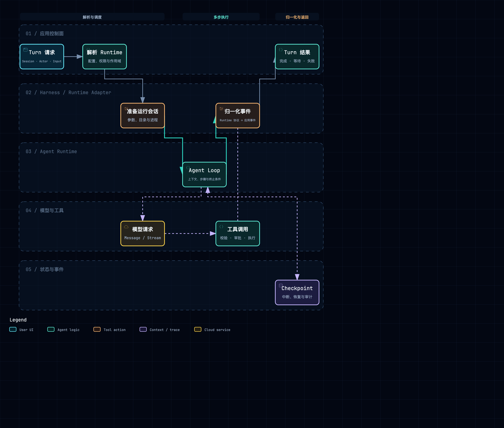

# Harness、Agent Runtime 与模型调用

## 1. 模块边界

这一层把应用层的 Turn 转换成模型—工具循环。稳定边界通常至少包含：输入上下文、模型/能力选择、取消与 steering、统一事件、终态结果，以及可选的 compact / resume。

附件：[SVG 矢量图](../diagrams/module-harness-runtime-execution.svg) · [HTML 交互图](../diagrams/module-harness-runtime-execution.html)

## 2. QM：Core 外挂多个 Harness

src/harness/harness.ts 的 HarnessTurnInput 是 Core 到 Runtime 的核心 contract。它不只包含 prompt，还包含 session、sandbox handle、tool/approval context、model、历史和控制信息。HarnessTurnResult 返回规范化 outcome 与 entries。

Harness 还声明 adapter profile：

- controlTransport：in-process、SDK、HTTP、JSON-RPC、API 等。
- toolTransport：plugin、dynamic、in-process MCP、MCP 等。
- capabilities：abort、steer、images、thinking-level、fast-mode、provider-sessions。

src/harness/harness-router.ts 的 resolveRuntimeChoice / createHarnessRouter 根据 scope 配置、默认值和持久选择找到具体 Harness。

~~~text
Orchestrator
  → resolveRuntimeChoiceDurable
  → Harness Router
  → Codex / Claude / Pi / OpenCode adapter
  → adapter.run(input)
  → normalized entries + outcome
~~~

Core 不直接理解某个 CLI 的 JSON 事件；各 adapter 把 assistant delta、tool call、approval、usage 和终态变成 Session entry。Capabilities 又避免统一接口退化成“最低共同能力”：Core 可以先查询是否支持 steer 或 provider session。

模型调用大多由具体 Harness 掌握，因此 QM 的 Core 更像产品编排器。Core 负责 Scope、Sandbox、Memory、Skills 和治理，Harness 负责其原生 loop。边界风险是 adapter 泄漏：如果 Orchestrator 根据某个 CLI 的内部状态写大量条件分支，多 Harness 抽象就失去意义。

## 3. Omnigent：Meta-Harness 与进程级 Scaffold

Omnigent 把 Harness 看成可独立运行的服务。HarnessProcessManager 为每个 Conversation 启动 Python module 或外部命令，等待 UDS/TCP 绑定，再把 endpoint 提供给 Runner。

omnigent/runtime/harnesses/_scaffold.py 的 HarnessApp 和 TurnContext 统一以下协议：

- 输入消息和 Conversation 上下文；
- MessageEvent、ToolResultEvent、ApprovalEvent、PolicyVerdictEvent、InterruptEvent；
- SSE 编码与终态关闭；
- pending input、approval 和 tool result replay。

~~~text
Server routing
  → Runner create_app
  → HarnessProcessManager.get_or_start
  → HarnessApp turn endpoint
  → concrete Harness adapter
  → Scaffold events
  → Runner / Server Conversation items
~~~

这层比 QM 更“重”，因为它同时跨进程、可能跨主机。好处是已有 CLI 能保持自己的依赖和 session；代价是必须处理 socket、健康检查、父进程死亡、idle cleanup、environment 和版本不匹配。

external runtime session id 用于恢复具体 Harness 的对话，但产品的 Conversation 仍保存在 Server。两者失配时，平台必须决定重新开始 Harness session、报告能力丢失，还是拒绝恢复，而不能静默生成错误历史。

## 4. DeepSeek Harness：Harness 内部全部服务化

DSH 本身就是原生 Harness，不再包一层多 CLI Router。Cordis Context 中的核心服务大致是：

~~~text
ctx.session      追加与读取事件
ctx.systemPrompt 组合提示词 section
ctx.llm          发送模型请求
ctx.tools        注册、列举和执行工具
ctx.agentLoop    推进 Turn / Step
ctx.approval     处理用户许可
~~~

packages/core/agent-loop 的 Loop 从 Session projection 获取模型可见历史，触发 agent/request，消费 LLM stream，把 assistant 与 tool call 写回 Session，再进入工具 pipeline。模型 Provider 在 packages/llm/*，Loop 只依赖 ctx.llm contract。

~~~text
turn/start
  → project Session to messages
  → compose system prompt
  → ctx.llm request
  → append assistant/tool-call events
  → ctx.tools pipeline
  → append tool results
  → next Step / turn/end
~~~

DSH 的可替换点在 Harness 内部：模型、工具、compaction、Sandbox、Session persistence 都是插件服务。它不需要为每个 Provider 再造产品层协议，但必须控制插件顺序、waterfall 结果和 Scope dispose。

## 5. AI Manus：自研 Native Harness

AgentBase 是单 Agent loop 的核心。__call__ 建立一次执行，reasoning 组装消息并调用 LLM，acting 分析 ToolBatch、发起审批或执行工具，reply 产生最终回复。ask_with_messages_stream 统一模型流，SessionMemoryManager 接收规范化消息。

~~~text
AgentRuntimeInstance.handle
  → AgentBase.__call__
  → reasoning
      → system prompt + session memory
      → LLM port / OpenAI adapter
  → acting
      → ToolManager.analyze_batch
      → approval 或 invoke
  → append result
  → 下一轮 reasoning 或 reply
~~~

AgentRuntimeInstance 位于 AgentBase 外层，负责 mailbox event 到 Agent 调用的转换、运行状态、runtime context、输出事件和后台 Bash 收尾。FlowRuntime 再管理多个 Instance。

LLM 通过 backend/app/agent_runtime/ports/llm.py 抽象，OpenAI 兼容实现位于 infrastructure/external/llm/openai_llm.py。usage_normalizer 与 thinking_response_parser 处理 Provider 差异，使 AgentBase 不直接依赖某个响应对象。

Native Harness 的控制力最强：Prompt、Tools、Skills、Approval、Checkpoint 都能按产品需求协同。维护面也最大，尤其是模型流中断、tool call 配对、context compaction 后的消息合法性和审批恢复，全部需要项目自己定义。

## 6. 具体差异

| 维度 | QM | Omnigent | DSH | AI Manus |
| --- | --- | --- | --- | --- |
| Harness 形态 | 多外部 Runtime adapter | 独立进程式 Meta-Harness | 插件化原生 Harness | 自研 Native Harness |
| Loop owner | 具体 Harness | Harness process | ctx.agentLoop | AgentBase |
| 产品/Runtime 边界 | HarnessTurnInput/Result | HTTP/UDS + Scaffold events | Context services/events | Instance event + ports |
| 能力差异 | capability profile | Harness/AgentSpec 能力 | Provider 是否安装 | Tool/Flow/Mode 配置 |
| 恢复句柄 | Session + provider session | Conversation + external session | Session revision | checkpoint + Agent records |

## 7. 阅读结论

- 先判断目标是“复用外部 Harness”还是“自研 Loop”，两者需要的抽象不一样。
- 多 Harness contract 应显式声明能力差异，不能用大量 runtime name 判断替代。
- 原生 Loop 的关键不是 while 循环，而是模型消息合法性、工具副作用、暂停/恢复和事件提交顺序。
- 控制面 / 执行面描述部署所有权；Core / Harness 描述代码责任，两组边界不必一一对应。

## 8. 源码索引

- QM：src/harness/harness.ts、src/harness/harness-router.ts、src/core/orchestrator.ts、各 Harness adapter
- Omnigent：omnigent/runtime/harnesses/_scaffold.py、process_manager.py、omnigent/runner/_entry.py
- DSH：packages/core/agent-loop/、packages/core/session/、packages/llm/、docs/agent-lifecycle.md
- AI Manus：backend/app/agent_runtime/core/agent_base.py、agent_runtime_instance.py、ports/llm.py、infrastructure/external/llm/

## 9. Runtime 能力不是“有或没有”，而是一张能力清单

初学者可以把 Harness 当成“会做题的机器人”。不同机器人会的动作不一样：有的能暂停，有的能继续同一场对话，有的能看图片，有的只能收到纯文字。应用在交给它任务前，最好先看清能力，而不是调用失败后才猜原因。

| 能力 | QM | Omnigent | DSH | AI Manus |
| --- | --- | --- | --- | --- |
| 流式文本 | adapter 统一转成 entries | Scaffold/Runner 事件 | LLM stream → Session event | LLM stream → SSE/delta |
| 中途取消 | 由 adapter profile 声明 | process interrupt / cleanup | agentLoop/provider contract | stopPhase + cancellation |
| 中途追加指令 | 取决于 Harness capability | pending input / session control | queue/steer 事件 | deferred input / mailbox |
| 原生会话句柄 | provider session 可选 | external session id | Session revision | checkpoint + Agent records |
| 工具与审批 | Core/Harness contract | Runner policy + Harness event | ctx.tools / ctx.approval | ToolBatch + approval batch |
| 图片/多模态 | capability profile | 由具体 Harness 声明 | LLM/provider 能力 | OpenAI 兼容消息能力 |

一次完整调用至少要传播以下标识：`session_id`、`turn_id`、`step_id`、`tool_call_id`、`run_id`（若存在）和 `trace_id`。少了其中任何一个，都会出现“前端知道有事件，却不知道它属于哪一次工具调用”的串线问题。

还要把**模型调用**与**模型会话**分开：

- 一次 HTTP LLM 请求是网络调用，可能很快结束；
- 一个 Harness session 是继续上下文的句柄，可能跨多个 Turn；
- 一个产品 Session 是用户看见的长期事实，不能因为 Harness 进程退出就消失。

QM 主要用 adapter 把外部 Runtime 的差异压平；Omnigent 再加一层跨进程 Scaffold，承担更强的启动与健康管理；DSH 把能力拆成 Cordis services；AI Manus 则把能力集中在 Native Harness 内，因此最容易做出贴合产品的行为，也最需要自己维护每一种状态和恢复协议。

[返回架构总览](../architecture.md)
