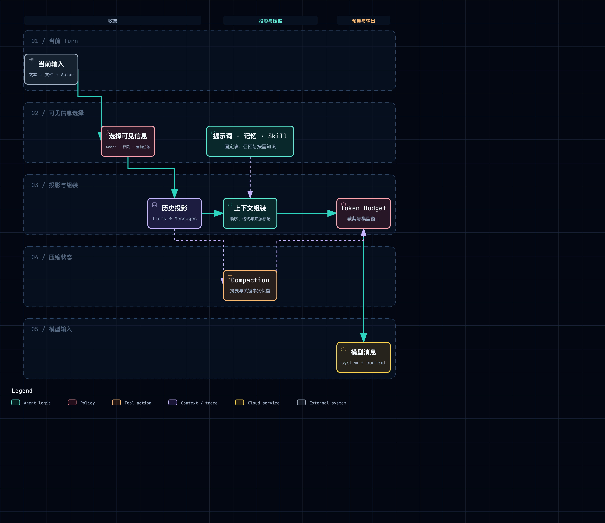

# Context、Prompt、Memory 与 Skills

## 1. 四个概念不要混在一起

- **Prompt**：最终发送给模型的指令和消息形态。
- **Context**：当前模型调用能看到的全部信息集合。
- **Memory**：可以跨 Turn 或跨 Session 召回的状态。
- **Skill**：可发现、按需读取的程序化知识和资源。

附件：[SVG 矢量图](../diagrams/module-context-assembly.svg) · [HTML 交互图](../diagrams/module-context-assembly.html)

最终模型输入通常由 system sections、Session projection、当前输入、Memory recall、Skill catalog、工具 schema 和 compaction 结果组成。安全策略不能只存在于 Prompt。

## 2. QM：Scope-first 的上下文构造

QM 的 Orchestrator 先解析 Actor、Conversation、Scope、audience 和项目资源，再决定模型可以看到什么。src/core/orchestrator/prompt-blocks.ts 把系统提示词拆成可组合 block，而不是维护一条巨型字符串。

~~~text
Actor + Conversation + Scope
  → 可见历史过滤
  → prompt blocks
  → Memory recall
  → Skill index / materialized files
  → Sandbox/environment facts
  → HarnessTurnInput
~~~

Session entry 还带 audience / visibility 语义。多人 Conversation 中并非所有历史都应进入每个 Agent 的上下文；Orchestrator 会处理 overheard、bystander、internal actor 等差异。这里的 Context 先是权限投影，再是 token 拼装。

Memory 是一等服务，具备 recall、capture 和策略层。代码与测试展示 per-turn、agent-only、scratch-promote、consolidation 等策略：capture 可以异步进行，recall 结果在后续 Turn 注入，而不是把所有历史直接当长期记忆。

Skills 通过 skill store、sync engine 和 materializer 进入 Scope。materialize.ts 分开生成 index 和完整 tree，并使用 hash/marker 避免无变化重写。典型策略是：

~~~text
Skill metadata → 轻量 index 进入 Prompt
模型决定需要某项 Skill
  → lazy read 或 materialized path
  → 读取 SKILL.md / 附件
  → 内容进入当前 Step
~~~

Compaction 位于 Orchestrator 的历史处理链，摘要必须与保留的尾部 entries 一起形成可继续执行的输入。

## 3. Omnigent：AgentSpec 声明，Harness 最终解释

AgentSpec / Agent entity 决定 Harness、模型、framework instruction、tools、policy 和相关资源。Server 把规范发送到 Runner，Runner 解析具体 Harness；因此产品控制面能声明上下文，但最终消息格式仍由 Harness adapter 决定。

ConversationItem 是上下文事实。MessageData、FunctionCallData、FunctionCallOutputData、ReasoningData、CompactionData 等类型使历史不必先压成纯文本。compaction item 可以替换模型可见前缀，同时原 Conversation 仍有持久记录。

~~~text
AgentSpec
  + Conversation items
  + runtime session id
  + current user input
  → Runner / Harness scaffold
  → concrete Harness prompt/session
~~~

Skills 使用 load_skill、read_skill_file 等内建工具按需展开。模型先看到可用 Skill 信息，再读取正文和资源。这样新增 Skill 不会线性增加每次请求 token。

Omnigent 没有要求所有 Agent 必须使用同一个长期 Memory 实现。hindsight 等工具可作为外部能力接入；这说明 Memory 在该架构中更像可选 Provider/Tool，而不是 Conversation 的必要组成。

实现难点在能力差异：某些外部 Harness 自己维护会话和 compaction，另一些依赖平台传入历史。Scaffold 需要保存 external session id 并避免同时让平台和 Harness 对同一历史重复压缩。

## 4. DeepSeek Harness：Session projection + 可组合 systemPrompt

packages/core/system-prompt 提供 ctx.systemPrompt 服务。插件注册 section，最终按 Context Scope、优先级和当前能力组合。时间、工作区、Agent instruction、Skill catalog 都可以是独立 section。

模型历史来自 packages/session/session-projection，而不是 Agent Loop 内的 messages 数组。projection 把 append-only event 折叠成 LLM messages，并处理 assistant stream、tool call/result 配对、compaction 和 reference。

~~~text
Session log
  → projection registry
  → model-visible messages

systemPrompt sections
  + Skill catalog
  + current environment
  → composed system prompt

两者 + 当前输入
  → ctx.llm
~~~

Compaction 是 packages/compaction 下的 Provider。basic compaction 生成摘要，tool-result-pruner 可只裁剪大工具结果；不同 Provider 可以组合，说明“压缩历史”和“删除高体积结果”是两个策略。

Skill 由 packages/skill/skill、skill-filesystem、tool-skill 组合：filesystem Provider 发现 Skill，system prompt 暴露目录，tool-skill 读取正文。Memory 并非最小 Core 的固定服务；CLI 示例可通过 MCP 配置 Memory。这与 QM 的一等 Memory 形成明确差异。

Cordis Scope 让 child Context 可以覆盖 Prompt section 或 Skill Provider，dispose 时撤销注册。灵活性很高，但 Context 最终内容要通过 inspect/telemetry 才容易解释。

## 5. AI Manus：YAML Prompt、SessionMemory 和两级 Skill

Prompt 配置位于 backend/app/config/prompts。PromptLoader 读取 YAML，PromptModuleLoader 处理模块，PromptManager 按 mode/agent 渲染 system 与 next prompt。AgentBase._render_system_prompt 和 _render_next_prompt 是调用点。

SessionMemoryManager 保存模型消息和 usage；AgentBase 在 reasoning 前确保 memory，LLM 完成后追加 assistant/tool messages。ContextMeter、TokenEstimator 和 CompactManager 判断是否需要压缩，llm_summary 生成摘要，truncation 提供不能调用摘要模型时的裁剪机制。

~~~text
PromptManager.render(system)
  + SessionMemory.messages
  + latest request / runtime context
  + ToolManager schemas
  → context meter
  → optional CompactManager
  → LLM request
  → append normalized messages
~~~

SkillManager 通过 loader/parser 读取 SKILL.md，区分 preload 与 lazy。preload 内容可直接进入 Prompt；lazy Skill 只暴露目录，再由 base_tools/skill.py 读取。应用层的 Skill repository、授权和 DockerSkillProjector 又把已授权 Skill 投影进当前 Sandbox。

这里要准确区分：当前完整实现以 SessionMemory 为主，backend/app/agent_runtime/memory/long_memory 仍未形成与 QM 同等级的长期 Memory 主链。不能因为目录名存在就把长期召回描述成已完成功能。

Runtime checkpoint 还会保存 current tool batch、approval batch 与 trace context。它们是继续执行状态，不等同于模型 Memory，但恢复 Context 时必须一起考虑。

## 6. 横向对比

| 维度 | QM | Omnigent | DSH | AI Manus |
| --- | --- | --- | --- | --- |
| Prompt 组织 | Core prompt blocks | AgentSpec + Harness | systemPrompt sections | YAML + PromptManager |
| 历史来源 | Session entries + visibility | Conversation items | Session projection | SessionMemory / events |
| Compaction | Core 策略 | item + Harness 协作 | 可替换 Provider | CompactManager |
| 长期 Memory | 一等服务、多策略 | 可选外部能力 | 可选插件/MCP | 尚以 Session Memory 为主 |
| Skill | Store + materialize | load/read tools | catalog + filesystem/tool | preload/lazy + projection |
| 关键作用域 | Actor/Conversation/Scope | Agent/Conversation | Cordis Context | Project/Session/Agent |

## 7. 阅读结论

- Context 构造的第一步是可见性，不是 token 裁剪。
- Compaction 是有损投影；原始事实、摘要版本和继续执行所需工具状态要分开保存。
- Skill 最适合“目录常驻、正文按需加载”，并明确文件在哪个 Workspace 可读。
- Memory 是产品能力，不是一个名为 memory 的数组；必须说明写入触发、召回范围和冲突策略。

## 8. 源码索引

- QM：src/core/orchestrator.ts、src/core/orchestrator/prompt-blocks.ts、src/memory/、src/skills/materialize.ts
- Omnigent：omnigent/entities/agent.py、entities/conversation.py、runtime/compaction.py、tools/builtins/load_skill.py
- DSH：packages/core/system-prompt/、packages/session/session-projection/、packages/compaction/、packages/skill/
- AI Manus：backend/app/agent_runtime/prompts/、context/session_memory/、context/compact/、skills/

## 9. Skill 要不要上传到 Sandbox：先分清“存放”和“看见”

Skill 不是一段神奇的 Prompt，更像一本放在书架上的说明书。模型通常先看到书名和目录，只有决定要用时才读正文。这里有两个容易混淆的问题：

1. Skill 原文件存在哪里：代码仓库、数据库、对象存储、用户目录，还是 Runner 的缓存目录？
2. 当前执行环境能不能读到它：需要复制到 Sandbox，还是通过一个受控工具读取？

附件：[SVG 矢量图](../diagrams/skill-materialization.svg) · [HTML 交互图](../diagrams/skill-materialization.html)

四个项目的答案不是同一个：

### 9.1 QM：对 Scope 做受控 materialize

QM 的 Skill Store/Sync Engine 负责源内容，`materialize.ts` 按 Scope 生成轻量 index 和完整 tree，并用 hash/marker 判断是否需要重写。模型先从 Prompt 看到可用 Skill；真正需要时，Harness 或工具从 Scope 对应的受控路径读取 `SKILL.md` 和附件。

因此 QM 更接近“**需要让执行环境读文件时，就把授权后的 Skill 投影进 Scope Sandbox**”，但不是每个 HTTP 请求都上传一遍。Scope、Skill 版本和 materialized marker 要能对应起来，删除或换 Scope 时也要撤销旧内容。

### 9.2 Omnigent：优先使用 Runner 的 Skill cache / plugin 目录

Omnigent 通过 `load_skill`、`read_skill_file` 等内建工具按需展开。bundled agent bundle 会被解压到稳定的 Runner cache/plugin 目录；模型拿到目录或元数据后，再通过工具读取正文。当前证据更像“**Runner 侧受控缓存 + 工具读取**”，不能简单写成所有 Skill 都上传到通用 Sandbox。

如果某个 Harness 自己维护运行环境，Skill 还可能由 Harness adapter 解释；Server 只传 AgentSpec 和允许的资源。分析时要记录最终读取者是 Runner、Harness 还是 Sandbox service。

### 9.3 DSH：Provider filesystem 与 tool-skill 组合，不规定统一上传动作

DSH 的 filesystem Provider 发现 Skill，`systemPrompt` 暴露 catalog，`tool-skill` 再读取文件。文件可以来自 bundled、user、project 等不同 root，当前 Context 决定哪些 root 可见。因为 DSH 把文件系统和 Sandbox 做成可替换 Provider，所以本机运行可以直接读文件，E2B 等远程 Provider 才可能需要在启动时同步或挂载。

换句话说，DSH 定义的是“**可寻址、可授权地读 Skill**”，没有规定“每次都把 Skill 复制到某个固定目录”。这正是 Provider 解耦带来的灵活性，也要求每个 Provider 明确路径和清理语义。

### 9.4 AI Manus：存储仓库与 Docker 投影分成两步

AI Manus 的 Skill repository/loader/parser 先从项目配置和 `SKILL.md` 得到 Skill，`SkillManager` 决定 preload 或 lazy；授权后的文件再由 `DockerSkillProjector` 投影进当前 Docker Sandbox。模型通过 Prompt 看见 preload 内容或 lazy 目录，工具在 Sandbox 中读取可执行文件和依赖。

所以 AI Manus 当前是“**源 Skill 在应用侧，运行时副本在 Session Sandbox**”。源文件更新、Session 复用和容器重建时，必须重新判断 projector 的版本/授权，而不能只看容器里是否已经存在同名文件。

### 9.5 一个小检查表

| 问题 | QM | Omnigent | DSH | AI Manus |
| --- | --- | --- | --- | --- |
| 模型先看到什么 | index/metadata | catalog/tool description | catalog/system section | preload 或 lazy 目录 |
| 正文由谁读 | Scope materialized path / Harness | Runner tool / Harness | tool-skill + FS Provider | Skill tool / Docker path |
| 是否需要 Sandbox 副本 | 受 Scope 授权时通常需要 | 不一定，常见是 Runner cache | 由 Provider 决定 | 授权后投影到 Docker |
| 大附件怎样处理 | 受控 Skill tree/引用 | plugin/cache 资源 | filesystem root | Sandbox 文件 |
| 版本与清理 | hash/marker + Scope | cache/version + session | Provider dispose | projector + container lifecycle |

最重要的结论是：**“模型能读到”不等于“文件已经上传”；“文件在 Sandbox”也不等于“模型被允许读”。** 这三个概念要在实现和文档中分开。

[返回架构总览](../architecture.md)
