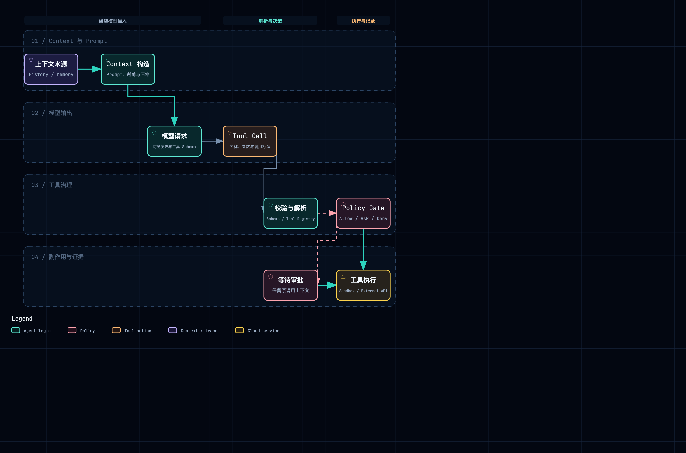

# Tools、MCP、Policy 与 Approval

## 1. 一次工具调用的完整链

工具模块不只是函数注册。完整路径至少包括发现、Schema、参数校验、Policy、Approval、执行位置、结果规范化、事件提交和恢复去重。



附件：[SVG 矢量图](../diagrams/module-context-tool-governance.svg) · [HTML 交互图](../diagrams/module-context-tool-governance.html)

MCP 只规定“怎样发现和调用外部工具/资源”，并不自动解决产品权限、用户审批、Sandbox、幂等和审计。

## 2. QM：Core primitive、外部 Harness 工具与 Ledger

QM 同时面对两类工具：Core 提供的 primitives，以及 Codex/Claude/Pi 等 Harness 自带工具。HarnessTurnInput 会携带工具展示和审批上下文，具体 adapter 再映射到 native tool、plugin 或 MCP transport。

~~~text
模型产生 tool call
  → Harness adapter 归一化
  → Core policy / primitive dispatch
  → 需要时创建 approval
  → Sandbox / connector / external API
  → ToolLedger complete
  → append tool result
~~~

src/runs/tool-ledger.ts 用 call id 记录 begin / complete，解决 Worker lease 失效后的副作用窗口。src/tools/primitives 下的工具通过统一 descriptor 进入 Core；connector 与 capability 决定某个 Actor/Scope 是否能看到和执行。

审批不只是 yes/no。QM 的 keychain/credential 视图、ACL、egress policy 和 sandbox route 共同决定是否允许；Slack approval card 只是审批交互 Surface。批准后仍需在原 Run、原 tool call 上继续。

MCP 可以作为 Harness 的工具传输方式，adapter profile 明确区分 in-process-mcp 与 mcp。这样 Core 知道工具是在当前进程、Sandbox 还是外部 server 执行。

## 3. Omnigent：ToolManager + Runner Policy Gate

omnigent/tools/manager.py 的 ToolManager 汇总 builtins、local callable、client-specified tools、MCP 和 UC functions。每项 Tool 具有输入 Schema 与执行方法；Runner 的 tool_dispatch 决定调用本地工具、MCP proxy 还是 Harness native tool。

~~~text
AgentSpec tool selection
  → ToolManager resolve
  → RunnerToolPolicyGate
  → allow / ask / deny
  → pending approval（如 ask）
  → Tool runner / MCP manager
  → ToolResultEvent
  → ConversationItem
~~~

Policy 有两层。runtime/policies/engine.py 负责通用规则状态和 policy dispatch；runner/policy.py 的 RunnerToolPolicyGate 把策略应用到具体 Tool Call，并输出 PolicyVerdict。deny 直接生成可回传结果，ask 创建 pending approval。

MCPManager / ProxyMCPManager 处理 server 生命周期、工具发现和跨 Runner 代理。工具输出经过 runtime/tool_output.py 规范化，大结果或文件不应直接塞进事件；tool_result_replay.py 用于恢复已产生的结果。

ApprovalEvent 与 PolicyVerdictEvent 是 Scaffold 的正式事件，所以 UI、Slack 或其他客户端可以采用不同审批界面，而 Runner 仍等待同一 approval id。

## 4. DeepSeek Harness：工具执行 Pipeline 是扩展协议

packages/core/tools 定义 ctx.tools 服务和 Tool Registry。docs/tool-execution-pipeline.md 把一次执行拆为 pre、execute、post、result 等事件/阶段，插件可以校验、修改参数、记录遥测或拦截。

~~~text
LLM tool_call event
  → ctx.tools resolve schema
  → pre-tool hooks / capability checks
  → user-approval service
  → Provider.execute
  → post/result hooks
  → append model-visible tool result
~~~

具体工具分散在 packages/fs/tool-fs、shell/tool-bash、web/tool-web、mcp/mcp-client 等包。FS、Shell 和 Subprocess 又依赖独立 Provider，因此工具定义不必知道自己运行在 local 还是 Sandbox。

Approval 位于 packages/interaction/user-approval。它是一个 service seam：Web Profile 可以弹 UI，Headless Profile 可以使用预设或拒绝。permission-presets 和 sandbox-policy 是不同层，前者描述用户许可，后者限制执行能力。

MCP Client 本身作为插件向 ctx.tools 注册远程工具。卸载 Context 时连接和注册由 Effect dispose 撤销，避免热重载后出现重复工具。

## 5. AI Manus：ToolBatch、权限配置和可恢复审批

ToolManager 分三步构建工具：build_base_tools、build_dynamic_tools、build_final_tools。基础工具包含 Bash、File、Plan、Todo、Interaction、Skill；项目 ToolGroup Builder 和 Agent Tool 再加入动态工具。

模型返回多个 tool call 后，analyze_batch 创建 ToolBatchItem，做 Schema/参数校验、ToolPermissionService 决策和审批分类。build_execution_groups 决定哪些调用可并行、哪些必须串行。

~~~text
LLM tool_calls
  → ToolManager.analyze_batch
  → validate + permission YAML
  → ApprovalBatch（若需要）
  → apply_approval_responses
  → ToolBatchExecutor / invoke_tool
  → ToolResult stream
  → Session event + memory
~~~

权限规则位于 backend/app/config/permissions/bash.yaml、file.yaml 等文件。ToolCallValidator 负责结构校验，ToolPermissionService 负责 allow/ask/deny。approval_workflow.py 的 build_approval_batch / apply_approval_responses 保留每个 item 的 tool_call_id，被拒绝的调用也会生成结构化 ToolResult，保证模型消息配对。

AgentBase 在发出 approval_request 前保存 current tool batch 和 approval batch；approval_response 恢复并继续未决项。AgentTaskRunner 随后清理 Turn 级 batch。这个顺序是恢复正确性的核心。

当前工具治理与 AgentBase/TaskRunner 联系较紧：ToolManager 分析，AgentBase 驱动审批，TaskOrchestrationService 接收用户响应，FlowRuntime 路由。它能工作，但阅读单次审批要跨多个层。

## 6. Web 能力工具补充：搜索、抓取与浏览器

这里的 Web 有两层含义：Web UI/会话入口已经在[交互与实时性](01-interaction-realtime.md)中分析；本节只补充“模型主动访问互联网”的工具能力。可以用下面这条链来阅读四个项目：

```text
模型 tool call
  → Web 工具 Schema
  → Policy / egress / 域名限制
  → 搜索提供方、HTTP 抓取器或浏览器运行时
  → 结果规范化（正文、来源、截图、错误）
  → ToolResult / Session event
```

### 6.1 QM：Browse Skill 承担浏览器能力，Core 不直接内置搜索工具

QM 当前没有在 `src/` 中发现独立的 `web_search`/`web_fetch` Core primitive。它把“需要操作网站”的能力放在 `skills-seed/browse/SKILL.md`：普通阅读优先用 `curl/wget`，只有登录、填表、点击、JavaScript 或反爬墙场景才启动远程 stealth browser；浏览器通过 CDP 连接 Kernel、Anchor 或 Browserbase，内部使用 browser-use + Chromium。

这条路径的特点是：

- 浏览器是 Skill 里的执行方案，不是每个 Harness 都必须实现的 Core 工具；
- provider key、模型 key、个人登录 profile 都有独立凭据要求，登录 profile 只允许在 DM 中使用；
- 文件上传、live view、CDP、最大步数和浏览器销毁都由 Skill 约束；
- `BrowserSessionStore` 按 `principalId` 加密保存 storage state，支持同一人的后续登录复用。

因此 QM 更像“通用 Core + 可插拔 Web 操作 Skill”：网络读取可以走 Sandbox/egress，复杂交互才进入昂贵的远程浏览器。需要继续关注的是 Skill 与 Core 的权限、成本和审计如何保持同一条事实链。

### 6.2 Omnigent：搜索、抓取、浏览器三种工具分别建模

Omnigent 在 `tools/builtins/` 中直接提供 `web_search`、`web_fetch` 和五个 `browser_*` 工具，工具 Schema 与真实执行位置是分开的：

- `web_search` 对 OpenAI 模型透传原生 `web_search_preview`；其他模型必须在 AgentSpec 明确选择 provider（如 DuckDuckGo、Google、Perplexity、Tavily），没有隐式默认值，配置错误会明确失败；
- `web_fetch` 不在父 Agent 进程里直接执行，而是由 Runner 启动 `__web_researcher` 子 Agent。子 Agent 继承父 Agent 的模型、Harness、Sandbox 和 egress 限制，用一次性 `curl`/Python 读取内容并返回来源 URL；
- `browser_navigate/snapshot/click/type/screenshot` 只有 Schema，真正执行由 Runner 发起 `browser/action_request`，Server 将请求发布到 Session stream，桌面 Renderer 认领后回传结果。`snapshot_id + ref` 用来拒绝过期元素引用，认领 token 和 30 秒超时避免重复执行或永久等待。

Omnigent 的分层很清楚：模型只看见稳定的工具名和结果，provider、子 Agent、浏览器 Renderer 分别在 Runner/Server/桌面侧替换。代价是一次浏览器调用要跨 Agent → Runner → Server → Renderer 多段链路，恢复、超时和 UI 不在线时的错误需要单独记录。

### 6.3 DeepSeek Harness：`ctx.web` 是提供方 seam，工具包只负责模型契约

DSH 把 Web 拆成两个包：`@deepseek-ai/dsh-tool-web` 负责 `web_search`/`web_fetch` 的名称、JSON Schema、提示词、结果卡片和 HTML→Markdown；`@deepseek-ai/dsh-web` 提供 `ctx.web` 服务、provider registry、选择策略和 `WebError`。当前实现覆盖 Exa、Perplexity、DeepSeek native search 和匿名 HTTP(S) fetch，但没有浏览器自动化。

它的几个关键取舍是：

- 搜索支持 1–4 个 query、结果数量上限、去重和引用 URL；抓取限制超时、正文字符数，并把非 2xx 作为结构化结果；
- provider 不可用时工具仍保持可见，执行阶段返回 `WEB_PROVIDER_*` 错误，而不是改变模型看到的 Schema；
- 工具不直接导入具体 provider，provider 选择、取消信号和错误分类只归 `ctx.web` 管理；
- Web 包本身没有专用 Approval/域名策略，部署侧需要在 `tools/pre-execute` 增加权限控制；HTTP fetch 当前也没有完整的 SSRF/私网防护和 PDF 分支。

DSH 的重点是“能力接口稳定、后端可替换、结果可组合”，适合把 Web 当作 Harness 的一项基础 Service，而不是把某个搜索厂商写死在 Agent Loop 中。

### 6.4 AI Manus：目前是间接访问，没有独立 Web 工具主链

AI Manus 当前 `base_tools` 注册的是 Bash、File、Interaction、Plan、Todo、Skill 等工具，没有发现已接入主链的 `web_search`、`web_fetch` 或浏览器工具实现。理论上 Bash Sandbox 可以执行 `curl`，但这只是通用命令能力，不会自动提供搜索 provider 选择、来源引用、网页快照、浏览器登录会话或 Web 专用错误类型。

所以在四项目对照中，AI Manus 应记录为“Web 能力尚未独立建模”：它现在依赖 Bash 是否允许网络访问；如果后续需要可靠的 Web 能力，就要再决定是沿用 Skill/命令方式，还是增加一个有明确 Schema、egress、结果引用和会话生命周期的 Web service/tool 层。本节先记录现状，不预先决定改造方案。

### 6.5 Web 能力横向对照

| 维度 | QM | Omnigent | DSH | AI Manus |
| --- | --- | --- | --- | --- |
| 搜索/抓取入口 | Browse Skill + `curl/wget` | 独立 `web_search` / `web_fetch` | 独立工具 + `ctx.web` | 当前无专用入口，主要靠 Bash |
| 浏览器自动化 | 有，远程 stealth browser | 有，Renderer 执行 `browser_*` | 当前没有 | 当前没有 |
| 提供方抽象 | Skill provider 文档与凭据 | AgentSpec 明确 provider | `ctx.web` registry/seam | 尚未抽象 |
| 结果形态 | Skill 返回文本/动作结果 | 搜索来源、抓取文本、浏览器快照/动作结果 | 结构化 result、引用、WebError | 普通命令 stdout/错误 |
| 主要安全关注 | DM-only profile、密钥、egress、销毁浏览器 | policy gate、claim token、超时、父子 Sandbox 继承 | 超时、输出上限、provider 错误、部署侧 SSRF/Approval | Bash 权限、Sandbox egress 与输出治理 |

## 7. 对照表

| 维度 | QM | Omnigent | DSH | AI Manus |
| --- | --- | --- | --- | --- |
| 注册中心 | primitives + Harness tools | ToolManager | ctx.tools Registry | ToolManager + ToolGroup |
| MCP 位置 | Harness transport / Core 能力 | Runner MCP manager | mcp-client plugin | 当前不是主工具装配中心 |
| Policy 输出 | capability/ACL/approval | allow/ask/deny verdict | capability + approval service | permission YAML allow/ask/deny |
| 并行批次 | Harness/Core 决定 | Harness/Runner 决定 | Agent Loop / Provider | ExecutionGroup 显式建模 |
| 恢复防重 | ToolLedger | result replay + ids | Session events | current batch + checkpoint |

## 8. 阅读结论

- 工具 Schema 解决“怎么调用”，Policy 解决“允许不允许”，Approval 解决“谁确认”，Sandbox 解决“在哪里执行”。
- deny 也应产生模型可见的结构化结果，不能只在 UI 报错。
- Approval 必须绑定原 tool_call_id；恢复时不能让模型重新生成调用来代替。
- MCP server 的连接生命周期、工具名称冲突和凭据作用域必须由宿主管理。

## 9. 源码索引

- QM：src/harness/harness.ts、src/tools/primitives/、src/runs/tool-ledger.ts、src/acl/
- Omnigent：omnigent/tools/manager.py、runner/tool_dispatch.py、runner/policy.py、runtime/policies/、runner/mcp_manager.py
- DSH：packages/core/tools/、packages/interaction/user-approval/、packages/mcp/mcp-client/、docs/tool-execution-pipeline.md
- AI Manus：backend/app/agent_runtime/tools/tool_manager.py、tool_batch_executor.py、permissions/、config/permissions/
- Web 细节：QM `skills-seed/browse/SKILL.md`、`src/connectors/browser-session-store.ts`；Omnigent `omnigent/tools/builtins/web_search.py`、`web_fetch.py`、`browser.py`、`runner/tool_dispatch.py`；DSH `packages/web/tool-web/`、`packages/web/web/`、`packages/web/web-fetch-http/`

## 10. 工具治理的四道门：认识、允许、确认、执行

把工具想成厨房里的电器：

1. **注册/Schema**：告诉模型“有一台什么电器，按钮叫什么，参数怎么填”；
2. **Policy**：系统判断这个用户、Workspace 和路径能不能用；
3. **Approval**：有风险的动作请人按一下确认；
4. **Sandbox/Executor**：真正接通电源并执行，记录结果。

如果把四道门揉成一个 `call_tool()`，代码短一些，但会很难回答“模型为什么看见了这个工具”“谁批准的”“批准后执行的是不是原来的参数”。

### 9.1 QM：Primitive、Harness tool 与 Tool Ledger

QM 的 Core primitives 负责稳定的文件、进程、Session 等能力；外部 Harness 可能带自己的原生工具或 MCP transport。Core 通过 capability、ACL 和 Scope 约束可见性，Harness adapter 把具体调用转成统一 entry。`ToolLedger` 记录 tool_call id、参数摘要、审批结果和执行结果，用于恢复时判断某次副作用是否已经发生。

这意味着 QM 的重点不是“所有工具都由 Core 直接执行”，而是让 Core 保持一套治理和审计事实，同时允许不同 Harness 保留自己的工具实现。工具名冲突、MCP Server 连接和 credential scope 需要在 Wiring/Router 层解决。

### 9.2 Omnigent：ToolManager 在 Runner，Policy Gate 在执行前

Omnigent 的 `ToolManager` 注册 builtin、MCP 和动态工具，Runner 接收 Harness 发来的 tool call 后先做参数/schema 校验，再经过 policy gate，最后调用本地或远端 executor。`allow / ask / deny` 是不同的 verdict：`ask` 会创建 pending approval，`deny` 也要回传结构化 ToolResult，让 Harness 的 assistant/tool 消息保持配对。

工具结果 replay 解决 Runner 或 WebSocket 重连时的重复请求；SessionResourceRegistry 负责把 terminal、进程和会话路径限制在当前 Conversation。Server 的 Policy 与 Runner 的实际执行检查要保持同一份决策输入，否则会出现“控制面说允许，执行面却按另一套规则运行”。

### 9.3 DSH：Pre → Execute → Post 是插件扩展面

DSH 把工具执行做成 pipeline：Provider/Plugin 可以在 pre 阶段改写或拒绝参数，在 execute 阶段调用 FS、Subprocess、MCP 等能力，在 post 阶段裁剪大输出、追加引用或生成 telemetry。`ctx.approval` 负责与用户交互，Sandbox policy 仍然是更低层的硬边界。

这种设计适合组合式 Harness：新增一个工具或审批策略不需要修改 Agent Loop，但顺序和事件 invariant 很重要。工具 call、approval request、approval response 和 result 必须能在 Session event 中对应起来。

### 9.4 AI Manus：ToolBatch 把并行、审批与恢复绑在一起

AI Manus 的 `ToolManager.analyze_batch` 先把模型输出分成可直接执行、需要审批和不允许执行的 item；`ToolBatchExecutor` 可以按 `ExecutionGroup` 并行，但每个 item 保留原始 `tool_call_id`。需要审批时，`AgentBase` 把 current tool batch 和 approval batch 保存到 checkpoint，后端 `respond_approval` 再把原批次恢复，而不是让模型重新生成一批可能不同的调用。

权限规则来自 `bash.yaml`、`file.yaml` 等配置，ToolCallValidator 负责结构正确，ToolPermissionService 负责 allow/ask/deny。拒绝项也生成结构化结果，保证下一次 LLM 请求仍是合法的 tool-call/tool-result 序列。当前实现的代价是入口、AgentBase、FlowRuntime 和 TaskOrchestrationService 都参与审批，排查一次审批要跨多层。

### 9.5 读代码时固定追踪一条调用

```text
模型声明 tool_call
  → Schema 校验
  → 找到注册项 / MCP endpoint
  → 生成 policy verdict
  → 需要时持久化 approval_request
  → 用户批准原 tool_call_id
  → Sandbox / Runner 执行
  → 保存结果、usage、audit
  → 回到同一个 Turn 的下一步
```

若流程图中少了“原始参数快照”“审批绑定 id”“执行位置”“结果持久化”和“失败后能否重试”，工具看起来能跑，但还不能称为可恢复的 Agent 应用。

[返回架构总览](../architecture.md)
