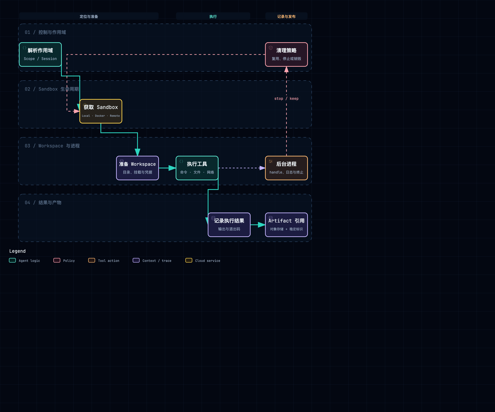

# Sandbox、Workspace、文件与 Artifacts

## 1. 三个对象的区别

- **Sandbox**：进程、文件、网络和资源限制的执行边界。
- **Workspace**：当前 Agent 可读写、可连续工作的目录视图。
- **Artifact**：离开 Sandbox 后仍能通过稳定 ID 引用、下载或分享的产物。

附件：[SVG 矢量图](../diagrams/module-sandbox-artifact-flow.svg) · [HTML 交互图](../diagrams/module-sandbox-artifact-flow.html)

## 2. QM：Per-Scope durable Sandbox

QM 的 Sandbox interface 把 exec、process、files 等能力与具体 Provider 分开。Wiring 可选择 Local、Sprites 或 AWS/microVM 路径，Sandbox Router 再根据 Scope / deployment 找到 handle。

~~~text
Scope
  → resolve Sandbox provider
  → acquire durable handle
  → materialize Skills / credentials / files
  → Harness executes tools
  → persist bytes / artifact metadata
  → keep or migrate Sandbox
~~~

Sandbox 以 Scope 为主要持久单元，而不是每个 HTTP 请求新建。这样同一个 Agent 可以跨 Turn 保留工作目录和后台进程。src/skills/materialize.ts 通过 Sandbox file API 把 Skill index/tree 写入受控路径。

文件内容和元数据分离。durable byte store 可使用本地或 S3，Session entry 只保存引用；file artifact store 决定用户可见文件。Sandbox 内路径不能直接当永久下载 URL，因为 Sandbox 可能迁移或销毁。

后台执行由 process primitives 和 process session 表达，轮询、超时和 kill 使用 handle。Scope 删除或迁移时需要处理仍在运行的进程，而不是只删数据库行。

## 3. Omnigent：执行位置、SessionResourceRegistry 和 Artifact Store

Omnigent 的执行位置由 Server routing 决定，Host 提供本机文件系统/工作树能力，Runner 为 Conversation 建立 workspace。omnigent/runner/resource_registry.py 的 SessionResourceRegistry 跟踪 terminal、进程和 session 目录。

~~~text
Conversation + Host route
  → Runner workspace
  → SessionResourceRegistry
  → terminal / tool / Harness process
  → upload/download tool
  → File Store / Artifact Store
~~~

Registry 对 session id 做路径清理并确保目录包含在根路径下，防止未可信 id 逃逸。TerminalExitEvent 保存退出状态和截断后的诊断输出；长日志不能无限进入 Conversation。

omnigent/runner/environment_filesystem.py 与 Host filesystem 解决执行环境文件，omnigent/entities/file.py 与 stores/file_store 解决产品级 File。upload_file / download_file 工具负责两侧转换。

远程 Host 模式下，“文件在 Server 还是 Host”是正式边界。Artifact 必须上传到平台可访问的 Store，不能只返回 Host 本地路径。Harness process 与 terminal 也由 Runner 负责关闭。

## 4. DeepSeek Harness：FS / Subprocess / Sandbox 三层 Provider

DSH 把能力分得最细：

- packages/fs/fs：文件系统 contract；
- fs-local / fs-sandbox：实现；
- packages/subprocess/subprocess：进程 contract；
- subprocess-local / e2b/subprocess-e2b：实现；
- packages/sandbox/sandbox：Sandbox 生命周期和 policy；
- shell-*、tool-fs、tool-bash：面向模型的工具。

~~~text
tool-bash / tool-fs
  → ctx.shell / ctx.fs
  → local 或 sandbox provider
  → subprocess / filesystem operation
  → spill 大输出
  → append tool result reference
~~~

这种分层让工具不依赖 Docker/E2B。Profile 选择 Provider 后，同一 tool package 可以在本机、E2B 或其他 Sandbox 上执行。

packages/spill 处理超大工具结果：模型得到摘要和引用，完整内容落 spill storage。packages/attachment 负责用户附件，workspace package 负责当前工作目录；它们不是一个模糊的 files 模块。

Sandbox policy 与用户 Approval 分离：即使用户批准，Provider 仍可禁止越界路径或网络能力。Context dispose 自动清理 Provider 注册，但外部进程仍需要具体实现执行 kill/close。

## 5. AI Manus：Per-Session Docker + MinIO

DockerSandbox 为每个 Session 创建/获取容器，ensure_sandbox 做健康检查，heartbeat 保持租约，destroy 删除容器。AgentTaskRunner 启动 sandbox heartbeat，并在 Session 删除时由 TaskOrchestrationService._destroy_session_sandbox 清理。

~~~text
Session
  → DockerSandbox.create/get
  → sandbox HTTP service
  → Bash/File tools
  → background task id
  → Session Artifact Service
  → MinIO object key + database metadata
~~~

DockerSandbox 的方法直接对应远端 service API：start_bash_task、read_bash_task_output、kill_bash_task、file_read/write/edit/grep/glob、upload/download。后台命令返回 task_id，session_routes.py 另有 Bash output SSE 用于持续读取。

源代码可以只读挂载，Workspace 提供可写区域；Skill 由 DockerSkillProjector 投影。文件二进制通过 MinIOObjectStorage 保存，PostgreSQL FileRepository 保存元数据和 Session 关系。

这里存在三个不同清理点：

1. Turn 结束：关闭已完成后台任务、清理 Turn 级引用。
2. Task/Runner shutdown：停止 heartbeat 和活跃执行。
3. Session delete：删除 Agent records、Mailbox、Artifact 关系并销毁 Sandbox。

如果只在 AgentBase 里 close，会遗漏应用层删除；如果只在 Session 删除时处理，正常 Turn 的后台资源又可能长期泄漏。

## 6. 对照表

| 维度 | QM | Omnigent | DSH | AI Manus |
| --- | --- | --- | --- | --- |
| 生命周期键 | Scope | Conversation / Runner session | Context/Provider | Session |
| Provider | Local/Sprites/AWS | Host/Runner + community sandbox | local/E2B/可插拔 | DockerSandbox |
| Workspace | durable Scope workspace | Runner workspace/worktree | workspace + fs provider | 容器 workspace |
| 大内容 | DurableByteStore/S3 | File/Artifact Store | spill provider | MinIO |
| 后台进程 | process handle | SessionResourceRegistry | subprocess/shell provider | bash task id |

## 7. 阅读结论

- Sandbox、Workspace、Artifact 必须有不同 ID，生命周期也不同。
- 工具结果事件只保存稳定引用；本地绝对路径不是跨进程 Artifact contract。
- 后台进程必须能列出、读取、停止，并明确 Session 删除时是否级联。
- 路径 containment、只读挂载和网络限制属于执行边界，不应依赖模型自觉。

## 8. 源码索引

- QM：src/sandbox/、src/files/、src/skills/materialize.ts、src/tools/primitives/process*
- Omnigent：omnigent/runner/resource_registry.py、runner/environment_filesystem.py、entities/file.py、stores/file_store/
- DSH：packages/fs/、packages/subprocess/、packages/sandbox/、packages/spill/、packages/workspace/
- AI Manus：backend/app/infrastructure/external/sandbox/docker_sandbox.py、external/file/minio_object_storage.py、application/sessions/session_artifact_service.py

## 9. 附件和 Artifact：文件要经过一座“桥”才能离开 Sandbox

附件：[SVG 矢量图](../diagrams/attachment-artifact-flow.svg) · [HTML 交互图](../diagrams/attachment-artifact-flow.html)

初学者可以把 Sandbox 想成临时教室：Agent 在里面写草稿，用户上传的文件是带进教室的资料，最终 Artifact 是要带回家的作业。教室里的绝对路径只在教室有效，不能直接当成用户下载地址。系统至少要有“导入、工作、导出、清理”四个动作。

### 9.1 QM：Scope 文件与持久 Artifact 分开

QM 的 Sandbox file API 负责执行期间的文件，DurableByteStore/本地或 S3 路径负责跨重启保存字节，Artifact Store 负责用户可见的元数据和稳定引用。Session entry 保存 artifact id、大小、mime、hash 等引用，而不是把大文件或 Sandbox 路径塞进事件正文。

Scope 迁移或 Sandbox provider 更换时，Artifact 仍应能通过稳定 ID 找到；反过来，删除 Scope 时要明确是删除工作目录、取消仍在运行的进程，还是保留用户已导出的 Artifact。

### 9.2 Omnigent：Host 文件和 Server 文件是两侧资源

Omnigent 的 Runner workspace、Host filesystem 与 Server 的 File/Artifact Store 处于不同边界。`upload_file` 把 Host/Runner 文件传到平台可访问的 Store，`download_file` 反向把产品文件放入执行目录。`SessionResourceRegistry` 管理 terminal、process 和 session 目录；它们关闭后不应留下无法追踪的后台资源。

远程 Host 场景尤其要问“这个路径现在属于谁”：Server 不能把 Host 本地路径直接返回给浏览器，Host 也不能绕过 Server 的用户权限。文件名和 session id 要做路径 containment，Terminal 输出要截断并保留诊断引用。

### 9.3 DSH：Attachment、Workspace、Spill 是三种不同东西

DSH 的 attachment 是用户带入的稳定内容，workspace 是当前工作目录，spill 是为了控制大工具输出而生成的临时或可引用内容。FS/Subprocess/Sandbox Provider 决定它们在哪个执行位置存在；tool-fs/tool-bash 只能通过 provider contract 访问。

这种拆分让“工具输出太大”不会把整个 Session event 撑爆：模型先拿摘要和引用，需要时再读取完整 spill。Provider 被 dispose 时要清理临时内容，但 attachment 的持久性不能跟着一次 Subprocess 结束而丢失。

### 9.4 AI Manus：SessionArtifactService 连接 PostgreSQL、MinIO 和 Docker

AI Manus 的二进制内容由 MinIO object key 保存，PostgreSQL FileRepository 保存元数据及 Session 关系；`SessionArtifactService` 负责把二者与当前 Session 对齐。DockerSandbox 提供 file read/write/upload/download 与 Bash API，Session 路由再把后台 Bash 输出通过 SSE 暴露给前端。

文件生命周期至少有三个 owner：容器里的临时路径由 DockerSandbox owner 管，Artifact 元数据由 SessionArtifactService/Repository 管，MinIO 对象由 object storage 管。Session 删除时必须决定级联顺序；只删数据库行会留下孤儿对象，只删 MinIO 又可能让历史事件失去引用。

### 9.5 每个文件都应该能回答的六个问题

| 问题 | 例子 |
| --- | --- |
| 文件的稳定 ID 是什么 | artifact id / object key / content hash |
| 当前执行路径是什么 | `/workspace/input.csv`，仅在当前 Sandbox 有效 |
| 谁可以读写 | Session、Agent、用户、子 Agent 的权限 |
| 什么时候从产品文件变成执行文件 | upload/materialize/project |
| 什么时候从执行文件变成 Artifact | export/finalize/persist |
| 删除谁负责 | Sandbox、Session、Artifact Store、Retention job |

只要这六个问题中有一个答案模糊，用户就可能看到“页面有文件，但点下载找不到”，或者容器删了以后历史结果打不开。

[返回架构总览](../architecture.md)
