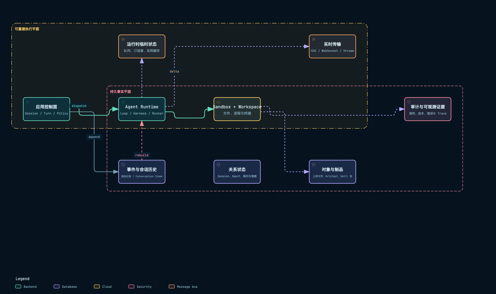

# 状态、事件、持久化与恢复

## 1. 先画状态平面

Agent 应用同时有业务事实、执行协调、实时增量、二进制产物和进程内临时状态。它们可以使用不同技术，但同一个对象只能有一个冲突裁决者。

附件：[SVG 矢量图](../diagrams/module-state-execution-planes.svg) · [HTML 交互图](../diagrams/module-state-execution-planes.html)

## 2. QM：Store contracts + Run lease + Session entries

QM 为 Session、Run、ACL、Memory、Directory、Audit、Bytes 等分别定义 Store interface，Wiring 选择 memory 或 PostgreSQL 实现。Session entry 是模型与用户可见事实，Run 是执行协调事实。

~~~text
enqueue Run（RunStore）
  → claim + lease
  → Orchestrator append Session entries
  → ToolLedger record
  → Run terminal status
  → result delivery state
~~~

PostgresRunStore 负责原子 claim、heartbeat、attempt 和 delivery；SessionStateBus / RunSignalStore 只发唤醒与状态通知。通知丢失可以重新查询 Store，Store 记录丢失则无法恢复。

reaper 使用 leaseExpiresAt 判断失联 Worker。恢复前要检查 ToolLedger：如果工具结果已 complete，重放应复用结果；如果只有 begin，必须依据工具幂等性决定 park 或人工处理。

QM 还把 DurableByteStore 与关系数据分开。事件中的文件引用在 Sandbox/Worker 变化后仍有效，这是恢复文件上下文的前提。

## 3. Omnigent：关系型 Conversation + 外部 Runtime 状态

SQLAlchemy Store 保存 Conversation、ConversationItem、Agent、Policy、File 等实体，默认可用 SQLite，生产可用 PostgreSQL。ConversationItem 的 typed data 既是 UI 事实，也是重建 Harness 输入的依据。

~~~text
Harness event
  → Runner normalize
  → persist ConversationItem
  → publish SessionStream
  → client projection
~~~

SessionStream 不是事实源。Server 或 Runner 重启后，客户端先从 Store 读取 snapshot。external runtime session id、Runner route 和 live status 是恢复外部 Harness 所需的附加状态。

HarnessProcessManager 的进程表主要在内存中，所以重启时必须重新发现/创建进程。tool_result_replay、pending_inputs 和 pending_elicitations 处理“执行已发生但对话尚未继续”的中间状态。

SQLite 简化单机安装，但多 Server 场景需要共享数据库，并重新审视进程内 Stream、MCP pool 和 Host registry 的作用域。

## 4. DeepSeek Harness：append-only Session 是中心

packages/core/session 定义 append/read/subscribe 等 Session 语义。session-persistence coordinator 把提交写入 Provider，write-behind 用于非关键派生写；revision 和 invariant 防止乱序或重复应用。

~~~text
Domain event
  → Session append
  → persistence JSONL / SQLite
  → revision
  → projection fold
  → query / UI / next model request
~~~

JSONL Provider 提供简单可读日志与压缩，SQLite Provider 支持更强查询；两者必须通过同一 persistence contract。session-projection registry 将 event type 映射为 reducer，未知或顺序错误会触发 invariant，而不是静默丢弃。

Checkpoint Policy 决定在哪些 revision 保存恢复点。重启时加载持久事件、恢复 projection 和 pending lifecycle，再继续 Agent Loop。Fork / Session reference 以 revision 为边界，因此历史可审计。

DSH 还提供 session-query、session-log-export 和 telemetry，说明事件日志不仅用于恢复，也作为分析与测试接口。

## 5. AI Manus：PostgreSQL 事实、Redis 协调、MinIO 二进制

SessionEventRepository 把完整事件写 PostgreSQL；SessionEventReducer 将事件折叠进 Session 视图。SessionEventPublisher.handle_session_event 在持久化后调用 Delivery，保证在线通知不会领先于事实提交。

~~~text
Runtime event
  → SessionEventService / PostgreSQL
  → SessionEventReducer
  → EventDeliveryService / Redis
  → SSE

Task / Mailbox
  → Redis Stream
  → TaskRunner / FlowRuntime

File bytes
  → MinIO
  → PostgreSQL metadata/reference
~~~

RuntimeAgentRepository 保存 Agent records，RuntimeCheckpointService 保存 checkpoint。FlowRuntime.restore_agent_loops 根据 registry 恢复 agent mailbox loop；TaskOrchestrationService 还检查 unfinished task、pending input、Sandbox 是否存在和 runtime selection 是否变化。

恢复不是单点读取：

1. PostgreSQL 恢复 Session、事件、Agent 与 Artifact 元数据。
2. Redis 恢复或重建 Task/Message 协调。
3. DockerSandbox.get 检查执行环境。
4. Runtime checkpoint 恢复 tool batch、approval、trace 等中间状态。
5. FlowRuntime 重新建立 agent loop。

多状态服务使职责更精确，也扩大一致性窗口。例如 DB 已提交事件但 Redis 发布失败时，应允许客户端通过 snapshot 补齐；MinIO 文件写成功而数据库事务失败时，需要孤儿清理策略。

## 6. 失败窗口对照

| 失败窗口 | 正确问题 |
| --- | --- |
| 模型响应前进程退出 | 是否有请求 id；能否判断是否已计费/返回 |
| 工具成功但结果未提交 | Ledger / tool_call_id 能否阻止重放 |
| DB 提交后实时发布失败 | 客户端能否从 revision 追赶 |
| 审批已展示但响应丢失 | approval id 是否可重复提交 |
| Sandbox 消失 | Workspace/Artifact 是否仍有持久引用 |
| Session 删除一半 | 是否有可重试的分步骤清理状态 |

## 7. 横向对比

| 维度 | QM | Omnigent | DSH | AI Manus |
| --- | --- | --- | --- | --- |
| 会话事实 | Session Store | ConversationItem Store | Session event log | PostgreSQL events |
| 调度事实 | Run Store | Conversation/Runner state | lifecycle events | Task state + Redis |
| 在线增量 | TurnStream/Bus | SessionStream | Context subscription | Redis/SSE |
| 二进制 | DurableByteStore | Artifact/File Store | attachment/spill | MinIO |
| 恢复核心 | lease + entries + ledger | items + external session | revision + projection | DB + Redis + checkpoint |

## 8. 阅读结论

- 关系表和事件日志可以并存，但必须指定谁裁决冲突。
- 正常顺序应是“提交事实 → 发布通知”；通知失败可以补，事实失败不能假装成功。
- 恢复设计必须覆盖工具副作用窗口，不只是重新启动 Agent Loop。
- 每个持久引用都要能跨进程、跨 Sandbox 和跨重启解析。

## 9. 源码索引

- QM：src/runs/postgres-run-store.ts、src/runs/session-state-bus.ts、src/runs/tool-ledger.ts、src/sessions/
- Omnigent：omnigent/stores/、entities/conversation.py、runtime/session_stream.py、runtime/tool_result_replay.py
- DSH：packages/session/session-persistence/、session-persistence-jsonl/、session-persistence-sqlite/、session-projection/
- AI Manus：backend/app/application/sessions/events/、infrastructure/persistence/postgresql/、infrastructure/external/message_queue/

## 10. 真正难的是“两个动作之间”的小缝隙

附件：[SVG 矢量图](../diagrams/turn-ui-state-sequence.svg) · [HTML 交互图](../diagrams/turn-ui-state-sequence.html)

系统通常不是在大步骤上出错，而是在两个动作之间挂掉。例如“工具已经把文件写好了，但结果事件还没提交”“数据库已经提交，但 SSE 还没送到浏览器”“用户已经看到批准按钮，但点击结果在网络里丢了”。所以要把**事实写入**和**通知交付**分开记账。

### 10.1 QM：lease、entries 和 ledger 各自解决一类问题

- Run Store 的 claim/lease 解决“哪个 Worker 负责继续”；lease 过期后可被回收。
- Session entries 解决“用户看见的对话事实”；Run/Turn stream 解决在线观察。
- Tool Ledger 解决“副作用是否已经发生”；没有 ledger，Worker 重启就可能重复调用外部工具。

恢复时不能只把状态改成 `running`：要先判断最后一个 entry 是 assistant tool call、approval pending 还是已提交 result，再决定继续、等待还是报错。

### 10.2 Omnigent：snapshot 能恢复产品状态，但不自动恢复外部进程

Conversation items 可以重建页面和 Harness 所需历史，SessionStream 断线可以从 snapshot 重新开始；但 Runner/Harness process、UDS、Host 连接是外部资源，必须另做 health check 和 process cleanup。外部 session id 失效时，平台应报告“不能继续原会话”或显式新建，而不是悄悄把一段新历史拼到旧 Conversation。

### 10.3 DSH：revision/sequence 是恢复的尺子

DSH 的 append-only event log 给每个 Session event 一个序号，projection 可以从任意 revision 重建。客户端用 `lastSeq` 重连，工具 pipeline 用 event contract 保证 call/result 配对。代价是事件协议和顺序一旦改变，会影响 replay、compaction 和所有插件；版本兼容必须被当作产品 contract。

### 10.4 AI Manus：PostgreSQL 是事实，Redis 是加速协调

AI Manus 把 Session events、Task/Agent records 和 checkpoint 写入 PostgreSQL；Redis delivery、Mailbox 和 cursor 让在线消费者快速收到更新，但 Redis 丢失时仍应能从 DB 追赶。恢复 Task 时，`TaskOrchestrationService` 还要同时确认 Agent records、Flow mailbox、approval batch 和 Docker Sandbox 是否存在，不能只按一个 `task.status` 继续。

### 10.5 五种重试不能混为一谈

| 情况 | 能否直接重试 | 必须先确认 |
| --- | --- | --- |
| SSE 断开 | 通常可以 | 从哪个 cursor/seq 继续、如何去重 |
| Worker 没抢到 lease | 可以换 Worker | 旧 owner 是否真的失效 |
| LLM 请求超时 | 视 provider contract | 请求是否已被计费、是否产生响应 |
| 工具调用超时 | 不能盲目重试 | 外部副作用是否已经发生 |
| 审批响应重复提交 | 需要幂等 | approval id 是否已经消费 |

这张表也是模块代码的验收标准：每种“重试”都要有不同的 idempotency key、状态检查和用户可见结果，不能用一个全局 retry 装饰器解决所有问题。

[返回架构总览](../architecture.md)
