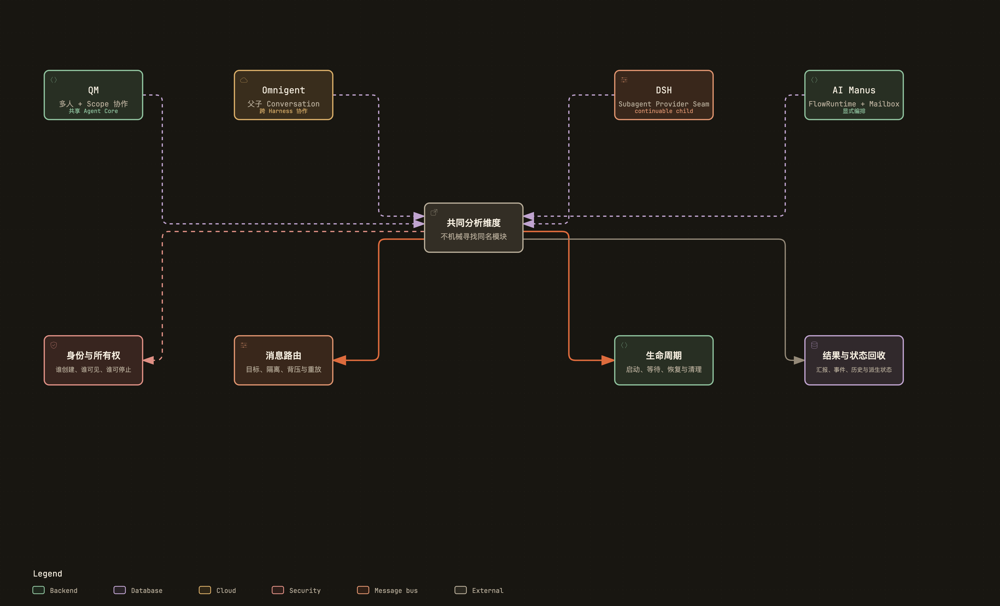

# 多 Agent、子 Agent 与消息协作

## 1. 三类能力

多人共享一个 Agent 应用、父 Agent 委派 child Agent、多个自治 Agent 通过 Mailbox 协作，是三个不同问题。

附件：[SVG 矢量图](../diagrams/module-multi-agent-patterns.svg) · [HTML 交互图](../diagrams/module-multi-agent-patterns.html)

比较时要看 Spawn、Address、Join、Cancel、Report、Recover 六个动作，而不是只统计“能否调用另一个 Agent”。

## 2. QM：核心首先是 multiplayer Scope

QM 的 Actor、Conversation、Scope、audience、ACL 和 Directory 组成多人协作底座。一个组织中的用户可以拥有不同 Agent、凭据、Memory 和文件视图，也可以在 group conversation 中共享上下文。

~~~text
Surface message
  → identify Actor
  → resolve Conversation audience
  → resolve personal/shared Scope
  → Orchestrator filters visible history/resources
  → target Agent/Harness executes
~~~

这种“多 Agent”主要是产品中的多个持久 Agent 与多人身份，不是一个 Turn 内动态创建几十个 child loop。ask-agent / Agent request 等入口可以委派给另一个 Agent，但仍经过 Core 的 Scope、ACL 和 Session 语义。

值得学习的是 audience 投影：同一 Conversation 中，内部 Agent、发言用户和旁观成员看到的 history / credential view 可能不同。多用户安全不是在子 Agent prompt 里加一句“别泄露”，而是 Context 构造前过滤资源。

因此 QM 的强项是共享产品模型；如果要分析 child-agent runtime，应避免把任意 Agent-to-Agent 消息误写成完整 spawn/join 协议。

## 3. Omnigent：子 Agent 是完整 child Conversation

Conversation 保存 parent_conversation_id / root_conversation_id，spawn 和 agents 内建工具创建并管理子 Conversation。子节点可以选择不同 AgentSpec、Harness、模型和 Runner。

~~~text
Parent Harness tool call: spawn
  → Server creates child Conversation
  → resolve AgentSpec / Host / Runner
  → start child Harness
  → child items persisted independently
  → completion/result returned to parent
~~~

因为 child 是正式 Conversation，它天然拥有历史、Artifact、Policy、external runtime session 和恢复能力。父节点只需要保存 child id / relation，而不是把整个 child transcript 塞进自己的内存。

subagent_routing.py 处理子 Agent 的执行位置与路由；async_inbox 等工具允许异步获取结果。父任务可以不阻塞等待所有 child，但需要明确何时检查 inbox、怎样展示失败。

取消语义也更重：停止父 Conversation 是否级联到所有 child、远程 Runner 是否收到 interrupt、已完成 child 是否保留，都必须由应用层定义。独立 Conversation 的优势是隔离清晰，成本是进程和持久对象更多。

## 4. DeepSeek Harness：Subagent Provider seam

packages/subagent/subagent 定义通用 Provider，tool-subagent 暴露给模型。具体实现可以是：

- fork-in-process / spawn-in-process：同 Harness 内 child Session；
- subagent-codex / subagent-claude-code：外部 CLI；
- subagent-acp / subagent-dsh-sdk：协议或其他 DSH Runtime。

~~~text
tool-subagent
  → ctx.subagent provider
  → spawn child handle/session
  → stream or await result
  → report/reference event
  → continue / control / cancel
~~~

continuation 允许父 Agent 之后用同一 handle 继续 child，而不是每次重新生成一个新任务。Session reference 把父子关系写入日志，使 projection、UI 和恢复能够追踪来源。

实验性的 packages/experimental/agent-team 在此之上增加 roster、mailbox、task-board、task-graph 和 journal。它说明：

~~~text
Subagent = 层级委派
Agent Team = 多方持续寻址 + 共享任务状态
~~~

Agent Team 被放在 experimental，而不是强行进入最小 Loop，反映了良好的边界判断。

## 5. AI Manus：FlowRuntime 内建多 Agent

FlowRuntime 以 session_id 和 agent_group_id 为边界，内部拥有 AgentRegistry、MailboxRouter、runtime instances 和 loop tasks。ensure_agent_instance 根据 AgentSpec 创建或恢复实例，next_agent_id 分配可寻址 id。

~~~text
Flow / Agent tool
  → FlowRuntime.ensure_agent_instance
  → AgentRegistry persist record
  → ensure_agent_loop
  → MailboxRouter.enqueue(recipient)
  → _serve_agent
  → AgentRuntimeInstance.handle
  → output event / send to next agent
~~~

send_to_agent 负责普通消息，dispatch_approval_response 把审批直接送给目标 Agent，dispatch_internal 处理内部事件。pending dispatch counter 使 TaskRunner 能判断 Flow 是否仍有工作。

Agent loop 是每个 Agent 的 mailbox consumer，而不是每发一条消息就新建一次 AgentBase。restore_agent_loops 根据持久 Agent records 恢复消费者；stop_active_agents 和 shutdown 负责取消传播。

Agent Tools 可以在模型调用中创建或联系 Agent；Flow 配置决定 root、专家和消息关系。事件带 sender/recipient，使 Session UI 能区分用户消息、Agent 间消息和 root 输出。

当前实现的复杂度主要在应用层与 FlowRuntime 交界：TaskOrchestrationService 要同时恢复 Task、Agent records、Mailbox、Sandbox 和 approval route。多 Agent 功能是真正的一等 Runtime 能力，而不是普通工具包装。

## 6. 行为对照

| 行为 | QM | Omnigent | DSH | AI Manus |
| --- | --- | --- | --- | --- |
| Spawn | 非核心，更多是持久 Agent 路由 | 创建 child Conversation | Provider 创建 child handle | 创建 AgentRuntimeInstance |
| Address | Actor/Scope/Conversation | conversation id | provider handle/session ref | agent id + Mailbox |
| Join | 依赖应用请求语义 | parent 查询 child/inbox | await/report/control tool | Flow pending dispatch |
| Context 继承 | Scope/ACL 投影 | AgentSpec + child Conversation | Provider 决定 | AgentSpec/runtime context |
| Recover | Session/Scope | Conversation tree | Session reference | Agent records + loops |

## 7. 阅读结论

- 子 Agent 的第一抽象是“可寻址、有生命周期的执行单元”，不是再调用一次 LLM。
- 父 Agent 不应默认继承全部 child transcript；结构化报告和稳定引用更容易控制 Context。
- 权限、凭据和 Workspace 应最小继承。
- Mailbox 适合持续协作，parent/child 适合层级委派，multiplayer Scope 适合产品共享，三者不能互相代替。

## 8. 源码索引

- QM：src/resolution/、src/acl/、src/core/orchestrator.ts、Agent request 相关 Surface
- Omnigent：omnigent/entities/conversation.py、tools/builtins/spawn.py、agents.py、runner/subagent_routing.py
- DSH：packages/subagent/、packages/context/session-reference/、packages/experimental/agent-team/
- AI Manus：backend/app/agent_runtime/flows/flow_runtime.py、core/agent_registry.py、core/mailbox_router.py、tools/agent_tools/

## 9. 多 Agent 最容易漏掉的不是“怎么创建”，而是“谁负责收尾”

可以把 root Agent 想成组长，把 child Agent 想成组员。创建组员只是第一步，还要规定：组员看哪些资料、能不能写同一个目录、组长怎样收到结果、组员卡住时谁取消、组长结束后组员是否继续跑。

### 9.1 QM：重点是多人 Scope 和可见性

QM 的 Actor、Conversation、Scope、ACL 决定谁能看见或触发某个 Agent。它的“多人”首先是共享空间和消息可见性，不一定对应一个完整的子进程。Agent request、audience 和 internal actor 影响哪些 entries 进入哪个 Harness 的 Context；因此父子关系要先从权限和可见性理解，而不是只找 `spawn()`。

### 9.2 Omnigent：child Conversation 是可观察的子执行

Omnigent 的 spawn 类工具创建 child Conversation，并由 Server/Runner 按 parent route 管理。子会话拥有独立 transcript、AgentSpec 和资源句柄；父会话更适合接收结构化报告或稳定引用，不应默认把整段 child transcript 拼回自己的 Prompt。child Runner 结束、超时或 Host 断开时，父会话需要能看到明确终态。

### 9.3 DSH：Provider seam 让子 Agent 变成可替换能力

DSH 的 subagent Provider 可以创建 child handle/session，context/session-reference 负责引用，experimental agent-team 再提供更高层协作。由于这些都是插件服务，父子上下文、工具权限和 join 语义由 Provider 决定；核心事件只要求消息和生命周期可追踪。这样可以换一种子 Agent 实现，但也意味着必须在配置和 telemetry 中写清“这个 child 到底由谁拥有”。

### 9.4 AI Manus：FlowRuntime 里的 mailbox 是持续执行单元

AI Manus 的 `AgentRegistry` 管理实例，`MailboxRouter` 按 agent id 投递，Agent loop 是持续消费者，而不是每条消息重新实例化 AgentBase。Flow 配置决定 root、专家和消息关系；AgentRuntimeInstance 持有 runtime context、tool/approval 状态和 checkpoint。Task 停止或 Session 删除时，需要取消 loop、清理 mailbox、处理未完成的 child task，并决定 Sandbox 和 Artifact 是否共享。

### 9.5 四条不可省略的 contract

1. **上下文 contract**：child 继承哪些 system prompt、Skill、历史、凭据和 Workspace。
2. **消息 contract**：消息有 sender/recipient、顺序、投递结果和重复处理规则。
3. **控制 contract**：parent 能否 cancel、steer、pause、resume，child 如何确认已收到。
4. **结果 contract**：返回全文、摘要、结构化结果还是 Artifact 引用；何时算 join 完成。

只有创建、寻址、取消、恢复和收尾都能追到 owner，多 Agent 才是工程能力，而不是把几个 LLM 调用并排写在一起。

[返回架构总览](../architecture.md)
