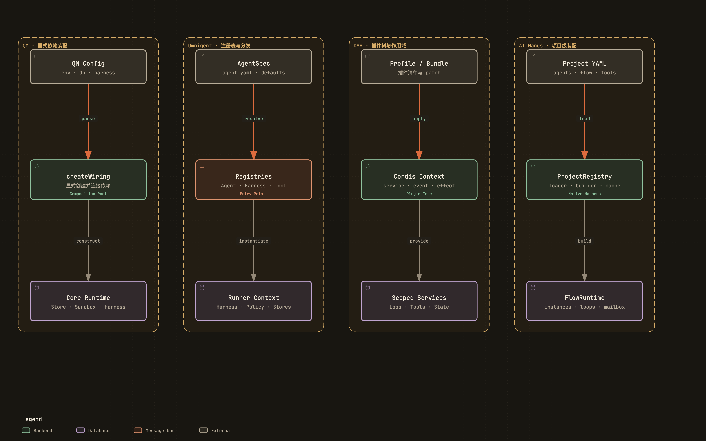

# 插件、依赖注入与模块组合

## 1. 组合问题是什么

模块组合要回答：配置从哪里来、实现如何选择、实例属于哪个作用域、资源由谁释放。普通构造函数、Registry、entry point 和 Plugin Context 只是动态程度不同的手段。



附件：[SVG 矢量图](../diagrams/module-composition-models.svg) · [HTML 交互图](../diagrams/module-composition-models.html)

## 2. QM：单一 Wiring 作为 Composition Root

src/wiring.ts 的 buildApp 是依赖图中心。它读取部署配置，创建 PostgreSQL / in-memory Store、Sandbox、Byte Store、Audit、Security、Harness、Worker 等组件，再把它们注入 App 和 API。

~~~text
config + environment
  → buildApp
  → create stores/providers
  → create Core services
  → create App / Worker runtime
  → return BuiltApp + stop()
~~~

Core 代码依赖 interface，不负责判断“现在用 S3 还是本地目录”。stopWithBackstop 和 Runtime.stop 又把释放顺序集中到 Wiring，避免各 route 私自创建长寿命 client。

Surface plugins 位于 plugins/，但这并不意味着所有 Core service 都经过动态插件容器。QM 的主要方式仍是显式 composition root + 稳定 interface。Harness Router 只是按配置选择已注册 Harness，不负责任意运行时卸载。

这种方式适合完整应用：依赖图能从一个文件追踪，启动失败早暴露，测试可传 in-memory 实现。局限是第三方独立包接入需要改 Wiring 或注册代码。

## 3. Omnigent：AgentSpec、Registry 和 Python entry point

Server create_app 组装 Store、Auth、Host registry、MCP pool、Policy 和 routes。Runner create_app 再组装执行侧资源，两处对应控制面和执行面不同生命周期。

Agent / LoadedAgent（entities/agent.py）保存可分发的 AgentSpec。Runner 从 Server 下载规范和 bundle，根据 harness 名称解析实现。ToolManager、MCP manager、Policy builder 和 Sandbox Provider 又各自使用 Registry。

~~~text
AgentSpec / server config
  → Server registries
  → routing decision
  → Runner resolves harness/provider
  → instantiate HarnessApp + resources
  → Conversation-scoped cleanup
~~~

社区 Harness 或 Sandbox 可通过 Python package entry point 注册。entry point 解决“第三方包不修改主仓库也能被发现”，但必须处理：

- 名称冲突和版本兼容；
- import 失败时的诊断；
- Server 与远程 Runner 是否安装同一扩展；
- Provider 的配置 Schema 和秘密分发。

Registry 选择与进程生命周期仍由 Server/Runner 控制，这比任意插件修改全局 service 更容易运维。

## 4. DeepSeek Harness：Cordis Context 是运行时组合内核

DSH 的 Profile / Bundle 最终生成 Cordis 插件树。Context 提供 service、event、waterfall、effect 和 scope：

~~~text
Profile / Bundle / patch
  → Context.plugin(...)
  → register service/event/effect
  → child scopes inherit or override
  → Agent runs
  → scope.dispose()
  → listeners/resources automatically revoked
~~~

service 定义可替换能力，event/waterfall 允许插件观察或修改流程，effect 把资源清理绑定到 Scope。Fiber/Scope 使同一进程里可以有父子 Context，并在局部安装 Provider。

Bundle 是可复用插件组合，patch overlay 只覆盖一部分配置；Profile 决定 CLI/Web/Headless 最终加载哪些 bundle。tool、llm、session、approval、sandbox 都遵守同一组合机制，所以 DSH 的“everything is a plugin”不是口号。

代价也很实际：调用链不再只由 import 和函数调用决定，还受插件顺序、服务覆盖、waterfall 结果和 Scope 继承影响。调试工具必须能 inspect registry、列出 Provider 和显示最终装配。

## 5. AI Manus：ProjectRegistry + Builder + YAML

ProjectRegistry 以 project_id 为边界，注册 Agent class、Runtime Flow、ToolGroup Builder、API plugin、startup/shutdown hook 和 input adapter。

~~~text
project.yaml + flow/*.yaml
  → initialize_project_registry
  → scan/register builtins and project modules
  → validate runtime flow
  → AgentTaskRunner builds session components
  → FlowRegistry / AgentFactory / Tool builders
~~~

register_tool_group_builder 允许项目根据 ProjectToolContext（含 Sandbox）构建工具组；register_runtime_flow 把配置中的 flow name 映射到 class；adapt_chat_input 让项目入口转换用户输入。

Application 和 Infrastructure 仍大量使用显式构造函数/工厂，例如 AgentLLMFactory、DockerSandbox、repositories。ProjectRegistry 更像项目级扩展总表，并非所有依赖都从一个 IoC container 解析。

Registry 还管理 startup/shutdown hooks，但没有 DSH 式任意 child scope、动态 service override 和自动 effect disposal。它的动态粒度更适合“选择一个项目及其 Flow/Tools”，而不是“运行中替换 Session persistence”。

当前需要注意的是双重组合来源：YAML 描述选择，Registry 保存代码映射，AgentTaskRunner 又真正构造实例。分析问题时应沿“配置值 → registry name → builder → 实例 owner”追踪。

## 6. 组合模型对照

| 维度 | QM | Omnigent | DSH | AI Manus |
| --- | --- | --- | --- | --- |
| 主入口 | buildApp / wiring.ts | Server + Runner create_app | Cordis Context | initialize_project_registry |
| 扩展单元 | Store/Provider/Harness/Surface | Agent/Harness/Tool/Provider | 任意 Plugin/Service | Project/Flow/ToolGroup/Agent |
| 动态发现 | 有限注册 | Python entry point | 配置加载插件包 | scan package + registry |
| 局部作用域 | Scope 业务对象 | Conversation/Runner | Context scope tree | Project/Session 构造 |
| 自动 dispose | Wiring stop | manager cleanup | Effect 一等语义 | hooks + owner cleanup |

## 7. 阅读结论

- 实现数量稳定时，显式 Composition Root 往往最清楚。
- Registry 的名称和配置 Schema 是公开 contract，未知名称要启动时失败。
- 第三方独立发布才真正需要 entry point。
- 只有运行时安装、卸载、覆盖和子作用域都存在时，才需要 Cordis 级 Plugin Context。
- 无论多动态，都必须能追到资源 owner 和 dispose 路径。

## 8. 源码索引

- QM：src/wiring.ts、src/harness/harness-router.ts、plugins/、各 Store/Sandbox interface
- Omnigent：omnigent/server/app.py、runner/_entry.py、entities/agent.py、tools/manager.py
- DSH：docs/cordis-primer.md、docs/cordis-tutorial/、packages/bundle/、packages/core/scope/
- AI Manus：backend/app/infrastructure/project_registry.py、agent_runtime/flows/registry.py、agents/agent_factory.py

## 9. 从配置到实例：用一条线检查组合是否可解释

初学者可以把组合系统想成“点菜单”：配置写了要哪道菜，Registry 找到菜谱，Builder 真正做菜，运行结束后还要收拾厨房。任何一步藏在全局变量里，出了问题就很难知道到底选了哪个实现。

```text
配置 / 环境变量
  → 名称校验与默认值
  → Registry / entry point
  → Builder / Wiring / Context plugin
  → 运行时实例
  → owner 保存句柄
  → shutdown / dispose / cleanup
```

### 9.1 QM：Composition Root 让替换点集中

QM 的 `wiring.ts` 选择 Store、Sandbox、Harness、Surface 和外部服务；Router/Provider interface 描述替换 contract。运行中对象由 Scope、Run 或 App owner 持有，关闭时沿 wiring 的 stop 路径释放。好处是生产路径清晰，代价是新增 provider 需要显式修改 wiring，而不是随便动态加载。

### 9.2 Omnigent：Server 和 Runner 各自有 Registry

Omnigent Server 的 AgentSpec、ToolManager、Policy 和 Host route 负责产品选择，Runner 再根据 Harness name、plugin entry point 和环境建立进程。这个双层 Registry 能支持远程 Host，但必须传播同一版本和 capability；否则 Server 选中了 Runner 不认识的 Harness，错误只会在运行时出现。

### 9.3 DSH：Cordis Context 把作用域和 dispose 做成一等概念

DSH Plugin 在 Context 中注册 service、event、effect 或 Provider，child Context 可以覆盖父 Context 的局部依赖，dispose 会撤销注册并清理相关 effect。它最适合“同一个 Harness 内有许多可组合能力”的场景，但越动态越需要 inspect/telemetry：必须能回答当前这次 Turn 到底解析出了哪一个 `ctx.llm`、`ctx.fs` 和 `ctx.tools`。

### 9.4 AI Manus：YAML、ProjectRegistry 和 Builder 共同决定实例

AI Manus 的 YAML 选择 project/mode/agent，`ProjectRegistry` 保存代码映射，Flow/Agent registry 再由 builder 创建 Agent、ToolGroup、LLM 和 Sandbox。它不是一个全局 IoC 容器；大量依赖仍通过显式构造函数传入。优点是 Python 调试直观，风险是配置、Registry 和 TaskRunner 可能同时拥有选择逻辑，排错时必须沿上面的链逐段确认。

### 9.5 组合层的最低要求

- 未知实现名称启动时失败，不在运行中静默换成另一个实现。
- 每个外部资源（进程、WebSocket、Sandbox、MCP client、定时器）都有明确 owner 和关闭路径。
- 配置选择、实例能力和运行时事件带版本或 capability 信息，便于日志还原。
- 动态插件只负责提供能力，不另建一份 Session、Tool 或 Approval 事实源。

[返回架构总览](../architecture.md)
