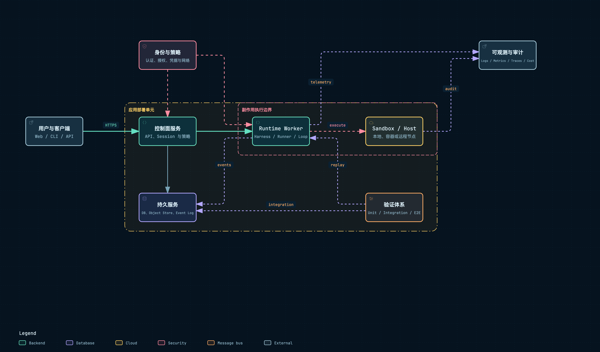

# 部署、可观测性、安全与测试

## 1. 这是前九个模块的工程验收

部署证明组件边界能落地；可观测性证明一次 Turn 能跨边界追踪；安全证明副作用受到真实控制；测试证明 Provider 可替换、事件可恢复。

附件：[SVG 矢量图](../diagrams/module-deployment-observability.svg) · [HTML 交互图](../diagrams/module-deployment-observability.html)

## 2. QM：API / Worker / Store / Sandbox

QM 可以把 API Surface、Worker、PostgreSQL 和 Sandbox Provider 分开部署。Run Store 的 claim/lease 支持多个 Worker 竞争工作，Session/Bytes 使用共享 Store。

~~~text
Surface/API
  → PostgreSQL Run + Session
  → Worker fleet
  → Harness
  → Local / Sprites / AWS Sandbox
  → Local/S3 bytes
~~~

安全边界包括 API gate、Actor/Scope ACL、credential/keychain view、egress policy、Approval 和 Sandbox。security screener、AuditLog 和 metrics 由 Wiring 注入，因此不需要每个 Tool 自己拼日志。

测试覆盖 Store contract、Harness adapter、Orchestrator、API、Sandbox 和端到端 Surface。内存 Store 与 PostgreSQL Store 应运行相同 contract 测试，证明“替换实现不改变 claim / session 语义”。

Worker reaper、turn resume、tool ledger、sandbox migration 等测试尤其重要，因为它们覆盖正常 happy path 看不到的恢复窗口。

## 3. Omnigent：远程 Host 是正式部署能力

Omnigent 的最完整拓扑是 Server、Host、Runner、Harness 四层；单机安装可以合并位置，但协议仍存在。

~~~text
Server + SQL/Artifact Store
  ⇄ authenticated Host WebSocket
  → Runner process
  → Harness subprocess
  → Sandbox / terminal / MCP
~~~

Host identity、binding token、Runner auth factory 和 tunnel origin 是远程控制边界。Runner environment 负责向 Harness 下发必要 credential，但不应把 Server 全部秘密复制过去。Policy 与 Sandbox 分别约束逻辑许可和实际执行能力。

runtime/telemetry.py、server/performance_metrics.py 与 OpenTelemetry 记录请求、Harness、工具和延迟。跨边界至少要传播 conversation_id、runner_id、host_id、harness 和 tool_call id。

测试除普通 API 外，还必须覆盖 Host tunnel frame、Runner init、UDS/TCP、ProcessManager 父子进程、Policy、MCP 和真实 CLI adapter。SessionStream 的 per-process 特性需要多 Server 测试，否则单进程测试会掩盖缺口。

## 4. DeepSeek Harness：Profile 决定部署形态

DSH 可作为 CLI、Web app、Headless 或 SDK server 运行。部署不是固定微服务图，而是 Profile 选择哪些 host、persistence、telemetry、sandbox 和 UI bundle。

~~~text
Profile
  → Cordis plugin composition
  → local process or host SDK
  → selected persistence/provider
  → optional Web/API frontend
~~~

安全使用 capability Provider、Scope、user-approval、sandbox-policy、fs-observation-policy 和 credential plugin。Prompt 不是安全边界；Tool 即使通过 Prompt 被隐藏，Registry/Provider 仍要拒绝未授权调用。

session-telemetry 与 session-telemetry-otel 从 Session event 派生 span，并有 redact 测试。事件驱动的优势是 telemetry 不必侵入每个 Agent Loop 分支。

测试策略很成熟：

- loader-composition：证明 Profile 能装配；
- Provider contract：证明实现遵守 service 语义；
- projection/replay/snapshot：证明事件模型稳定；
- LLM mock/replay：复现模型边界；
- assembled runtime / e2e：证明完整插件树可运行。

## 5. AI Manus：Compose 服务 + Per-Session 容器

AI Manus 的典型环境包含 FastAPI、Vue、PostgreSQL、Redis、MinIO 和每 Session DockerSandbox。PostgreSQL 保存业务事实，Redis 负责 Task/Event/Mailbox 协调，MinIO 保存二进制。

~~~text
Frontend
  → FastAPI
  → PostgreSQL
  → Redis task/stream/mailbox
  → AgentTaskRunner + FlowRuntime
  → DockerSandbox
  → MinIO artifacts
~~~

安全由 API 认证、Session ownership、Skill 授权、permission YAML、Approval、只读源挂载和 Docker 隔离共同构成。session_routes 的访问服务是入口边界，ToolPermissionService 是动作边界，DockerSandbox 是副作用边界。

可观测性可以接 OpenTelemetry 与 Langfuse。AgentBase/ToolManager/FlowRuntime 已记录 trace context、模型调用、工具 batch、dispatch 和 output；关键是让同一 session_id / task_id / agent_id / tool_call_id 贯穿日志与 span。

测试应特别覆盖多服务一致性：

~~~text
tool ask
  → approval persisted/published
  → runner suspended
  → process/request boundary
  → approval response
  → original tool_call resumes once
  → event persisted
  → SSE reconnect sees final state
~~~

仅 mock LLM 的单元测试无法证明 Redis、PostgreSQL、MinIO、Sandbox 和 checkpoint 的恢复链。

## 6. 最小可观测字段

| 层次 | 必须关联的字段 |
| --- | --- |
| 请求 | request_id、actor/user、route |
| 会话 | session/conversation、turn/task、status |
| Runtime | worker/runner/agent、harness、attempt |
| 模型 | provider、model、tokens、TTFT、duration、error |
| 工具 | tool_call_id、tool、policy、approval、execution location |
| Sandbox | sandbox/workspace、process/task、resource usage |
| 数据 | event revision、commit、publish、projection version |

日志字符串不是 trace。字段必须通过 API → Task → Runtime → Tool/Sandbox 传播。

## 7. 分层测试

| 测试层 | 证明内容 | 例子 |
| --- | --- | --- |
| 单元 | 纯规则和 reducer | Policy、permission、projection |
| Contract | Provider 语义一致 | Store、Sandbox、LLM、Artifact |
| 集成 | 真实协议和资源 | Postgres claim、Redis、UDS、MCP |
| Replay | 历史与恢复稳定 | Session event、compaction、checkpoint |
| E2E | 用户路径成立 | chat → tool → approval → resume |

### 7.1 Omnigent：测试金字塔 + 专用车道

Omnigent 的测试设计值得单独学习。它不是把所有测试都叫作 E2E，而是按照“越接近真实环境，成本越高、波动越大”的顺序分层。下面是为了便于理解整理出的逻辑结构；项目的官方目录并不完全使用这些层级名称。

~~~text
                         真实外部环境
              真实 LLM / Web Provider / CLI / 发布服务
                                ▲
                    Live / Nightly / Compatibility
                                ▲
               ┌────────────────┴────────────────┐
               │                                 │
          Backend E2E                         UI E2E
               ▲                                 ▲
               └──────────── Journey Integration ┘
                                ▲
                   Component / Protocol Contract
                                ▲
                         Unit / Pure Logic
~~~

#### 7.1.1 各层分别证明什么

| 逻辑层 | Omnigent 的实际位置 | 保留真实的部分 | 主要证明内容 | 运行时机 |
| --- | --- | --- | --- | --- |
| 单元 | `tests/runtime/`、`tests/server/`、`tests/tools/`、`tests/stores/` 等 | 当前模块和临时数据 | 规则、状态、解析器、策略、数据库逻辑 | 每次 PR |
| 组件/契约 | 分散在 `server/`、`runner/`、`tools/`、`spec/` | 本地组件和协议实现 | API、SSE、事件、Tool、Approval、Schema 的字段和语义 | 每次 PR |
| 集成旅程 | `tests/server/integration/`、`tests/integration/` | Server、Runner、Session、Harness | 多轮上下文、Client Tool、共享、真实 dispatch 路径 | PR 使用 Mock；Nightly 可使用真实模型 |
| 后端 E2E | `tests/e2e/` | 真实 Server/Runner 子进程、Agent Bundle、Sandbox | 完整后端链路、子进程、工具、恢复和部署路径 | PR 分片；真实环境显式启用 |
| 前端 UI E2E | `tests/e2e_ui/` | 构建后的 SPA、真实 HTTP 后端、Playwright | 聊天、流式状态、审批、文件和用户可见状态 | 每次 PR |
| 视觉回归 | `tests/e2e_ui/visual/` | 固定浏览器、视口和 Fixture | 页面布局是否发生意外变化 | 独立 CI，可阻塞合并 |
| 桌面端 | `web/electron/e2e/` | Electron 主进程和窗口 | 重载、窗口、菜单、OAuth 弹窗等桌面行为 | 独立 Node 测试 |
| Live | `tests/e2e_live/` 及真实 Harness 集成 | 真实模型、Web Provider、CLI | 第三方接口漂移和真实环境可用性 | Nightly/手动 |

“组件/契约层”是从测试目标归纳出来的概念，不是 Omnigent 中一个统一命名的目录。这个区分很重要：项目可以按代码组织目录，但仍然应该按“我到底想证明什么”来设计测试。

#### 7.1.2 单元测试为什么默认最快

在 [pytest 全局配置](/Users/songqiutao/Project/source_agent_projects/omnigent/pyproject.toml) 中，默认测试会排除 `tests/e2e`、`tests/e2e_ui`、`tests/e2e_live` 和 `tests/integration`。所以开发者本地直接运行 `pytest` 时，首先得到的是快速、确定性的反馈。

这一层不试图回答“模型今天会说什么”，而是回答确定性问题：

~~~text
Approval 已拒绝 → Tool 不应该继续执行
SSE 连接断开   → Session 仍应保持可恢复
Tool 返回错误  → Turn 应产生正确的错误事件
事件字段缺失  → 协议校验应明确失败
~~~

Omnigent 的 CI 还按 runtime、server、tools、runner、stores 等领域拆分 pytest 矩阵。这样某一个领域变慢或卡住时，不会把所有测试绑在同一个大任务里。

#### 7.1.3 集成层要区分两种“Integration”

这两个目录很容易混淆：

| 目录 | 它是什么 | LLM 模式 | 典型内容 |
| --- | --- | --- | --- |
| `tests/server/integration/` | Server 内部集成测试 | Mock LLM | Server、策略、存储和模型边界的组合 |
| `tests/integration/` | 面向 Harness 的用户旅程测试 | 默认 Mock；传入凭据后可用真实 LLM | `smoke`、三轮上下文、Client Tool、共享 |

`tests/integration/` 的旅程说明见 [tests/integration/AGENTS.md](/Users/songqiutao/Project/source_agent_projects/omnigent/tests/integration/AGENTS.md)。它的典型链路是：

~~~text
注册一个临时 Agent
  → 启动真实 omnigent Server
  → 启动真实 Runner
  → 创建 Runner-bound Session
  → 发送 Turn
  → Harness 调用模型
  → 检查事件、结果和下一轮上下文
~~~

例如 `test_multi_turn.py` 不只检查“第三轮有文字返回”，而是检查前两轮的信息是否真的进入第三轮上下文；`test_client_tools.py` 检查客户端工具结果是否能被下一轮消费。

#### 7.1.4 后端 E2E：真实进程，模型可控

后端 E2E 位于 [tests/e2e/](/Users/songqiutao/Project/source_agent_projects/omnigent/tests/e2e/)，Fixture 会启动真实的 `omnigent server` 和 Runner 子进程，上传真实 Agent Bundle，并走真实的工具、Sandbox、Session 和 HTTP 路径。

当前 CI 的 E2E 默认使用 Mock LLM；只有显式传入 `--llm-api-key`，才会连接真实模型。目录中的部分历史说明仍然写着“需要真实 LLM”，但当前 [e2e.yml](/Users/songqiutao/Project/source_agent_projects/omnigent/.github/workflows/e2e.yml) 和 [E2E Fixture](/Users/songqiutao/Project/source_agent_projects/omnigent/tests/e2e/conftest.py) 是更准确的运行依据。

两种模式分别证明不同问题：

~~~text
Mock LLM 模式：
  真实 Server + Runner + Harness + Tool + Sandbox + UI
  只替换模型的随机输出、网络和费用

真实 LLM 模式：
  在上面的基础上，再验证 Provider 连接、模型名、真实响应格式和真实模型行为
~~~

CI 将 E2E 分成 4 个 Shard，每个 Shard 使用有限数量的 pytest worker，并设置每测试超时。失败时会上传 Server/Runner 日志、JUnit 结果、进度日志和 Token 使用量，而不是只留下一个“测试失败”。

#### 7.1.5 UI E2E、视觉回归和 Electron 为什么分开

`tests/e2e_ui/` 使用 Playwright 驱动构建后的 SPA，关注用户真正能看到的行为：

~~~text
打开页面
  → 创建或恢复 Session
  → 发送消息
  → 接收流式事件
  → 显示 Tool/Approval
  → 点击批准
  → 显示最终 Turn 状态
~~~

它仍然可以使用 Mock LLM，但页面、HTTP API、SSE、Session 和后端连接是真实的。这样可以验证“前端会话状态是否正确反映后端状态”，而不是只测试 React 函数。

视觉测试单独位于 `tests/e2e_ui/visual/`，固定 1280×800、浏览器、字体、颜色模式和 Fixture，并与已提交的截图基线比较。相关规则见 [视觉回归说明](/Users/songqiutao/Project/source_agent_projects/omnigent/tests/e2e_ui/visual/README.md)。它不适合和普通 UI E2E 混在一起，因为普通 UI E2E 可以容忍少量渲染差异，而像素基线不能。

Electron 又是另一种边界：它要测试桌面壳和原生窗口，所以使用 JavaScript Playwright 的 `_electron.launch` 和 Node `--test`，见 [Electron E2E 说明](/Users/songqiutao/Project/source_agent_projects/omnigent/web/electron/e2e/README.md)。浏览器 E2E 和桌面端 E2E 测试的对象不同，不能简单互相替代。

#### 7.1.6 Mock LLM 和 Fixture 的设计

Omnigent 的 Mock LLM 不是测试函数里的一个简单返回值，而是一个独立的 FastAPI/uvicorn 子进程。共享 Fixture 的实现见 [tests/conftest.py](/Users/songqiutao/Project/source_agent_projects/omnigent/tests/conftest.py) 和 [E2E Fixture](/Users/songqiutao/Project/source_agent_projects/omnigent/tests/e2e/conftest.py)。

它支持：

- 按 `model` 配置响应队列；
- 按用户消息中的唯一 Token 路由响应，避免并行测试抢错响应；
- 返回文本、Tool Call 和流式事件；
- 暂停请求并由测试显式放行；
- 记录模型请求，检查上下文是否正确；
- 在每个测试前后清空队列。

Fixture 生命周期可以简化为：

~~~text
测试 Session 开始
  → 启动 Mock LLM 子进程
  → 启动真实 omnigent Server 子进程
  → 启动 Runner 子进程
  → 每个测试创建唯一 Agent/Session
  → 测试前清空 Mock 队列
  → 执行旅程并检查事件
  → 测试后再次清空队列
  → 结束时终止子进程、删除临时数据、保留日志
~~~

这里有几个很值得借鉴的细节：

1. [共享 `conftest.py`](/Users/songqiutao/Project/source_agent_projects/omnigent/tests/conftest.py) 会在导入 Omnigent 模块前设置临时 `OMNIGENT_DATA_DIR`，并固定测试认证模式，避免读到开发者本机的数据和环境变量。
2. 测试环境 Guardrail 会拒绝看起来像生产数据库或开发服务地址的配置，防止测试误伤真实环境。
3. `tests/integration/conftest.py` 使用自动 Fixture 在每个测试前后重置 Mock 队列，避免测试 A 的模型响应泄漏到测试 B。
4. `--dist=loadscope` 尽量把使用同一 Session 级 Server 的测试放在同一 worker，减少重复启动和共享资源竞争。
5. 每个 worker 会写入 START/END 进度日志，并记录峰值 RSS，便于定位卡死或内存增长的测试。

#### 7.1.7 CI 是按测试成本组织的

Omnigent 的 CI 不是只有一个“全部测试”任务，而是按成本和风险分车道：

| 车道 | 内容 | 默认环境 | 触发 |
| --- | --- | --- | --- |
| Fast CI | 单元、组件、Server/Store/Runner 测试 | 临时数据 + Mock 外部服务 | 每次 PR/主分支 push |
| Integration Mock | Harness 用户旅程 | 真实 Server/Runner + Mock LLM | PR，可并行或串行运行 |
| Backend E2E | 完整后端路径 | 真实 Server/Runner/Bundle；CI 使用 Mock LLM | PR，4 个 Shard |
| UI E2E | 浏览器用户路径 | 构建 SPA + 真实后端 + Mock LLM | PR，4 个 Shard |
| UI Snapshot | 固定截图基线 | 固定浏览器和 Fixture | 渲染相关 PR，Merge-blocking |
| Nightly/Live | 真实 Harness、真实 Provider、真实 CLI | 真实凭据和外部服务 | 定时或手动 |

对应的主要 Workflow 是 [CI 单元矩阵](/Users/songqiutao/Project/source_agent_projects/omnigent/.github/workflows/ci.yml)、[Integration](/Users/songqiutao/Project/source_agent_projects/omnigent/.github/workflows/integration.yml)、[Backend E2E](/Users/songqiutao/Project/source_agent_projects/omnigent/.github/workflows/e2e.yml) 和 [UI E2E](/Users/songqiutao/Project/source_agent_projects/omnigent/.github/workflows/e2e-ui.yml)。

当前 `pyproject.toml` 有 Coverage 报告，但没有设置 `fail_under`，因此覆盖率目前主要用于观察，并不是所有情况下的合并阻断条件。这是一个需要如实记录的差异：Omnigent 的测试分层、隔离和 CI 诊断很成熟，但不代表每个工程指标都已经达到最严格的门槛。

#### 7.1.8 从 Omnigent 迁移到 AI Manus 的最小模板

AI Manus 不必一开始复制 Omnigent 的所有测试目录，可以先保留四条主线：

~~~text
PR 快速测试
  → Domain/Flow/Policy/Projection 单元测试
  → API、SSE、ToolBatch、Approval、DB Adapter 契约测试

PR 集成测试
  → 真实 FastAPI + AgentTaskRunner + Redis/PostgreSQL/MinIO
  → Mock LLM

PR E2E
  → 真实 Tool、Approval、DockerSandbox、Artifact、SSE
  → Mock LLM

Nightly/手动
  → 真实 LLM、真实 Browser、真实 Web Provider、真实 CLI
~~~

建议先固定一条跨边界旅程，并让不同层分别验证它：

~~~text
用户发送消息
  → 模型请求调用 Tool
  → Approval 持久化
  → 前端显示“等待审批”
  → 用户批准
  → Runner 恢复原始 Tool Call
  → Tool 只执行一次
  → Artifact 生成
  → SSE 断开并重连
  → 前端显示最终 Session 状态
~~~

单元测试验证状态转换，契约测试验证事件字段，集成测试验证 Server/Runner/存储协作，E2E 验证真实子进程和工具，UI E2E 验证用户是否真的看得到并能操作，Nightly 再验证真实模型和外部服务。这种“每层只证明一件事”的方式，比让所有测试都直接调用真实 LLM 更容易稳定、定位和维护。

## 8. 横向对比

| 维度 | QM | Omnigent | DSH | AI Manus |
| --- | --- | --- | --- | --- |
| 拓扑驱动 | 完整应用与 Worker | 远程 Host/Runner | Profile/Provider | Compose + Session Sandbox |
| 横向扩展点 | Run lease | Host routing | 宿主扩容 | Task/Redis + API |
| 安全中心 | Scope/ACL/credential | Host identity/Policy | capability/Scope | ownership/permission |
| 可观测中心 | Core/Run/Audit | Server/Runtime OTel | Session events | Task/Flow/LLM traces |
| 测试特色 | Store/Harness contract | 跨进程协议 | composition + replay | 多存储 + 容器恢复 |

## 9. 阅读结论

- 需要远程执行才引入 Host；需要独立扩缩才拆 Worker，部署拓扑应来自真实边界。
- 安全控制必须落在 Tool、credential、path、network 和 Sandbox 边界。
- 事件越关键，越要做 replay 测试；Provider 越可替换，越要做 contract 测试。
- 至少保留一条完整的“审批暂停后跨边界恢复”测试。

## 10. 源码索引

- QM：src/wiring.ts、src/runs/worker.ts、src/sandbox/、src/audit/、test/*store*、test/*resume*
- Omnigent：omnigent/server/、host/、runner/、runtime/telemetry.py、tests/
- DSH：packages/session/session-telemetry-otel/、packages/test-support/、各 Provider tests、apps/web/tests/
- AI Manus：docker-compose 配置、backend/app/infrastructure/、backend/tests/、Agent/Tool tracing 代码

## 11. 运行中的“看得见、停得住、查得回”

前九个模块都要落到运行环境里。把 Agent 应用想成一座小工厂：部署决定车间在哪里，观测决定有没有监控摄像头，安全决定谁能进哪间房，测试决定停电后能不能重新开工。

### 11.1 四项目的运行形态

附件：[SVG 矢量图](../diagrams/module-deployment-observability.svg) · [HTML 交互图](../diagrams/module-deployment-observability.html)

| 项目 | 主要拓扑 | 运行时最重要的边界 |
| --- | --- | --- |
| QM | API/Core + Worker + Store + Sandbox | Run lease、Scope/ACL、Sandbox provider、Artifact |
| Omnigent | Server + 可选远程 Host + Runner + Harness | Host 身份、WebSocket 隧道、Runner 进程、Workspace |
| DSH | Profile/Host + Cordis Context + 可替换 Provider | Context scope、Provider contract、事件/JSON-RPC 协议 |
| AI Manus | Compose 服务 + PostgreSQL/Redis/MinIO + 每 Session Docker | Task/Flow、SSE delivery、容器租约、文件对象 |

### 11.2 一条 trace 要能串起整件事

每次日志、事件、工具审计和前端错误至少应带：`trace_id`、`session_id`、`turn_id`、`step_id`、`tool_call_id`、`run_id/task_id`、`agent_id`（若有）、`host_id`（若有）和 `sandbox_id`（若有）。

这样才能从“用户点了批准”追到“哪个 Runner 在哪个 Sandbox 执行了哪个参数”，再追到“结果写入了哪一条 Session event”。只有 request id 而没有 tool/turn 关联，Agent 的日志仍然像散落的纸片。

### 11.3 成本、配额和资源也属于架构

- QM：Run、Scope、Harness usage 和后台进程需要能归属到 Actor/Conversation，便于预算和租约回收。
- Omnigent：Host/Runner 的进程、idle timeout、远程连接和模型费用要分开统计；一个 Conversation 不是一个无限资源桶。
- DSH：Provider 可以替换 LLM、Subprocess、Sandbox，因此 usage、超时和输出 spill 要在 contract 层传播，不能只在某个 CLI 做统计。
- AI Manus：LLM usage 已在 Agent/Flow 事件中有归一化路径；Docker 容器、Bash task、Redis stream 和 MinIO 对象同样需要 quota/retention，否则成本会从模型账单转移成基础设施账单。

### 11.4 最小但真实的安全检查

1. 身份认证和 Session/Conversation ownership 在入口检查；子 Agent 不能因为被 parent 创建就自动获得全部权限。
2. Tool policy、Approval 和 Sandbox policy 三者都检查；用户批准不能绕过路径 containment、网络禁用或凭据作用域。
3. Host/Runner/UDS/WebSocket 连接要校验对端身份和版本；远程 Host 断开后不能继续使用失效句柄。
4. 上传文件、Skill、Artifact、日志和 Prompt 中可能包含秘密，保留和脱敏策略要分开写。
5. 删除 Session 时同时考虑数据库、Mailbox、Sandbox、Artifact 和缓存；“删掉列表项”不等于数据已清理。

### 11.5 测试不只测“最终回答对不对”

建议每个项目至少有以下五类可重复测试：

| 测试 | 要证明什么 |
| --- | --- |
| 真实协议 contract | HTTP/SSE、WebSocket、UDS、JSON-RPC 的字段和关闭语义稳定 |
| 事件 replay | 从 snapshot/seq/revision 能重建与在线显示一致的状态 |
| 工具与审批恢复 | 网络断开、进程重启、重复 approval 不会产生双重副作用 |
| 资源清理 | Turn/Task/Session 删除后进程、容器、定时器、临时文件能结束 |
| 端到端路径 | chat → model → tool → approval → resume → artifact 全链路成立 |

这也是阅读源码的顺序：先找生产入口和真实测试，再判断一个模块是“已经实现”，还是只有接口、示例或未接入的预留代码。

[返回架构总览](../architecture.md)
