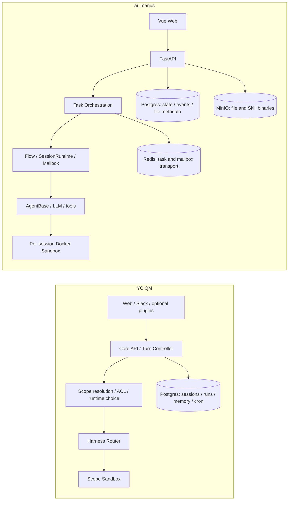

# YC QM 与本地 ai_manus 对比分析

> 分析日期：2026-08-18
> 对比对象：YC QM（Quartermaster）与本地 `/Users/songqiutao/Project/ai_manus`
> 分析依据：YC QM 讨论记录、QM 当前源码与文档、ai_manus 当前源码与文档

## 目录

- [1. 分析范围与口径](#1-分析范围与口径)
  - [1.1 对“QMA”的名称修正](#11-对qma的名称修正)
  - [1.2 事实、推断与建议的区分](#12-事实推断与建议的区分)
- [2. 结论先行](#2-结论先行)
- [3. 两个项目的定位与概念映射](#3-两个项目的定位与概念映射)
- [4. 总体架构对比](#4-总体架构对比)
  - [4.1 架构主链路](#41-架构主链路)
  - [4.2 分层映射](#42-分层映射)
- [5. 产品入口与使用方式](#5-产品入口与使用方式)
- [6. Scope、用户、项目、会话与权限](#6-scope用户项目会话与权限)
- [7. Agent Runtime、Harness 与多 Agent 编排](#7-agent-runtimeharness-与多-agent-编排)
- [8. Sandbox、工具执行与安全控制](#8-sandbox工具执行与安全控制)
- [9. 持久化、记忆、文件与故障恢复](#9-持久化记忆文件与故障恢复)
- [10. Skills、业务项目扩展与插件体系](#10-skills业务项目扩展与插件体系)
- [11. 后台任务、外部集成与运维](#11-后台任务外部集成与运维)
- [12. 相同点与差异点总表](#12-相同点与差异点总表)
- [13. 对 ai_manus 的成熟度与能力判断](#13-对-ai_manus-的成熟度与能力判断)
  - [13.1 ai_manus 已经具备的优势](#131-ai_manus-已经具备的优势)
  - [13.2 最值得借鉴的 QM 能力](#132-最值得借鉴的-qm-能力)
  - [13.3 暂时不建议直接照搬的能力](#133-暂时不建议直接照搬的能力)
- [14. 如果要向 QM 类平台演进：建议路线](#14-如果要向-qm-类平台演进建议路线)
- [15. 证据索引与结论边界](#15-证据索引与结论边界)

## 1. 分析范围与口径

这份文档不是对两个仓库做逐文件代码审计，而是回答一个更具体的问题：

> QM 与 ai_manus 是否在做同一类事情？它们的能力边界分别在哪里？如果以 ai_manus 为基础继续演进，哪些 QM 设计值得吸收，哪些不应直接复制？

本次比较覆盖以下维度：

- 产品入口与交互面：Web、Slack、API、后台管理。
- 控制平面：身份、权限、Scope、会话、任务、调度与审计。
- Agent 执行：单 Agent、多 Agent、Harness、模型和工具调用。
- 执行环境：Sandbox 生命周期、文件、进程、网络和凭据。
- 数据与恢复：Postgres、Redis、MinIO、事件、记忆、队列、租约和重启恢复。
- 扩展方式：Skills、业务项目、插件、部署层和组织定制。
- 工程定位：平台化程度、产品化程度、复用边界和下一步演进成本。

### 1.1 对“QMA”的名称修正

讨论记录中先出现了“QMA Agent”的说法，后续澄清为 YC 的 **QM（Quartermaster）**。本文统一使用 QM；“QMA”只作为原讨论链接的标题背景保留。

讨论记录提供了很好的产品和架构解释，但源码结论优先以当前 QM 仓库为准。特别是以下判断经过源码或项目文档交叉确认：

- QM 的核心是 headless、多用户、多 Scope 的 Agent 后端，而 Web 只是一个可选交互面。
- Slack、Web 和其他入口最终进入统一 Core，而不是各自拥有一套 Agent 实现。
- QM 的 Harness Router 每一轮选择一个 Agent Runtime；它不是把多个 Harness 聚合成一个并行多 Agent 编排器。
- ai_manus 的多 Agent 能力主要发生在自身的 Flow、SessionRuntime、MailboxRouter 和 AgentRuntimeInstance 内部。

### 1.2 事实、推断与建议的区分

本文使用以下口径：

- **事实**：能在源码、项目文档或当前配置中直接找到的能力。
- **推断**：根据多个事实推导出的产品定位或架构含义，会明确使用“更像”“可理解为”“当前证据显示”等措辞。
- **建议**：面向 ai_manus 后续演进的设计建议，不代表当前代码已经具备，也不代表必须照搬 QM。

ai_manus 当前处于 `feat/skill-management` 分支，工作区存在较多未提交改动。因此，Skills 相关结论要区分“当前分支正在形成的能力”和“已经稳定存在的基础能力”。QM 工作区也保留了用户原有的未提交 Portal 改动，本次没有修改这些改动。

## 2. 结论先行

### 2.1 一句话定位

**QM 是面向多用户、多入口、多 Scope 的 Agent 后端平台；ai_manus 是以会话为中心、具备显式单 Agent/多 Agent Flow 的 Agent 产品与运行时框架。**

两者都不是单纯的“调用大模型聊天页面”，都在解决 Agent 长时间运行、工具执行、审批、状态持久化、Sandbox 隔离和可扩展性问题。但它们选择的系统边界不同：

| 维度 | QM | ai_manus |
|---|---|---|
| 首要问题 | 如何把多种 Agent Runtime 安全地服务给多个用户、频道、团队和组织 | 如何把一个会话可靠地运行成单 Agent 或多 Agent 任务，并通过 Web 交付结果 |
| 核心抽象 | Scope、Turn、Harness、Sandbox、Run、Resource ACL | Session、Agent Flow、AgentRuntime、Agent、Task、Session Event |
| 多 Agent 含义 | Core 选择一个 Harness；Harness 内部是否多 Agent 由外部 Runtime 决定 | Flow 原生定义 root orchestrator、worker、mailbox 和多 Agent 生命周期 |
| 执行环境 | 以 Scope 为边界的持久化计算环境，可路由到不同 Sandbox Backend | 以 Session 为边界的动态 Docker Sandbox，文件通过 MinIO/数据库持久化或恢复 |
| 入口 | Web、Slack，以及可选的 CLI/其他接入面 | 当前仓库主要是 Vue Web、FastAPI、REST/SSE |
| 扩展方式 | 核心包 + 组织部署目录 + 插件 + Scope 资源 | 通用后端 + `projects/{project_id}` 业务项目模块 + Skills |

### 2.2 最重要的判断

1. **两者属于同一个大类，但不是同一个产品层级。** ai_manus 已经覆盖了 QM 内部执行链路的大部分“Agent Runtime”问题；QM 额外把入口、Scope、资源授权、Harness 适配、后台作业和组织级部署提升为平台的一等能力。

2. **ai_manus 的多 Agent 是显式业务编排能力，QM 的核心多 Runtime 是平台路由能力。** 这两个概念不能直接等同。ai_manus 的 `GenericOrchestratorAgent`、Flow YAML、Mailbox 和 Worker 是其核心特色；QM 不应被简单描述为“同样的多 Agent 框架”。

3. **两者最大的结构差异是“Scope-first”与“Session-first”。** QM 先确定谁在什么 Scope 中工作，再解析记忆、文件、权限、运行时和 Sandbox；ai_manus 当前先创建 Session，再把 Project、Agent Flow、Runtime Agent 和 Sandbox 挂到 Session 上。

4. **ai_manus 已经具备可靠的会话级基础设施。** Postgres 事实源、Redis 事件传输、MinIO 文件对象、事件序列、幂等事件、审批恢复、Mailbox 重放和 Sandbox 恢复，说明它不是简单 Demo，而是一个有明确运行时生命周期的系统。

5. **如果要吸收 QM，优先吸收“边界模型”和“平台控制面”，不要先替换 AgentBase。** 对 ai_manus 来说，最有价值的 QM 思路是 Scope/Resource ACL、统一 Turn/Ingress、持久化 Run/Lease、Sandbox Backend 抽象和组织部署层；不是把现有 Flow/AgentRuntime 直接替换成 QM 的 Harness Router。

## 3. 两个项目的定位与概念映射

可以把两者放在同一条 Agent 系统链路上理解：

- **QM 更靠近平台外层**：负责接入谁、进入哪个 Scope、用什么 Runtime、访问哪些资源、在哪个 Sandbox 执行、如何排队和审计。
- **ai_manus 更靠近产品与执行内核**：负责一个 Session 如何创建任务、如何运行 Flow、如何驱动 Agent、如何在多 Agent 之间投递消息、如何把事件推给前端。

### 3.1 不是“QM = ai_manus 的升级版”

QM 的设计目标是把 Pi、OpenCode、Codex、Claude Code 等多种 Harness 作为可替换运行时放进统一的平台控制面。它更关心运行时的统一接入、权限和执行边界。

ai_manus 的设计目标是让业务项目能够定义自己的 Agent、Flow、Prompt、Tool Group、Input Adapter、Hook 和领域服务，再由统一的 Session Runtime 执行。它更关心业务可编排性和会话内 Agent 协作。

因此，若只比较“Agent Loop”，两者会显得很像；若把系统边界拉开，差异就很明显：

| QM 概念 | ai_manus 当前最接近的概念 | 是否一一对应 | 说明 |
|---|---|---:|---|
| Surface / Ingress | Vue 页面、FastAPI Session API、SSE | 部分对应 | QM 把入口抽象为统一输入；ai_manus 当前主要围绕 Web API 组织 |
| Scope | personal space、team、project、Session owner 的组合 | 不对应 | QM Scope 是运行时边界；ai_manus 的 Project 还承担业务配置选择 |
| TurnRequest | `/sessions/{id}/chat` 加任务输入事件 | 部分对应 | ai_manus 的输入已持久化，但入口协议还没有 QM 那样统一 |
| Run / Lease | Task、AgentTaskRunner、Redis consumer group、恢复逻辑 | 部分对应 | ai_manus 有任务恢复能力，但 Run 不是同样的独立控制面实体 |
| Harness | Flow + SessionRuntime + AgentRuntimeInstance + AgentBase | 部分对应 | ai_manus 的整套运行时更接近一个 Harness，而不是一个 Harness Router |
| Sandbox | DockerSandbox 与 Sandbox FastAPI 服务 | 部分对应 | QM 偏持久化 Scope 计算机；ai_manus 偏 Session 动态容器 |
| Resource ACL | SessionAccessService、Team/Project membership、ToolPermissionService | 部分对应 | ai_manus 有权限，但资源共享与跨 Scope 授权粒度不同 |
| Skill | Managed Skill、平台 Skill、项目 Skill | 部分对应 | 两边都有版本和能力约束，但分享、签名、Scope 解析方式不同 |
| Deployment layer | `projects/{project_id}`、Compose 配置、环境变量 | 不对应 | QM 将组织定制与核心代码明确分离；ai_manus 当前偏代码仓库内扩展 |

## 4. 总体架构对比

### 4.1 架构主链路

下图将两边当前代码和文档中最重要的生产路径放在一起。它不是表示所有可选组件，而是展示两种系统的主控制流。



### 4.2 分层映射

#### QM 的四层模型

结合讨论记录与当前源码，QM 可以概括为四层：

1. **Interaction Surface**：Web、Slack、Portal、管理界面等负责接收输入和展示结果。
2. **Control Plane / Agent Core**：身份、策略、Scope 解析、Turn Controller、Harness Router、队列、调度与审计。
3. **Durable State**：Postgres 中的 Session、Tape、Memory、Run、Lease、ACL、Cron、Tool Ledger 等。
4. **Isolated Execution**：按 Scope 提供的 Sandbox、文件、进程、Skills、命令、凭据和外部服务访问。

这使得 QM 的 Web UI 不等于 QM 本身；即使没有 Web，也可以由 Slack、CLI 或其他企业入口调用同一 Core。

#### ai_manus 的四层模型

ai_manus 当前更接近：

1. **Product Surface**：Vue Web 页面、会话界面、项目界面、Skills 页面、Session Audit 页面。
2. **Application Control**：FastAPI 路由、认证、SessionAccessService、TaskOrchestrationService、AgentTaskRunner。
3. **Agent Runtime**：Flow、SessionRuntime、MailboxRouter、AgentRuntimeInstance、AgentBase、Agent Registry。
4. **Infrastructure**：Postgres、Redis、MinIO、Docker Sandbox、LLM、Langfuse，以及业务项目提供的外部服务。

ai_manus 的各层已经有相当明确的职责，但“产品入口、业务项目、会话运行时、基础设施”之间的边界比 QM 更紧。尤其是 `APP_PROJECT_ID` 在进程级选择业务项目，说明 Project 目前仍是部署/运行配置的一部分，而不是完全由每个 Session 独立选择的资源。

#### 差异的本质

QM 是先通过控制面把“输入”变成一个有身份、有 Scope、有策略的 Turn，再交给 Harness 执行；ai_manus 是先由 Session API 创建或恢复一个会话任务，再在这个会话里构造 Flow、Runtime Agent 和 Sandbox。

这不是谁更正确，而是服务目标不同：

- QM 优先保证不同入口、用户、频道和组织之间的边界统一。
- ai_manus 优先保证一个业务会话里的 Agent 任务能够完整运行、暂停、恢复并呈现事件。

## 5. 产品入口与使用方式

### 5.1 QM：入口无关的 Agent 后端

QM README 对产品的概括是 “A multiplayer agent harness for work. In Slack and on the web.” 当前仓库和讨论记录共同表明：

- Web 是一个主要入口，但不是系统的唯一入口。
- Slack 是一等交互面，DM、Channel、Thread 会参与 Scope 和 Session 解析。
- Admin、Portal、Web UI 以插件方式接入 Core HTTP API。
- 同一个 Core 可以被不同表面复用，入口只负责提供 Actor、Conversation、附件、时区和回复地址等上下文。
- 每个人和每个共享房间可以拥有不同的记忆、文件、权限、Cron、Skills 和 Sandbox 视图。

使用体验更像“一个组织共享的 Agent 工作平台”：用户不一定需要本地安装或维护 Agent 运行环境，Agent 在服务端 Scope/Sandbox 中持续运行。

### 5.2 ai_manus：Web 产品优先的会话系统

ai_manus 当前前端路由包含登录、注册、项目、聊天列表、Skills、Session Audit 和 Chat 页面；前端通过 FastAPI API 与 SSE 接收会话事件。README 直接把它描述为通用前端，覆盖：

- 会话交互。
- 审批交互。
- 文件和终端展示。
- 浏览器和工具过程展示。
- 项目与 Skills 管理。

从当前仓库能确认的是 Web 入口和 REST/SSE 协议。没有在本次检查的 README、架构文档和源码范围内发现等价的 Slack 插件或多入口统一路由。因此，ai_manus 目前更像“可扩展的 Agent Web 产品”，而不是已经完成的“多入口 Agent 平台”。

### 5.3 直接影响

如果目标是服务单个团队、内部用户或特定业务项目，ai_manus 的 Web-first 设计更直接；如果目标是让同一套 Agent 能被 Slack、Web、自动化和企业系统共享，QM 的入口抽象和 Core 边界更有优势。

ai_manus 后续增加 Slack 时，最需要避免的是把 Slack 逻辑直接塞进 Session 页面或 AgentBase。更合理的边界是新增 Ingress Adapter，把 Slack 事件转成统一的身份、会话、附件和输入事件，再复用现有 Session/Flow 能力。

## 6. Scope、用户、项目、会话与权限

这是两个项目差异最大的维度。

### 6.1 QM 的 Scope-first 模型

QM 的 `ScopeKind` 包含 `personal`、`channel`、`team`、`org`、`group`。Scope 不是简单的用户组，而是一个完整的逻辑工作边界，至少承载：

- 租户和命名空间。
- 工作目录或 Workspace Layer。
- 成员与 ACL。
- 记忆命名空间。
- Runtime 配置和 Harness/Model 选择。
- Skills、文件、部署、Cron、服务凭据等资源的可见性。
- Sandbox 的路由和执行边界。

Session 记录 `scopeId`、Session 类型、Thread 引用和 Surface；Turn 到达后，Core 根据 Actor 与 Conversation 计算目标 Scope。讨论中给出的典型规则是：

- Slack DM 通常映射到个人 Scope。
- Slack Channel/Group 映射到共享 Scope。
- 同一个共享 Scope 内的成员可以共同看到被授权的文件、Skills 或记忆。

QM 的资源 ACL 以资源拥有者 Scope 和被授权 Scope 为核心，支持读写权限、成员管理、资源句柄、Scope 管理者和不可传递的授权规则。这样“谁能看到会话”和“谁能使用某个资源”可以分别表达。

### 6.2 ai_manus 的 Session/Owner 模型

ai_manus 数据模型要求一个 Session 恰好属于以下一种 owner：

- Personal Space。
- Team。
- Project。

Team 有 owner/admin/member 角色，Project 也有 owner/admin/member 角色。Session 由用户创建，并保存 `created_by_user_id`、`personal_space_id`、`team_id` 或 `project_id`、状态、Sandbox、Task 和运行时快照。当前 `SessionAccessService` 还区分了查看权限和执行权限，执行权限更依赖创建者或明确的访问规则。

这套模型已经具备多用户产品的基础，但它与 QM Scope 不是同一层抽象：

- Personal Space、Team、Project 主要承担归属、成员和业务组织语义。
- Session 仍然是状态、记忆、文件、Agent Flow 和 Sandbox 的主容器。
- `APP_PROJECT_ID` 是进程级的业务项目选择，Project 还负责注册 Agent、Flow、Prompt、Tool Group 和 Hook。
- 当前证据没有显示一个独立的、可被多个 Session 共同使用的 Channel Scope 工作空间模型。
- 当前文件事实主要挂在 Session 文件生命周期上，Team/Project 访问更多体现为会话权限，而不是一个与 QM Workspace Layer 等价的共享文件层。

### 6.3 关键差异表

| 问题 | QM 的回答 | ai_manus 当前回答 | 差异含义 |
|---|---|---|---|
| Agent 在谁的空间里工作 | Turn 先解析到 Scope | Session 先确定 owner | QM 更适合跨入口共享，ai_manus 更适合会话产品 |
| 共享边界是什么 | Channel/Group/Team/Org Scope | Team/Project 归属和成员关系 | ai_manus 尚缺独立的共享运行时命名空间 |
| 资源如何共享 | Resource ACL、grant、Scope 可见性 | Session/Project/Team 权限与 Tool Permission | 两者权限粒度和资源模型不同 |
| 记忆归属 | Scope-scoped，可按 Scope 读取、版本化和恢复 | Session Memory 与 Agent Flow 快照为主 | QM 更容易实现跨会话共享记忆 |
| 运行时配置归属 | Org 与 Scope 可解析 Harness/Model | Session 选 mode/model，Project 由进程配置 | ai_manus 的运行时仍与业务项目部署耦合 |
| 文件/计算环境归属 | Scope 可拥有持久 Sandbox 和 Workspace Layer | Session 拥有动态 Docker Sandbox | QM 更偏长期工作空间，ai_manus 更偏任务隔离 |

### 6.4 对 ai_manus 的设计启示

如果要引入 Scope，不建议直接把所有现有对象重命名成 Scope。需要先回答三个业务问题：

1. 一个用户的多个 Session 是否需要共享同一个持久工作目录和记忆？
2. Team/Project 与 Slack Channel、业务项目之间是什么关系，是否允许同一用户同时位于多个运行时 Scope？
3. “可以查看 Session”“可以执行 Agent”“可以读文件”“可以运行 Skill”“可以管理 Sandbox”是否需要独立权限？

只有这些问题明确后，才能判断应该扩展现有 `personal_space/team/project`，还是新增真正的 Scope 和 Resource Grant 层。

## 7. Agent Runtime、Harness 与多 Agent 编排

### 7.1 QM：Harness 是可替换的完整 Agent Runtime

QM 的 `Harness` 接口把一次 Agent Turn 所需的输入、历史、系统提示、工具、审批、环境、流式输出和结果统一起来。当前有 Pi、OpenCode、Codex、Claude Code 等适配器，并通过 `RuntimeChoice` 保存 `harnessId` 和 `modelId`。

`HarnessRouter` 会根据组织默认值、Scope 配置和已批准的 Runtime 选择适配器，并处理运行时切换、Session Reset 和 Adapter 生命周期。代码明确检查：

- 请求的 Harness/Model 是否在已批准列表中。
- 目标 Model 是否被该 Harness 支持。
- 组织级策略是否允许当前 Scope 使用它。
- 切换 Harness 后是否需要重置之前的 Session 状态。

因此，QM Core 主要做“选择和约束一个 Runtime”；具体 Runtime 内部是否使用多个 Agent、是否有自己的工具循环和上下文管理，由 Harness 自己决定。

### 7.2 ai_manus：Flow 原生定义单 Agent 与多 Agent

ai_manus 的 Agent Runtime 链路更深入 Agent 内部：

1. `AgentTaskRunner` 创建或恢复 Flow 和 Session Runtime。
2. `SessionRuntime` 管理 Agent 实例、Mailbox、事件队列和生命周期。
3. `AgentRuntimeInstance` 消费单个 Agent 的 Mailbox，调用 `AgentBase` 并更新状态快照。
4. `AgentBase` 负责 Prompt、Reasoning/Acting、工具批次、审批、记忆、Hook 和 Trace。
5. Flow Profile 可以选择单 Agent 或多 Agent；多 Agent 通常由 Root Orchestrator 调度 Worker。

当前架构文档中，`flash`、`think` 更偏单 Agent，`pro` 可进入多 Agent Flow；具体 Flow 通过 YAML 和项目配置定义。Mailbox 让用户输入、审批结果、系统通知和 Agent 间消息可以路由到指定 Runtime Agent。

这说明 ai_manus 的多 Agent 不是表面上的多个模型调用，而是有：

- Agent 身份和角色。
- Root/Worker 关系。
- 目标 Agent 路由。
- Agent 级状态和恢复。
- Agent 间消息邮箱。
- 多 Agent 事件汇聚。

### 7.3 二者不是同一种“多 Agent”

| 主题 | QM | ai_manus |
|---|---|---|
| 组合单位 | 多种外部 Harness | Flow 内的多个 Runtime Agent |
| 选择时机 | 每个 Turn 选择 Harness/Model | Session/Task 根据 Mode/Flow 选择执行结构 |
| 调度目标 | 把请求交给一个受控 Agent Runtime | 在一个 Session 内调度 Root、Worker 和消息 |
| 状态边界 | Harness Session 状态由适配器管理 | Session、Flow、Agent Registry、Mailbox 都由 ai_manus 管理 |
| 可替换性 | 外部 Runtime 适配是核心能力 | 项目通过 Registry 扩展 Agent/Flow，外部 Harness 还不是主抽象 |
| 典型收益 | 同一平台接入不同 Agent 工具链 | 业务任务中拆解并行角色和协作步骤 |

因此，若把 QM 的 Harness Router 引入 ai_manus，正确理解应该是：把现有 `Flow + SessionRuntime + AgentBase` 看成一种本地 Harness，再为未来的 Codex/Claude Code 等外部运行时增加适配器。它不应取代现有多 Agent Flow，除非产品目标明确转向“委托外部 Agent 工具链”。

## 8. Sandbox、工具执行与安全控制

### 8.1 QM：持久化 Scope Sandbox 与策略组合

QM 的 Sandbox 抽象包括：

- Scope 关联的 `SandboxHandle`、root/home 目录和后端信息。
- 读写 Workspace Layer、文件操作和安全路径处理。
- 命令执行、进程会话、后台进程和清理。
- 快照、备份、Blob stage in/out。
- `local`、`sprites`、`aws` 等 Backend 路由。
- 按 Scope 持久化 Backend 选择和能力检查。
- 出站网络等级或 Domain/IP/Port 约束。

这类 Sandbox 更像“一个用户或共享 Scope 的长期工作电脑”。它可以承载持续运行的进程、登录状态、Skills、文件和被授权的外部服务凭据视图。

QM 的安全控制还包括：

- `strict`、`auto`、`dangerous` 三种 Security Posture。
- 组织级安全下限与 Scope 级设置组合。
- 对工具调用和破坏性命令的审批。
- 命令策略中的 deny、allow、require approval。
- 对递归删除、强制推送、破坏性 SQL、pipe-to-shell 等操作的默认控制。
- 对外部页面、文件、邮件、工具结果等输入的“不可信数据”处理与来源标记。
- Resource ACL、已授权的文件/Skill/Deploy/Credential 句柄。

### 8.2 ai_manus：Session 动态 Docker Sandbox

ai_manus 的 Sandbox 链路是 Backend -> `DockerSandbox` -> Sandbox FastAPI 服务 -> Bash/File/Supervisor。当前文档和实现显示：

- 每个 Session 可以创建动态容器。
- 容器使用指定镜像、网络、名称前缀和 Supervisor。
- 提供 Bash 启动、状态、输出、终止和文件读写/编辑/上传/下载 API。
- 有心跳、TTL、容器恢复和 Session 删除清理。
- Session 恢复时可以从持久化状态重新建立或恢复 Sandbox。
- Sandbox 当前明确定位为 Bash、Python、文件和进程环境，不包含浏览器、CDP、VNC 或远程桌面。
- MinIO 保存二进制文件和产物，Postgres 保存元数据，Sandbox 是工作副本。

ai_manus 的工具权限采用 deny/ask/allow 优先级和路径/Bash 参数策略，并通过 ToolBatch/Approval Batch 暂停和恢复工具执行。它已经有真实的权限边界，不能被理解为“没有安全控制”。

### 8.3 差异与取舍

| 维度 | QM | ai_manus |
|---|---|---|
| 主要边界 | Scope | Session |
| 计算机生命周期 | 可以长期保留，按 Scope 路由和备份 | 动态创建，按 Session TTL/恢复/删除 |
| Backend | 多 Backend 抽象与能力路由 | 当前以 Docker 为主，接口已存在 |
| 共享工作区 | Workspace Layer 与 Resource Grant | 当前主要是 Session 文件和项目/会话权限 |
| 网络 | Egress Enforcement 是显式能力 | 当前文档重点是容器网络和工具策略，未见同等粒度的 egress 层 |
| 凭据 | Scope 的服务凭据视图和授权句柄 | 当前证据更集中于 Sandbox、项目外部客户端和应用配置 |
| 外部数据安全 | Security Posture、来源标记、入站筛查 | 工具审批、参数权限和会话授权 |

ai_manus 选择 Session 级 Docker 隔离有一个明显优点：边界直观、资源生命周期容易与用户会话对齐、部署成本较低。QM 的 Scope 级持久化计算机则更适合长期任务、后台任务、多人共享和 Slack 场景，但会带来更复杂的租约、清理、资源计费、凭据和跨成员隔离问题。

## 9. 持久化、记忆、文件与故障恢复

### 9.1 QM 的持久化控制面

QM 的核心数据模型围绕长期运行和多入口恢复设计：

- Session Store 保存 Session、Entry、Tape、LLM Request、Lease 和来源信息。
- Postgres Session Store 对 Session Entry 使用递增序号、父序号、参与者窗口和持久化 Tape。
- Run Store 保存 pending/running/done/failed 状态、请求/结果、去重键、尝试次数、租约 Token、过期时间和 Worker ID。
- Postgres Run Store 提供排队、Claim、Heartbeat、Release、Complete、Fail、Reap 和按 Thread 查询。
- Run 表对幂等键和同一 Session 的运行中任务进行约束。
- Memory Service 按 Scope 管理记忆内容、Revision、Query、Capture、Restore 和历史。
- Cron/Monitor 的状态、触发记录和交付来源也持久化。
- Tool Ledger 和审批状态支持执行审计和重启后的上下文恢复。

QM 的核心假设是：只要用户、系统或后台任务之后还要读取，就不能只放在进程内存里。

### 9.2 ai_manus 的持久化与传输分工

ai_manus 的架构文档明确区分三类存储：

- **Postgres 是事实源**：Session、Agent Flow、Runtime Agent、Session Event、File 元数据、用户/团队/项目、Skill 元数据和检查点。
- **Redis 是传输层**：Task 输入流、Agent Mailbox、消费组、实时事件运输和未确认消息恢复。
- **MinIO 是二进制对象存储**：文件内容、产物、Skill ZIP 包和大对象。

具体可靠性机制包括：

- `session_events` 的会话内序列、Event ID 幂等和冲突检测。
- `pending_input_events` 对用户输入、审批响应和待处理输入做持久化。
- Redis Stream 消费组的 PEL-first、XACK、去重和重放。
- Agent Flow 中的 `session_memories`、`active_skills`、当前工具/审批/Trace 快照。
- SessionRuntime 和 Runtime Agent 在恢复时重新建立实例和 Mailbox。
- 文件元数据采用 pending/available 等状态，物理对象与数据库元数据分离。
- 动态 Sandbox 失效或重建时，能够从持久化文件和 Session 状态恢复。

这套设计在“单个会话的任务可靠性”方面已经很完整。区别在于，ai_manus 的持久化组织单位仍然是 Session/Flow，而 QM 还额外把 Scope Memory、Run、Cron、Resource ACL 和 Sandbox 路由作为跨会话控制面实体。

### 9.3 记忆模型差异

QM 的 Memory Service 是 Scope-first：同一个 Scope 下的多个 Session 可以共享记忆命名空间，记忆有版本和恢复能力；频道/群组产生的事实还可以按来源写入个人记忆。

ai_manus 当前主要是 Session Memory Manager 和 Agent Flow 快照：会话消息、系统提示、压缩摘要和 Agent 状态可以持续保存；长期记忆是产品路线中的独立方向，当前工作区文档把 Hindsight 长记忆列为后续重点。

这意味着 ai_manus 若要支持“跨会话工作记忆”，不应只把 Session Memory 的生命周期拉长，而要先定义记忆归属、可见性、来源、冲突、版本和删除语义。

### 9.4 恢复能力的相对判断

两边都具备恢复思路，但重点不同：

- QM 更强调工作平台层的 Run Lease、后台任务、Scope Sandbox、Cron 和多入口持续性。
- ai_manus 更强调 Session 内部的输入、事件、Agent Mailbox、Flow Checkpoint 和动态容器恢复。

可以把它们理解为两种不同的可靠性重心，而不是简单的“一个有恢复、一个没有恢复”。

## 10. Skills、业务项目扩展与插件体系

### 10.1 QM Skills：带治理的 Scope 资源

QM 的 Skill Store 将 Skill 视为可治理资源，包含：

- `draft`、`reviewed`、`published`、`archived` 生命周期。
- Scope 所属、创建者、版本、Manifest、签名和 Pack。
- Granted Capabilities 与审批记录。
- HMAC 签名验证、Review、Publish、Archive。
- 按 Scope 顺序解析和同名 shadowing。
- Promote 到目标 Scope，而不是隐式复制。
- Git Pack 同步、Leader Lease 和周期性同步。
- 将 Skill Index/Tree 物化到 Sandbox，并通过 Hash/Marker 做增量投影。

这套设计重点解决的是“谁创建、谁审查、谁可以看到、谁可以推广、Skill 请求了什么能力、物化到哪个执行环境”。

### 10.2 ai_manus：业务项目扩展 + Managed Skill

ai_manus 的通用后端允许业务项目通过 `projects/{project_id}` 提供：

- 项目配置。
- Agent 与 Flow。
- Prompt、Skill、Tool Group。
- Input Adapter、Hook。
- 领域模型、服务和外部客户端。
- 启动/关闭注册逻辑。

这是一种很直接的“业务项目插件”方式：平台负责通用 Session/Agent Runtime，业务项目负责具体工作流和工具集合。

当前 `feat/skill-management` 分支还在形成 Managed Skill 能力，已能从文档和源码看到：

- Postgres 保存 Skill、版本、用户安装和启用状态。
- MinIO 保存完整 ZIP 包。
- 平台 Skill 可从启动目录 Bootstrap。
- Turn 开始时把用户启用的精确版本同步到 Session Sandbox 私有缓存。
- `skill_manage` 负责管理，`skill_use` 负责显式激活。
- `allowed-tools` 与 Flow 工具集合求交集。
- 激活 Skill 在 Sandbox 中以只读投影提供，未激活的 Skill 不可读。
- 创建、更新、删除、发布等变更可以复用工具审批机制。

这说明 ai_manus 在 Skill 的用户安装、启用、版本选择和运行时投影方面有较清晰的产品路径；但当前工作区改动尚未完成提交，且当前证据中的 owner/source 主要是 platform/personal，尚未形成 QM 那样完整的 Channel/Team/Org Scope 推广模型。

### 10.3 QM Plugin 与 ai_manus Project Extension 的差异

| 维度 | QM Plugin | ai_manus Project Extension |
|---|---|---|
| 扩展对象 | Web、Admin、Portal、Slack 等表面和核心插件 | 业务项目的 Agent、Flow、Tool、Prompt、Hook、领域服务 |
| 依赖方向 | 插件通过 Core API/共享 Chassis 接入 | 项目模块通过 Registry 注册到通用后端 |
| 运行位置 | 可以是 Core 内部插件，也可以是独立 Web/Portal | 主要在同一个后端运行时和代码仓库内 |
| 主要价值 | 把同一 Agent Core 暴露给不同入口 | 快速定义不同业务项目的 Agent 行为 |
| 隔离方式 | 插件与组织部署目录、核心包边界 | `APP_PROJECT_ID` 和 Python 模块边界 |

从产品架构上看，QM 的插件解决“平台如何扩展表面和基础设施”；ai_manus 的 Project Extension 解决“同一个产品如何承载不同业务 Agent”。两者可以组合，但不是替代关系。

## 11. 后台任务、外部集成与运维

### 11.1 QM 的后台工作是一等能力

QM 的类型和实现中有独立的 Cron、Monitor、Background Wake、Run Store、Worker Lease 和 Delivery Provenance：

- Cron 可以按 Scope 创建、启停、记录 Fire Log，并指定以 owner、Scope Floor 或共享身份运行。
- Monitor 可以观察进程输出、模式、Cursor、Tail 和过期时间。
- Scheduler 使用周期性 Sweeper、Leader Lease 和触发记录。
- 后台运行创建新 Thread，并带有自动化来源和交付审计。
- Slack/Web/其他入口可以接收后台结果，Core 仍统一执行和授权。

这使 QM 更像一个可以持续工作的 Agent 服务，而不是用户打开页面后才运行的聊天应用。

### 11.2 ai_manus 当前更强调任务级异步

ai_manus 已有：

- Task Orchestration 和输入流。
- 后台 Bash 与进程生命周期。
- Deferred Input、Pending Input Event 和审批恢复。
- Redis PEL 恢复、Agent Mailbox 和 Task 恢复。
- Sandbox 心跳、TTL 和重新建立。
- SSE 实时输出和 Session Audit。

但在本次检查范围内，没有看到与 QM Cron/Monitor/Scope-level automation 等价的通用调度与观察模型。也就是说，ai_manus 已经能够可靠地“把一个任务跑完”，QM 更进一步支持“让一个 Scope 长期自己工作”。

### 11.3 外部集成与组织部署

QM 的组织定制通过独立部署目录承载：核心代码、插件、Sandbox 工具/Skills、配置、基础设施和运行手册分开管理；`qm init` 生成部署目录，目标可以是 Docker、Fly 或 AWS，部署包和镜像支持版本/摘要固定，组织私有内容不需要回写核心仓库。

ai_manus 当前主要通过 Docker Compose 组织前端、后端、Sandbox、Postgres、MinIO 和 Redis，通过 `.env` 和 `APP_PROJECT_ID` 选择运行配置，再由 `projects/{project_id}` 提供业务行为。这个方式对本地开发和快速定制很直接；从本次检查的文档不能推断它已经具备 QM 那样完整的多目标生产部署层。

运维定位可以概括为：

- QM 把“核心平台”和“组织部署”拆开，强调可复制、可升级、可在组织云账号中运行。
- ai_manus 把“通用产品”和“业务项目扩展”放在同一仓库，强调业务开发效率和运行时可控性。

### 11.4 观测与审计

两边都有持久化观测基础，但关注点不同：

- QM 有 Session Tape、LLM Request、Tool Ledger、Approval、Run 和 Delivery Provenance，服务于多入口、多用户平台审计。
- ai_manus 有 Session Event、Trace Context、Session Audit、Langfuse 集成和事件快照，服务于单会话执行可视化、调试和管理员审阅。

如果未来 ai_manus 增加后台自动化、共享 Scope 或跨入口执行，现有 Session Audit 之外还需要补充“谁以什么身份在什么 Scope 对什么资源发起了什么 Run”的平台级审计维度。

## 12. 相同点与差异点总表

### 12.1 共同点

| 共同能力 | QM | ai_manus | 判断 |
|---|---:|---:|---|
| LLM 驱动的 Agent Loop | 有 | 有 | 共同基础 |
| 工具调用 | 有 | 有 | 都不是只读聊天 |
| 命令/文件 Sandbox | 有 | 有 | 都把执行放在隔离环境 |
| 审批与暂停恢复 | 有 | 有 | 都把高风险工具作为可中断过程 |
| Session/事件持久化 | 有 | 有 | 都考虑长任务和刷新/重启 |
| 会话记忆 | 有 | 有 | Scope 记忆与 Session 记忆边界不同 |
| 多用户权限 | 有 | 有 | QM 偏资源 Scope，ai_manus 偏用户/团队/项目/会话 |
| Skill/工具扩展 | 有 | 有 | 治理与安装模型不同 |
| 后台/异步执行 | 有 | 有 | QM 更偏调度平台，ai_manus 更偏任务恢复 |
| 外部系统接入 | 有 | 有 | QM 偏平台凭据/服务，ai_manus 偏业务项目客户端 |

### 12.2 关键差异

| 关键问题 | QM 的选择 | ai_manus 的选择 | 影响 |
|---|---|---|---|
| 第一主语 | Scope | Session | 决定共享、记忆和 Sandbox 的默认归属 |
| 运行时 | 多种外部 Harness 适配 | 自有 AgentBase/Flow Runtime | 决定系统扩展是在 Runtime 外还是 Flow 内 |
| 多 Agent | Harness 内部自决定 | Flow 内显式 orchestrator/worker | ai_manus 的业务编排特色更强 |
| 入口 | 多入口统一 Core | Web 产品与 API 优先 | QM 更适合 Slack/企业系统共用 |
| Sandbox | 持久 Scope 计算机 | 动态 Session 容器 | QM 更适合长期/共享，ai_manus 更易控制成本和隔离 |
| 共享资源 | Scope ACL + grants | owner/membership + session resource | 两者授权粒度不一样 |
| 记忆 | 可跨 Session 的 Scope Memory | Session/Flow memory 为主 | ai_manus 需要先补跨会话语义 |
| 后台 | Cron/Monitor/Run 一等 | Task/Deferred Input/后台 Bash | QM 更偏自主工作平台 |
| 安全 | Posture、组织下限、来源筛查、命令策略 | JWT、会话权限、工具 deny/ask/allow、审批 | QM 的平台级安全控制更细；ai_manus 已有会话级基础 |
| 组织定制 | Deployment Directory 与核心解耦 | Project Registry 与仓库内模块 | QM 更适合多组织独立运营，ai_manus 更适合快速业务定制 |
| 交付形态 | 平台/基础设施产品 | Web 产品 + Agent Runtime | 商业和工程边界不同 |

## 13. 对 ai_manus 的成熟度与能力判断

这里的“成熟度”不是给两个项目打总分，而是看每个能力域已经解决到什么边界。

### 13.1 ai_manus 已经具备的优势

#### 1. 会话运行时的职责划分清楚

`AgentTaskRunner`、`SessionDispatcher`、`SessionRuntime`、`AgentRuntimeInstance`、`AgentBase` 和 `Flow` 之间已经形成可解释的链路。输入、Agent 消费、事件发布、审批和清理都有明确位置。这是 ai_manus 最有价值的基础，不应为了追求 QM 形式而重新打散。

#### 2. 多 Agent 是真正的运行时能力

ai_manus 不只是允许选择多个模型，而是支持 Root/Worker、Agent Mailbox、Agent Registry、Agent 状态和 Flow Profile。对于需要任务拆解、并发角色和业务流程控制的场景，这比单纯接入多个外部 Harness 更有表现力。

#### 3. 数据可靠性边界已经明确

Postgres、Redis、MinIO 的职责分离，事件序列与幂等、待处理输入持久化、消费组恢复和 Session Checkpoint，说明系统已经认真处理了长任务和重启场景。QM 的 Run/Lease 设计可以作为增强方向，但不需要推翻现有持久化原则。

#### 4. 业务扩展入口直接

通过 Project Registry 注册 Agent、Flow、Tool Group、Hook 和外部客户端，业务团队可以在不修改通用 Session Runtime 的情况下加入领域能力。这种方式适合快速建立垂直业务 Agent。

#### 5. Web 产品闭环较完整

当前前端已经覆盖认证、项目、会话、审批、文件、终端、Skills 和管理员审计等用户可见链路。对于内部产品落地，这比先搭建完整多入口平台更能快速获得反馈。

### 13.2 最值得借鉴的 QM 能力

按优先级排序，建议关注以下能力。

#### 优先级 A：把 Scope 与 Session 解耦

目标不是增加一个抽象名词，而是回答：多个 Session 是否共享某个长期工作空间、记忆、Skill、凭据和运行时配置。

最小可行模型可以先在现有结构之上增加清晰的资源归属和解析过程：

```text
Actor + Conversation + Project/Team
        -> resolve execution scope
        -> resolve memory/files/skills/permissions
        -> create or resume session
        -> run Flow or Harness
```

第一阶段不必支持 QM 全部 ScopeKind，但至少要明确：个人 Session、项目共享空间、未来 Channel/Team 共享空间之间的关系。

#### 优先级 A：统一 Turn/Ingress 协议

将当前 `/sessions/{id}/chat` 的输入与后续 Slack、Webhook、定时任务统一成类似 `TurnRequest` 的结构，保留：

- Actor 和身份来源。
- Surface。
- Conversation、Thread 和受众。
- 文本、附件和时区。
- human、automation、ambient、direct 等输入来源。
- 选定的 Mode/Model/Runtime。
- 审批、异步和回复地址。

这样可以让 Session Dispatcher 和 Flow 不再假设输入一定来自 Web Chat。

#### 优先级 A：把 Run/Lease/Idempotency 提升为独立控制面能力

ai_manus 当前已经有 Task、Redis Stream 和恢复机制。下一步重点不是再造一条队列，而是把以下概念显式化：

- 一次可追踪的 Run 请求。
- Run 的状态、去重键和最终结果。
- Worker Lease、Heartbeat、过期回收。
- 同一 Session 的并发约束。
- 人工输入、自动化触发和后台触发的来源。

这会把“Redis 如何传消息”和“系统当前承诺执行什么”分开，逐步接近 QM 的长期任务控制面。

#### 优先级 B：扩展 Sandbox Backend 与资源边界

当前 DockerSandbox 已经有接口和生命周期，后续可以在不改变 AgentBase 的前提下增加：

- Sandbox Backend 能力声明。
- 持久 Workspace 与 Session 临时目录的区分。
- 文件/Skill/凭据的资源授权句柄。
- 出站网络策略。
- 进程和后台任务的租约。
- 资源清理、备份和成本观测。

这里应先从真实需求开始，例如长期任务、共享项目文件或受控外部服务访问，而不是一次性实现 QM 的全部 Sandbox 能力。

#### 优先级 B：为现有 Agent Runtime 增加 Harness 边界

可以把当前 `Flow + SessionRuntime + AgentBase` 定义成一种内置 Runtime/Harness，然后在外层增加适配器协议。这样未来可以同时支持：

- ai_manus 原生 Flow。
- 外部 Codex/Claude Code/OpenCode 等 Runtime。
- 只读分析 Runtime 或专用业务 Runtime。

关键是先统一输入、事件、审批、工具、Sandbox 和结果协议，避免直接把外部 Harness 的内部 Session 状态硬塞进 ai_manus 的 Agent Flow 数据库。

#### 优先级 B：吸收 QM 的 Skill 治理而不是重写现有 Skill 产品

ai_manus 当前分支已经在解决版本、安装、启用、精确版本投影和工具交集问题。更适合补充的是：

- Skill 能力声明和审查状态。
- 签名/完整性校验。
- 用户、项目、团队或 Scope 的可见性。
- Promote/Publish 的显式流程。
- 运行时物化的来源和版本审计。

不要同时保留两套 Skill 事实源或两套物化路径。当前 Managed Skill 方案应继续作为主路径，QM 的治理能力按需并入。

#### 优先级 C：组织部署层

当 ai_manus 需要被多个业务团队或多个组织独立部署时，再把业务项目、Skills、工具、插件、基础设施和配置拆成类似 QM Deployment Directory 的层。这个能力对单项目快速开发不是第一优先级。

### 13.3 暂时不建议直接照搬的能力

#### 1. 不要先把全部对象改名为 Scope

如果没有明确共享语义，新增 Scope 只会形成 `Scope -> Project -> Session -> Flow` 的重复层。先确定共享记忆、共享文件、共享凭据和共享运行时配置的需求，再决定抽象边界。

#### 2. 不要用 Harness Router 替换 ai_manus 的多 Agent Flow

QM 的 Harness Router 与 ai_manus 的 Root/Worker 编排解决不同问题。若当前核心价值是业务任务拆解，多 Agent Flow 应保持主路径；外部 Harness 应作为可选执行后端。

#### 3. 不要过早引入长期 Scope 计算机

持久 Sandbox 会带来存储、计费、进程、凭据、租约、备份和共享访问问题。如果现阶段主要需求仍是每次会话独立执行，动态 Docker Sandbox 是更简单的正确实现。

#### 4. 不要提前复制完整插件和多目标部署体系

QM 的插件/部署分层是多组织平台化的结果。ai_manus 当前若还在验证业务 Agent 和用户体验，过早拆出独立 Core、Portal、Slack、组织部署仓库，会增加发布、测试和排障成本。

#### 5. 不要只为“安全最佳实践”复制所有 QM 策略

QM 的 Security Posture、入站筛查和 Egress Enforcement 有明确的平台威胁模型。ai_manus 应先定义自己的用户、网络、凭据和数据边界，再选择必要的控制。工具审批、路径权限、Bash 策略和 Session Access 已经是当前真实边界，应在此基础上逐步增强。

## 14. 如果要向 QM 类平台演进：建议路线

以下路线是条件式建议，前提是目标确实从“业务 Agent 产品”扩展为“多入口、多用户 Agent 平台”。

### 阶段 0：定义边界，不改运行时

- 画出 Personal、Team、Project、Session、Sandbox、Skill、File 的归属矩阵。
- 明确查看、执行、读文件、写文件、运行 Skill、管理 Sandbox 的权限差异。
- 明确哪些状态是 Session 级，哪些状态必须跨 Session 持久化。
- 固定 Postgres/Redis/MinIO 的事实源和传输边界。

交付物应是数据模型和行为契约，而不是新增一批空接口。

### 阶段 1：抽取 Surface-neutral Turn 与 Run 控制面

- 保留现有 Vue Web 和 REST/SSE 作为第一套 Surface Adapter。
- 将 chat 输入、审批、自动化、Webhook 统一成 TurnRequest。
- 将 Task 的执行承诺、Lease、幂等和恢复状态独立出来。
- 让现有 SessionDispatcher 和 Flow 复用统一 Turn。

这一阶段能带来平台化收益，同时对现有 AgentBase 改动较小。

### 阶段 2：补充 Scope 与 Resource ACL

- 先实现个人/项目共享两种 Scope，不必一次支持全部 QM ScopeKind。
- 把文件、Skill、凭据、部署配置作为有 owner 的资源处理。
- 为 Session、Sandbox 和跨 Session Memory 定义可见性。
- 增加资源授权记录和审计，而不是只依赖 Project membership。

### 阶段 3：增强 Sandbox 和后台工作

- 将 Docker 作为一个 Backend，实现能力声明。
- 分离临时 Session 工作目录和长期共享 Workspace。
- 增加受控后台 Run、进程租约、定时触发或监控触发。
- 根据真实外部服务需求补充 Egress、凭据和来源标记。

### 阶段 4：增加 Harness Adapter 与第二入口

- 先把本地 Flow Runtime 适配成一个清晰的 Harness。
- 再按实际场景接入 Slack 或外部 Code Agent Runtime。
- 让入口只提供身份、会话和回复上下文，不复制 Agent Loop。
- 验证同一 Scope 在 Web、Slack 和自动化入口下的记忆、权限和交付一致性。

### 阶段 5：组织部署和核心/定制分离

- 将业务 Project、Skills、工具和组织配置迁移到独立部署层。
- 固定核心版本、Sandbox 镜像和部署配置。
- 补齐升级、回滚、密钥、环境检查和组织级审计。
- 只有多个组织或多个独立部署的现实需求出现时，再完成这一步。

### 14.1 选择判断

如果未来目标是以下场景，优先级不同：

| 目标场景 | 更应该优先吸收的 QM 能力 |
|---|---|
| 单一业务团队 Web Agent | Session 可靠性、Flow、Sandbox、Skills、审计；暂不急于 Scope 化 |
| 多项目 SaaS Agent | Scope、Resource ACL、Run/Lease、组织隔离、部署层 |
| Slack + Web 统一助手 | Turn/Ingress、Conversation/Thread 映射、Scope、Delivery Provenance |
| 长期自主工作 Agent | 持久 Sandbox、Cron/Monitor、后台 Run、租约和成本控制 |
| 多种代码 Agent 共存 | Harness Adapter、Runtime Choice、工具/审批/结果协议 |
| 多组织私有部署 | Deployment Directory、核心版本、组织配置隔离和回滚 |

## 15. 证据索引与结论边界

### 15.1 QM 主要证据

以下路径均相对于 `/Users/songqiutao/Project/source_agent_projects/qm`：

| 文件 | 主要观察点 |
|---|---|
| `README.md` | 产品定位、Scope、Web/Slack、Sandbox、Skills、部署和安全概览 |
| `src/types.ts` | ScopeKind、Session、TurnRequest、WorkspaceLayer、Grant、Cron、Monitor、TurnResult |
| `src/api/app-turn.ts` | Web/Slack Turn 的 Scope 解析、Runtime 选择和输入进入 Core 的方式 |
| `src/api/app-sessions.ts` | Session、文件、Project、Grant、后台任务和资源访问 API |
| `src/harness/harness.ts` | Harness 输入、工具、审批、流式输出和结果协议 |
| `src/harness/harness-router.ts` | Harness/Model 选择、已批准 Runtime、切换与重置 |
| `src/sessions/session-store.ts` | Session、Entry、Tape、LLM Request、Lease 和来源 |
| `src/runs/run-store.ts` | Run 状态、租约、幂等、Heartbeat、重试和回收 |
| `src/runs/postgres-run-store.ts` | Postgres Run 表和 Worker Lease 实现 |
| `src/memory/memory-service.ts` | Scope 记忆的查询、捕获、版本和恢复接口 |
| `src/memory/postgres-memory-service.ts` | Scope Memory Revision 和并发更新实现 |
| `src/sandbox/sandbox.ts` | Sandbox Backend、Workspace Layer、进程、文件和备份抽象 |
| `src/sandbox/sandbox-routing.ts` | 按 Scope 保存和选择 Sandbox Backend |
| `src/security/security-posture.ts` | strict/auto/dangerous、组织下限和外部数据安全处理 |
| `src/policy/command-policy.ts` | 命令 allow/deny/require approval 和默认危险操作策略 |
| `src/acl/resource-ref.ts`、`src/acl/acl-store.ts` | Resource ACL、Grant、资源句柄和 Scope 授权 |
| `src/skills/skill-store.ts` | Skill 生命周期、签名、能力、可见性、Promote 和解析 |
| `src/skills/skill-sync-engine.ts`、`src/skills/materialize.ts` | Skill Pack 同步和 Sandbox 物化 |
| `src/cron/cron-store.ts`、`src/cron/scheduler.ts` | Cron 持久化、触发、Leader Lease 和后台交付 |
| `docs/deploy-directory.md` | 组织部署目录、核心版本、Sandbox、Secrets、基础设施和回滚 |
| `deploy/layers/README.md` | 核心与组织定制边界 |

### 15.2 ai_manus 主要证据

以下路径均相对于 `/Users/songqiutao/Project/ai_manus`：

| 文件 | 主要观察点 |
|---|---|
| `README.md` | 项目组成、Compose 服务、Sandbox、Project 配置和启动方式 |
| `docs/architecture.md` | 前端、FastAPI、编排、Agent Runtime、Redis、Postgres、MinIO、SSE 总体链路 |
| `docs/backend/runtime/overview.md` | SessionRuntime、AgentRuntime、Mailbox、Dispatcher、恢复和清理 |
| `docs/backend/runtime/storage.md` | Postgres 事实源、Redis 传输、MinIO 对象、事件幂等和文件生命周期 |
| `docs/sandbox/overview.md` | Docker Sandbox API、TTL、恢复、文件与产物关系 |
| `docs/backend/extensions/overview.md` | Project Registry、业务项目扩展点和注册方式 |
| `docs/backend/extensions/agent-flow.md` | AgentBase、单/多 Agent Flow、审批、Memory 和 Tool Group |
| `docs/backend/extensions/skills.md` | Managed Skill、版本、安装、启用、激活、工具交集和 Sandbox 投影 |
| `backend/app/infrastructure/persistence/postgresql/tables.py` | 用户、团队、项目、Session、Flow、Agent、Event、File、Skill 表结构 |
| `backend/app/application/orchestration/agent_task_runner.py` | 任务运行、Flow/Runtime/Sandbox 组装和清理 |
| `backend/app/application/orchestration/session_dispatcher.py` | 输入类型、优先级、目标 Agent、审批和事件路由 |
| `backend/app/agent_runtime/core/session_runtime.py` | Agent 实例、Mailbox、循环和生命周期 |
| `backend/app/agent_runtime/core/agent_runtime_instance.py` | 单 Agent Mailbox 消费、执行、状态更新和 ACK |
| `backend/app/agent_runtime/agents/agent_base.py` | Prompt、Reasoning/Acting、工具、审批、Memory、Hook 和 Trace |
| `backend/app/infrastructure/external/sandbox/docker_sandbox.py` | 动态 Docker 容器、Supervisor、心跳、HTTP API 和清理 |
| `backend/app/application/services/session_access_service.py` | Session owner、查看权限和执行权限 |
| `backend/app/agent_runtime/permissions/tool_permission_service.py` | 工具 deny/ask/allow 与 Bash/路径策略 |
| `backend/app/infrastructure/project_registry.py` | `APP_PROJECT_ID`、业务项目模块和 Registry 注册 |
| `frontend/src/router/index.ts` | 当前 Web 产品入口、认证路由和管理员审计页面 |
| `frontend/README.md` | Vue Web 的会话、审批、文件、终端、浏览器和工具展示范围 |

### 15.3 结论边界

本次结论不包含以下内容：

- 没有做性能压测、成本测算或生产容量评估。
- 没有对任一项目做完整的安全渗透测试。
- 没有把 ai_manus 当前未提交的 Skill 改动当成已经发布的稳定能力。
- 没有据此判断两个项目的商业规模、团队效率或最终产品竞争力。
- 没有修改 QM 或 ai_manus 的代码、配置、依赖和工作区现有改动。

最终可以用一句话收束：

> **ai_manus 已经是一个具备可靠会话运行时和原生多 Agent 编排的 Agent 产品内核；QM 则是在此类执行内核之外，进一步建立了统一入口、Scope/资源授权、可替换 Harness、持久 Sandbox、后台调度和组织部署的多用户 Agent 平台。**

如果后续要继续逐点深挖，最值得先展开的是第 6 节 Scope/权限、第 7 节 Runtime 映射和第 9 节持久化/恢复，因为这三处决定了 ai_manus 是否需要平台化，以及平台化会不会破坏现有多 Agent 核心。
